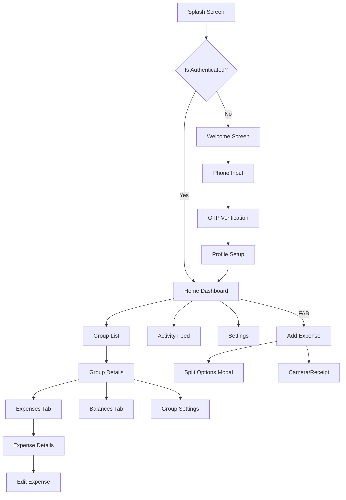

# One By Two — UI/UX Design Specifications

> **Note to Developers:** This document serves as the "Figma" for the project. Since I am a text-based AI, I cannot generate binary `.fig` files. Instead, this document provides high-fidelity specifications for the UI, including layout, colors, typography, and widget composition.

## 1. Design System

### 1.1 Color Palette
We use a **Material 3** color scheme.
*   **Primary:** `Indigo 600` (`#3949AB`) — Trust, stability.
*   **On Primary:** `White` (`#FFFFFF`)
*   **Secondary/Accent:** `Teal 500` (`#009688`) — Money, positive balance.
*   **Error:** `Red 600` (`#E53935`) — Debt, negative actions.
*   **Surface:** `White` (`#FFFFFF`)
*   **Background:** `Grey 50` (`#FAFAFA`)
*   **Text Primary:** `Grey 900` (`#212121`)
*   **Text Secondary:** `Grey 600` (`#757575`)
*   **Divider:** `Grey 200` (`#EEEEEE`)

### 1.2 Typography
Standard Material 3 Type Scale (Roboto or system default sans-serif).
*   **Headline Large**: 32sp, Bold (Welcome screen)
*   **Headline Medium**: 28sp, Regular (Group totals)
*   **Title Medium**: 16sp, Medium (List headers, App bar titles)
*   **Body Large**: 16sp, Regular (Main content)
*   **Body Medium**: 14sp, Regular (Secondary text)
*   **Label Small**: 11sp, Medium, All Caps (Tags, small buttons)

### 1.3 Iconography
Use **Material Symbols Rounded**.
*   **Expense Categories**: 
    *   Food: `restaurant`
    *   Travel: `flight`
    *   Transport: `directions_car`
    *   Groceries: `shopping_cart`
    *   Rent: `home`
*   **Actions**:
    *   Add: `add`
    *   Edit: `edit`
    *   Delete: `delete`
    *   Sync: `sync`

---

## 2. Screen Specifications

### 2.1 Authentication Flow

#### Screen: Welcome
*   **Layout**: Center-aligned column.
*   **Content**:
    *   **Logo**: 120x120 SVG centered (top 1/3).
    *   **App Name**: Headline Large, "One By Two".
    *   **Tagline**: Body Large, Grey 600, "Split expenses. Not friendships."
    *   **Action**: Button (Filled), Bottom-aligned (padding 24), Label: "Get Started".

#### Screen: Phone Input
*   **Layout**: Column, `CrossAxisAlignment.start`, Padding 24.
*   **Content**:
    *   **Header**: Title Large "Enter your phone number".
    *   **Subheader**: Body Medium "We'll send you a verification code."
    *   **Input**: `Row` [ Country Code Dropdown (+91) | TextField (Phone Number, numeric keyboard) ].
    *   **Action**: Button "Send OTP" (width: double.infinity).

#### Screen: OTP Verification
*   **Layout**: Similar to Phone Input.
*   **Content**:
    *   **Header**: "Verify Phone".
    *   **Subheader**: "Code sent to +91 XXXXX XXXXX".
    *   **Input**: `Pinput` widget (6 blocks).
    *   **Timer**: "Resend code in 00:30" (Grey 600).

---

### 2.2 Main App Shell (Dashboard)

#### Screen: Home
*   **AppBar**:
    *   **Title**: "One By Two" (Left aligned).
    *   **Actions**: `Notifications` (icon), `Search` (icon).
*   **Body**: `CustomScrollView`
    *   **SliverToBoxAdapter (Balance Card)**:
        *   **Card**: Elevation 2, Gradient Background (Indigo 600 -> Indigo 400).
        *   **Content**:
            *   "Total Balance" (White, opacity 0.8).
            *   **Row**:
                *   [You owe: ₹2,450 (Red-100)]
                *   [Divider (Vertical, White)]
                *   [You are owed: ₹5,200 (Green-100)]
    *   **SliverToBoxAdapter (Section Header)**:
        *   **Tabs**: [Groups] [Friends] (Segmented Control or TabBar).
    *   **SliverList (Groups/Friends)**:
        *   **Item**: `ListTile`
            *   **Leading**: `CircleAvatar` (Group Icon OR User Avatar).
            *   **Title**: Group Name OR Friend Name.
            *   **Subtitle**: "You owe ₹400" (Red) OR "Settled" (Grey).
            *   **Trailing**: `ChevronRight`.
    *   **SliverToBoxAdapter (Section Header)**: "Recent Activity".
    *   **SliverList (Activity)**:
        *   **Item**: `ActivityTile` (Icon based on category, text description).
*   **FAB**:
    *   **Location**: Center Docked.
    *   **Icon**: `add`.
    *   **Label**: "Expense".

---

### 2.3 Feature: Group / Friend Details

#### Screen: Group / Friend Details
*   **SliverAppBar**:
    *   **ExpandedHeight**: 120.0.
    *   **FlexibleSpace**: Cover Image (Group) OR Avatar (Friend).
    *   **Title**: Group Name OR Friend Name.
    *   **Bottom**: `TabBar` [Expenses, Balances (Group only), Settle Up].
    *   **Actions**: `Settings` (icon).
*   **TabBarView**:
    *   **Tab 1: Expenses**:
        *   `ListView.builder`.
        *   **Grouped By Date** (Sticky Headers: "Today", "Yesterday").
        *   **Expense Item**:
            *   **Leading**: Date (e.g., "14 FEB") in a small box.
            *   **Title**: Expense Description.
            *   **Subtitle**: "Paid by [Name]" • category icon.
            *   **Trailing**: Amount (Color coded).
    *   **Tab 2: Balances**:
        *   **Chart**: Network graph or simple list of bars.
        *   **List**: "Who owes who".
            *   [Avatar A] -> [Arrow w/ Amount] -> [Avatar B].
            *   Button: "Remind" (Secondary outline).

---

### 2.4 Feature: Add Expense

#### Screen: Add/Edit Expense
*   **Layout**: `Column` (Scrollable).
*   **Content**:
    *   **Input (Description)**:
        *   `TextField`, "What is this for?", Leading Icon `edit_note`.
    *   **Input (Amount)**:
        *   `TextField`, Large Font (Headline Medium), "₹ 0".
        *   Centered.
    *   **Row (Payer)**:
        *   "Paid by" [Dropdown: You / Other Member].
        *   "and split" [Dropdown: Equally / By % / Shares].
    *   **Category Grid**:
        *   Horizontal scroll or small grid 4x2.
        *   Selection highlights icon with Primary Color circle.
    *   **Date/Time**:
        *   Row: [Today, 4:30 PM] (Click to open Picker).
    *   **More Options** (Expandable):
        *   "Add Receipt" (Camera Icon).
        *   "Add Note" (TextField).
*   **BottomBar**:
    *   **Button**: "Save Expense" (Full width, Primary Color).

---

### 2.5 Feature: Expense Splitting (Modal/Screen)

#### Screen: Split Options
*   Accessed via "and split" dropdown in Add Expense.
*   **Tabs**: [Equally] [Unequally (₹)] [Percentages (%)] [Shares].
*   **Equally**:
    *   List of group members with Checkboxes (Select All checked by default).
    *   "₹500 / person" displayed next to selected names.
*   **Unequally**:
    *   List of members with `TextField` for amount.
    *   **Validation**: "₹X remaining" (Red if sum != total).
*   **Shares**:
    *   List of members with `+` / `-` stepper (1 share default).
    *   "1 share = ₹X".

---

## 3. Component Specs

### 3.1 Buttons
*   **Primary Button**: Height 48, Radius 8, `ElevatedButton`.
*   **Secondary Button**: Height 40, Radius 8, `OutlinedButton`.

### 3.2 Cards (Groups/Expenses)
*   **Padding**: 12 horizontal, 8 vertical.
*   **Shape**: RoundedRect (Radius 12).
*   **Elevation**: 0 (Border: Grey 200) or 1 (Shadow).

### 3.3 Avatars
*   **Standard**: 40x40 Circle.
*   **Fallback**: Initials (e.g., "AG") on random pastel background color.

### 3.4 Feedback/States
*   **Sync Pending**: Small clock icon (Grey) next to timestamp.
*   **Sync Error**: Red warning icon, tap to retry.
*   **Offline Mode**: Banner at bottom "You are offline. Changes will sync later." (Black background, white text).

## 4. Navigation Flow Diagram

