# Navigation Flow — OneByTwo v1.0

> Information Architecture: complete navigation graph, entry/exit points,
> auth guard logic, and deep-link resolution.

| Field            | Value                                       |
|------------------|---------------------------------------------|
| Document version | 1.0                                         |
| Status           | Draft — pending Architect and PM review      |
| Author           | UX/UI Designer Agent                        |
| SRS baseline     | v1.1                                        |
| Last updated     | 2025-01-20                                  |

---

## 1. Mermaid Navigation Graph

The diagram is organised into sub-graphs for readability. Decision diamonds
represent auth-state checks performed by the GoRouter `redirect` guard.
Edge labels describe the user action or system event that triggers the
transition.

```mermaid
graph TD
    %% ----------------------------------------------------------------
    %% ENTRY POINTS
    %% ----------------------------------------------------------------
    ColdStart([Cold Start — app launch])
    PushCold([Push Notification — cold start])
    PushWarm([Push Notification — warm start])
    ShareLink([Share-sheet invite link / Universal Link])
    AppLink([App Link from browser])

    %% ----------------------------------------------------------------
    %% AUTH GUARD — Decision Logic
    %% ----------------------------------------------------------------
    ColdStart --> AuthCheck{Authenticated?}
    PushCold --> AuthCheck
    ShareLink --> AuthCheck
    AppLink --> AuthCheck

    AuthCheck -- No --> PhoneEntry
    AuthCheck -- Yes --> ProfileCheck{Profile exists?}

    ProfileCheck -- No --> ProfileSetup
    ProfileCheck -- Yes --> RouteResolver{Resolve requested route}

    RouteResolver -- default / no deep link --> HomeDashboard
    RouteResolver -- deep link: friend --> FriendDetail
    RouteResolver -- deep link: group --> GroupDetail
    RouteResolver -- deep link: expense --> ExpenseDetail
    RouteResolver -- deep link: activity item --> ActivityFeed
    RouteResolver -- deep link: group invite --> GroupDetail

    PushWarm --> RouteResolver

    %% ----------------------------------------------------------------
    subgraph Auth ["Auth Flow"]
        direction TB

        Splash["/splash — Splash Screen"]
        Onboarding["/onboarding — Onboarding Slides x3"]
        PhoneEntry["/auth/phone — Phone Number Entry"]
        OTPVerify["/auth/otp — OTP Verification"]
        ProfileSetup["/auth/profile-setup — Profile Setup"]

        Splash -- first launch --> Onboarding
        Splash -- returning user,\nnot authenticated --> PhoneEntry
        Onboarding -- tap Continue / skip --> PhoneEntry
        PhoneEntry -- tap Continue,\nvalid +91 number --> OTPVerify
        OTPVerify -- correct OTP,\nfirst-time user --> ProfileSetup
        OTPVerify -- correct OTP,\nreturning user --> HomeDashboard
        OTPVerify -- incorrect OTP --> OTPVerify
        OTPVerify -- tap Resend OTP\n30s cooldown --> OTPVerify
        OTPVerify -- back --> PhoneEntry
        ProfileSetup -- tap Continue,\nname entered --> HomeDashboard
    end

    %% ----------------------------------------------------------------
    subgraph MainTabs ["Main Tabs — Bottom Navigation Shell"]
        direction TB

        HomeDashboard["/home — Home Dashboard"]
        FriendsList["/friends — Friends List"]
        GroupsList["/groups — Groups List"]
        ActivityFeed["/activity — Activity Feed"]
        ProfileScreen["/profile — Profile and Settings"]
    end

    %% ----------------------------------------------------------------
    subgraph FriendFlow ["Friend Screens"]
        direction TB

        FriendDetail["/friends/:id — Friend Detail"]
        FriendHistory["/friends/:id/history — Transaction History"]
        AddFriend["/friends/add — Add Friend"]

        FriendsList -- select friend --> FriendDetail
        FriendsList -- tap Add Friend --> AddFriend
        FriendDetail -- tap history --> FriendHistory
        FriendDetail -- tap Settle Up --> SettleUp
        FriendDetail -- tap Add Expense --> AddExpense
        FriendDetail -- back --> FriendsList
        FriendHistory -- back --> FriendDetail
        AddFriend -- friend linked --> FriendDetail
        AddFriend -- invite via\nsystem share sheet --> AddFriend
        AddFriend -- back --> FriendsList
    end

    %% ----------------------------------------------------------------
    subgraph GroupFlow ["Group Screens"]
        direction TB

        GroupDetail["/groups/:id — Group Detail"]
        GroupMembers["/groups/:id/members — Group Members"]
        CreateGroup["/groups/create — Create Group"]

        GroupsList -- select group --> GroupDetail
        GroupsList -- tap Create Group --> CreateGroup
        GroupDetail -- tap members --> GroupMembers
        GroupDetail -- tap Settle Up --> SettleUp
        GroupDetail -- tap Add Expense --> AddExpense
        GroupDetail -- tap invite via\nsystem share sheet --> GroupDetail
        GroupDetail -- back --> GroupsList
        GroupMembers -- back --> GroupDetail
        CreateGroup -- group created --> GroupDetail
        CreateGroup -- back --> GroupsList
    end

    %% ----------------------------------------------------------------
    subgraph ExpenseFlow ["Expense Screens"]
        direction TB

        AddExpense["/expense/add — Add / Edit Expense\n(multi-step bottom sheet)"]
        ExpenseDetail["/expense/:id — Expense Detail"]

        AddExpense -- save --> ExpenseDetail
        AddExpense -- back / cancel --> PreviousScreen(["Previous Context\n(Friend or Group)"])
        ExpenseDetail -- tap edit --> AddExpense
        ExpenseDetail -- tap delete,\nconfirm --> PreviousScreen
        ExpenseDetail -- back --> PreviousScreen
    end

    %% ----------------------------------------------------------------
    subgraph SettleFlow ["Settle Up Flow"]
        direction TB

        SettleUp["/settle — Settle Up\n(pre-filled from simplified debts)"]

        SettleUp -- confirm settlement --> PreviousContext(["Previous Context\n(Friend or Group)"])
        SettleUp -- back / cancel --> PreviousContext
    end

    %% ----------------------------------------------------------------
    subgraph ProfileFlow ["Profile Screens"]
        direction TB

        ProfileEdit["/profile/edit — Edit Profile"]
        NotificationPrefs["/profile/notifications — Notification Preferences"]
        AccountDeletion["/profile/delete-account — Account Deletion"]

        ProfileScreen -- tap edit --> ProfileEdit
        ProfileScreen -- tap notifications --> NotificationPrefs
        ProfileScreen -- tap Contact Support --> MailClient(["Device mail client\n(mailto: link)"])
        ProfileScreen -- tap Sign Out --> SignOutConfirm{Confirm sign out?}
        ProfileScreen -- tap Delete Account --> AccountDeletion

        ProfileEdit -- save --> ProfileScreen
        ProfileEdit -- back --> ProfileScreen
        NotificationPrefs -- back --> ProfileScreen

        SignOutConfirm -- Yes --> PhoneEntry
        SignOutConfirm -- No / cancel --> ProfileScreen

        AccountDeletion -- confirm deletion --> DeletionProcessing["Processing deletion\n(Cloud Function)"]
        AccountDeletion -- back / cancel --> ProfileScreen
        DeletionProcessing -- complete --> PhoneEntry
    end

    %% ----------------------------------------------------------------
    %% CROSS-TAB CONNECTIONS
    %% ----------------------------------------------------------------
    HomeDashboard -- tap friend/group\nin top 5 --> FriendDetail
    HomeDashboard -- tap friend/group\nin top 5 --> GroupDetail
    HomeDashboard -- tap FAB --> AddExpense

    ActivityFeed -- tap activity item\n(expense) --> ExpenseDetail
    ActivityFeed -- tap activity item\n(friend) --> FriendDetail
    ActivityFeed -- tap activity item\n(group) --> GroupDetail

    %% ----------------------------------------------------------------
    %% TAB SWITCHING
    %% ----------------------------------------------------------------
    HomeDashboard -. tab .-> FriendsList
    HomeDashboard -. tab .-> GroupsList
    HomeDashboard -. tab .-> ActivityFeed
    HomeDashboard -. tab .-> ProfileScreen
    FriendsList -. tab .-> HomeDashboard
    GroupsList -. tab .-> HomeDashboard
    ActivityFeed -. tab .-> HomeDashboard
    ProfileScreen -. tab .-> HomeDashboard

    %% ----------------------------------------------------------------
    %% STYLING
    %% ----------------------------------------------------------------
    classDef entry fill:#2E86AB,stroke:#1F4E79,color:#fff,stroke-width:2px
    classDef decision fill:#F4A261,stroke:#E76F51,color:#000,stroke-width:2px
    classDef exit fill:#E76F51,stroke:#E76F51,color:#fff,stroke-width:2px
    classDef screen fill:#fff,stroke:#1F4E79,color:#1F4E79,stroke-width:1px
    classDef context fill:#f0f0f0,stroke:#999,color:#666,stroke-dasharray: 5 5

    class ColdStart,PushCold,PushWarm,ShareLink,AppLink entry
    class AuthCheck,ProfileCheck,RouteResolver,SignOutConfirm decision
    class PhoneEntry,DeletionProcessing exit
    class Splash,Onboarding,OTPVerify,ProfileSetup,HomeDashboard,FriendsList,GroupsList,ActivityFeed,ProfileScreen screen
    class FriendDetail,FriendHistory,AddFriend,GroupDetail,GroupMembers,CreateGroup screen
    class AddExpense,ExpenseDetail,SettleUp,ProfileEdit,NotificationPrefs,AccountDeletion screen
    class PreviousScreen,PreviousContext,MailClient context
```



---

## 2. Entry Points

| Entry Point | Trigger | Resolution | SRS Reference |
|---|---|---|---|
| **Cold start** | User taps the app icon. | App renders the splash screen, then the GoRouter `redirect` guard evaluates auth state (see section 4 below). | FR-AU-07 (auto-login) |
| **Push notification — cold start** | User taps a notification while the app is terminated. | The OS launches the app with the notification payload. After the splash screen and auth guard pass, GoRouter resolves the deep-link target from the payload (expense, friend, group, or activity item). | FR-AC-05 |
| **Push notification — warm start** | User taps a notification while the app is backgrounded or foregrounded. | The notification handler extracts the route from the payload and calls `GoRouter.go()` directly, bypassing the splash screen. The auth guard still validates before navigation. | FR-AC-05 |
| **Share-sheet invite link** | User taps a OneByTwo link received via SMS, WhatsApp, or any messaging app. | The OS resolves the Universal Link (iOS) or App Link (Android). If the app is installed, GoRouter receives the URI; if not, the link falls back to the App Store or Play Store listing. | FR-SH-02, FR-GR-02, FR-GR-03, ADR-0015 |
| **Universal/App Link from browser** | User taps a OneByTwo link in a mobile browser. | Identical resolution to the share-sheet invite link above. The `apple-app-site-association` (iOS) or `assetlinks.json` (Android) file routes the link to the app or to the store. | FR-SH-02, ADR-0015 |

---

## 3. Exit Points

| Exit Point | Trigger | Behaviour | SRS Reference |
|---|---|---|---|
| **Sign out** | User taps "Sign Out" on the Profile screen and confirms the dialog. | Firebase Auth session is cleared. Local cached data (Firestore offline cache) is purged. GoRouter navigates to `/auth/phone`. Subsequent cold starts show the phone entry screen (no auto-login). | FR-AU-08 |
| **Account deletion** | User taps "Delete Account" on the Profile screen and confirms the double-confirmation dialog. | A Cloud Function is triggered to anonymise the user's data in shared groups and schedule personal data removal within 30 days. The local session is cleared. GoRouter navigates to `/auth/phone`. | FR-AU-09, section 5.5 (DPDP compliance) |

---

## 4. Auth Guard — GoRouter Redirect Logic

The GoRouter `redirect` callback runs on every navigation event, including
cold starts, deep links, and push notification taps. It implements a
three-tier guard:

```
┌─────────────────────────────────────────────────────────────┐
│                    GoRouter redirect                        │
│                                                             │
│  1. Is FirebaseAuth.instance.currentUser non-null?          │
│     ├── NO  → redirect to /auth/phone                      │
│     │         (unless already on an /auth/* route)          │
│     └── YES → step 2                                       │
│                                                             │
│  2. Does a users/{userId} document exist in Firestore?      │
│     ├── NO  → redirect to /auth/profile-setup               │
│     │         (first-time user; profile not yet created)    │
│     └── YES → step 3                                       │
│                                                             │
│  3. Allow navigation to the requested route.                │
│     - If the requested route is /auth/phone or              │
│       /auth/profile-setup, redirect to /home instead        │
│       (prevent authenticated users from re-entering the     │
│       auth flow).                                           │
│     - Otherwise, navigate to the requested route            │
│       (supports deep links from notifications and           │
│       invite URLs).                                         │
└─────────────────────────────────────────────────────────────┘
```

### Route table

The following route paths are derived from the navigation graph above and
the route scheme proposed in `docs/sprint-zero/first-story-FR-AU-01.md`.

| Route Path | Screen | Auth Required | Notes |
|---|---|---|---|
| `/splash` | Splash | No | Transient; auto-advances based on auth state. |
| `/onboarding` | Onboarding slides | No | Shown only on first-ever launch (local flag). |
| `/auth/phone` | Phone number entry | No | Locked +91 prefix. |
| `/auth/otp` | OTP verification | No | Receives phone number as parameter. |
| `/auth/profile-setup` | Profile setup | Yes (partial) | User is authenticated but has no Firestore profile. |
| `/home` | Home dashboard | Yes | Default landing route; bottom nav shell root. |
| `/friends` | Friends list | Yes | Bottom nav tab. |
| `/friends/add` | Add friend | Yes | Contact picker or manual +91 entry. |
| `/friends/:id` | Friend detail | Yes | Net balance, transaction history link, Settle Up. |
| `/friends/:id/history` | Transaction history | Yes | Reverse-chronological expenses and settlements. |
| `/groups` | Groups list | Yes | Bottom nav tab. |
| `/groups/create` | Create group | Yes | Name, type, cover photo. |
| `/groups/:id` | Group detail | Yes | Members, expenses, simplified balances. |
| `/groups/:id/members` | Group members | Yes | Member list, invite, remove. |
| `/expense/add` | Add/edit expense | Yes | Multi-step bottom sheet; context param (friend or group). |
| `/expense/:id` | Expense detail | Yes | View, edit, delete. |
| `/settle` | Settle up | Yes | Pre-filled from simplified debts; context param. |
| `/activity` | Activity feed | Yes | Bottom nav tab. |
| `/profile` | Profile and settings | Yes | Bottom nav tab. |
| `/profile/edit` | Edit profile | Yes | Display name, photo. |
| `/profile/notifications` | Notification preferences | Yes | Per-category toggles (FR-PR-03). |
| `/profile/delete-account` | Account deletion | Yes | Double-confirmation flow. |

### Bottom navigation shell

Routes under the main tabs (`/home`, `/friends`, `/groups`, `/activity`,
`/profile`) are wrapped in a GoRouter `ShellRoute` that renders the
persistent bottom navigation bar with the floating action button for adding
expenses (FR-HD-04). Child routes (e.g., `/friends/:id`, `/groups/:id`)
push on top of the shell, preserving the tab state beneath.

---

## 5. Deep-Link Payload Contract

Push notifications and invite links carry a payload that the GoRouter
`redirect` logic uses to resolve the target screen after auth validation.

| Payload Field | Type | Example | Maps To |
|---|---|---|---|
| `type` | `string` | `"expense_added"` | Route resolver decision |
| `contextType` | `string` | `"friendship"` or `"group"` | Friend detail vs group detail |
| `contextId` | `string` | `"abc123"` | `/friends/:id` or `/groups/:id` |
| `itemId` | `string` (optional) | `"exp456"` | `/expense/:id` |

The resolver falls back to `/home` if the payload is malformed or the
referenced document no longer exists (e.g., deleted expense). An
appropriate empty-state message is shown in that case (SRS section 6.4).

---

## 6. SRS Cross-References

| SRS Section | Relevance to This Document |
|---|---|
| 4.1 (FR-AU-01 to FR-AU-09) | Auth flow screens, auto-login, sign-out, account deletion. |
| 4.2 (FR-PR-01 to FR-PR-05) | Profile screens, notification preferences, Contact Support. |
| 4.3 (FR-FR-01 to FR-FR-05) | Friend list, friend detail, add friend, delete friend. |
| 4.4 (FR-GR-01 to FR-GR-07) | Group list, group detail, create group, invite members. |
| 4.5 (FR-EX-01 to FR-EX-09) | Add/edit expense, expense detail, category selection. |
| 4.6 (FR-SE-01 to FR-SE-09) | Settle up flow, settlement history, simplified debts display. |
| 4.7 (FR-AC-01 to FR-AC-05) | Activity feed, push notification deep links. |
| 4.8 (FR-HD-01 to FR-HD-04) | Home dashboard, FAB, top-5 list. |
| 4.11 (FR-SH-01 to FR-SH-04) | System share sheet for invites, Contact Support mailto. |
| 6.3 | Core screens list (11 screens for v1.0). |
| 6.4 | Empty, error, and loading states for every screen. |
| ADR-0007 (pending) | GoRouter as the navigation library. |
| ADR-0015 (pending) | Universal Links / App Links for deep linking. |

---

## 7. Open Questions for Architect / PM

1. **Splash-to-onboarding transition:** Should the onboarding slides be shown
   on every fresh install, or only once (persisted via a local `SharedPreferences`
   flag)? The current diagram assumes once only, with subsequent unauthenticated
   launches going directly to `/auth/phone`.

2. **Group invite link resolution:** When an unauthenticated user taps a group
   invite link, should the app remember the pending invite through the auth flow
   and auto-join the group after profile setup? This requires a "deferred deep
   link" mechanism (store the target route, complete auth, then navigate). The
   diagram currently shows the auth guard redirecting to `/auth/phone` first,
   with the invite route resolved after authentication.

3. **Account deletion confirmation UX:** The SRS (FR-AU-09) specifies permanent
   deletion with a 30-day anonymisation window. Should the confirmation flow
   require the user to re-enter their phone number or type "DELETE" as a
   destructive-action safeguard? The diagram shows a double-confirmation dialog
   but the exact interaction is TBD.

4. **FAB context awareness:** When the user taps the FAB from the Home dashboard,
   should the add-expense sheet open with no pre-selected context (user picks
   friend or group), or should it intelligently pre-select based on recent
   activity? This affects the `/expense/add` route parameters.

---

*-- End of Document --*
