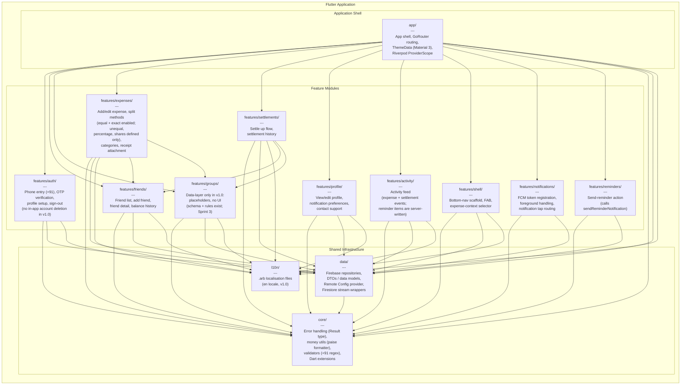

# C4 Component Diagrams -- One By Two

**Document type:** Architecture design -- C4 Level 3 (Component)
**Version:** 1.0
**Last updated:** 2025-01-27

This document provides C4 component-level views for the two primary containers
in the One By Two system: the Flutter mobile application and the Cloud Functions
backend. The diagrams use Mermaid syntax and follow the module boundaries
defined in the SRS (sections 5.7, 7.1, 13.1).

---

## 1. Flutter Application Components

The Flutter app follows a feature-first folder layout (SRS section 5.7,
section 13.1). Modules are organised into four tiers: the application shell
(`app/`), shared infrastructure (`core/`, `data/`, `l10n/`), and
domain-specific feature modules under `features/`. Arrows indicate compile-time
dependencies -- a module at the tail depends on the module at the head.

State management uses Riverpod 2.x (ADR-0004, confirmed). Navigation uses
GoRouter (ADR-0007, proposed). Both are wired in the `app/` shell.

### Key dependency rules

1. **Feature modules never depend on each other**, with two justified
   exceptions: `expenses` and `settlements` reference `friends` and `groups`
   because expense creation and settlement flows require selecting a friend or
   group context (SRS sections 4.5, 4.6). These cross-feature references are
   restricted to shared identifiers and provider reads, not widget imports. In
   v1.0 only the `friends` linkage is live; the `groups` linkage is forward-looking,
   as `groups` is data-layer-only (no UI).

2. **All feature modules depend on `core/`, `data/`, and `l10n/`** for
   shared utilities, repository access, and localised strings respectively.

3. **`data/` depends on `core/`** for error types, money utilities, and
   validators. It does not depend on any feature module.

4. **`l10n/` and `core/` are leaf modules** with no internal dependencies on
   other application modules.

5. **`app/` is the composition root.** It wires the `ProviderScope`, registers
   GoRouter routes that reference feature-module screens, and applies the
   global `ThemeData`. It depends on every other module but no module depends
   on it.

---

## 2. Cloud Functions Components

The Cloud Functions backend (Node.js 22, TypeScript, region `asia-south1`) is
organised by feature folder, with a shared core module for the simplified-debts
algorithm and a function-based notifications module (SRS sections 7.1, 7.3, 7.4,
13.1). v1.0 ships **six** functions: one HTTPS endpoint (`healthcheck`), three HTTPS
callables (`recomputeSimplifiedBalances`, `lookupUserByPhoneNumber`,
`sendReminderNotification`), and two Firestore triggers (`onExpenseWriteFriendship`,
`onSettlementWrite`). There is **no** `onUserDelete`, **no** group-invite callable, and
**no** group-expense trigger in v1.0.

```mermaid
graph TD
    subgraph "External Trigger Sources"
        FS_EXP[("Firestore<br/>friendships/{id}/expenses<br/>(write events)")]
        FS_SET[("Firestore<br/>settlements collection<br/>(write events)")]
        CLIENT["Flutter App<br/>(HTTPS / callable)"]
    end

    subgraph "Cloud Functions Container (Node 22, asia-south1)"
        direction TB

        subgraph "HTTPS"
            HEALTH["healthcheck<br/>---<br/>onRequest. Returns<br/>{ ok, region }."]
        end

        subgraph "Callable Functions"
            RECOMP["recomputeSimplifiedBalances<br/>---<br/>Callable entry to the<br/>simplified-debts recompute core."]
            LOOKUP["lookupUserByPhoneNumber<br/>---<br/>Phone lookup via Admin SDK.<br/>PII-safe logging (id-hash)."]
            REMIND["sendReminderNotification<br/>---<br/>FR-SE-09. Reads simplifiedBalances<br/>(read-only), rate-limits in<br/>_rateLimits, writes activity item,<br/>sends FCM."]
        end

        subgraph "Firestore Triggers"
            ON_EXP["onExpenseWriteFriendship<br/>---<br/>create/update/delete of<br/>friendship expenses.<br/>Invokes recompute core,<br/>writes activity, notifies."]
            ON_SET["onSettlementWrite<br/>---<br/>create/update/delete of<br/>settlements. Invokes recompute<br/>core, writes activity, notifies."]
        end

        subgraph "Core + Shared Modules"
            DEBTS["simplified-debts/<br/>---<br/>algorithm.ts (pure fold +<br/>greedy matching, SRS 7.4)<br/>function.ts (recomputeAndWrite<br/>Firestore boundary)"]
            NOTIF["notifications/<br/>---<br/>Function-based NotificationsApi<br/>over fcm-send.ts transport;<br/>payload-renderer.ts, prefs-filter.ts"]
            UTILS["utils/id-hash.ts<br/>---<br/>SHA-256 to 16-hex PII-safe<br/>ID hashing for logs"]
        end
    end

    subgraph "Output Destinations"
        FS_BAL[("Firestore<br/>simplifiedBalances on<br/>friendships (groups: future)")]
        FS_ACT[("Firestore<br/>activity/{userId}/items")]
        FCM_SVC["Firebase Cloud Messaging"]
    end

    %% Trigger sources to functions
    FS_EXP -->|"onDocumentWritten"| ON_EXP
    FS_SET -->|"onDocumentWritten"| ON_SET
    CLIENT -->|"callable"| RECOMP
    CLIENT -->|"callable"| LOOKUP
    CLIENT -->|"callable"| REMIND
    CLIENT -->|"HTTPS GET"| HEALTH

    %% Internal dependencies
    ON_EXP --> DEBTS
    ON_EXP --> NOTIF
    ON_SET --> DEBTS
    ON_SET --> NOTIF
    RECOMP --> DEBTS
    REMIND --> NOTIF
    LOOKUP --> UTILS

    %% Output destinations
    RECOMP -->|"writes"| FS_BAL
    ON_EXP -->|"writes"| FS_BAL
    ON_EXP -->|"writes"| FS_ACT
    ON_EXP -->|"sends"| FCM_SVC
    ON_SET -->|"writes"| FS_BAL
    ON_SET -->|"writes"| FS_ACT
    ON_SET -->|"sends"| FCM_SVC
    REMIND -->|"writes"| FS_ACT
    REMIND -->|"sends"| FCM_SVC
```

### Trigger and data-flow notes

1. **`onExpenseWriteFriendship`, `onSettlementWrite`, and the
   `recomputeSimplifiedBalances` callable** are the only paths that write the
   `simplifiedBalances` field. They all funnel through the shared recompute core
   (`simplified-debts/function.ts`, `recomputeAndWrite`). This enforces Invariant 2 --
   clients never write `simplifiedBalances` (SRS sections 4.6, 7.3, 7.5).

2. **`simplified-debts/algorithm.ts` is a pure function** with no Firestore or network
   dependencies. It folds expenses and settlements into net balances and returns a
   minimal set of `{ from, to, amountPaise }` transfers. All monetary values are integer
   paise (Invariant 1). The algorithm is specified in SRS section 7.4 and has its own
   unit-test suite (SRS section 5.7); the Firestore read/write boundary lives in
   `function.ts`.

3. **Account deletion is not implemented in v1.0.** There is no `onUserDelete` function;
   the earlier cascade-cleanup design is deferred with the account-deletion epic.

4. **Groups are data-layer-only in v1.0.** There are no `acceptGroupInvite` /
   `revokeGroupInvite` callables and no group-expense trigger; group documents have rules
   but no client or server write paths yet (Sprint 3).

5. **`sendReminderNotification`** is a callable (user-initiated, FR-SE-09). It reads
   `simplifiedBalances` for the precondition check (read-only), enforces a per-friend
   24-hour limit via `_rateLimits/{senderUid}/sends/{recipientUid}`, writes an activity
   item for the recipient, and dispatches FCM via the notifications module.

6. **Split-sum and paise validation** are enforced primarily in `firestore.rules`
   (bounded-enumeration sum check, integer-paise assertions; see
   `firestore-security-rules.md`). The simplified-debts core additionally operates only
   on integer paise. There is no shared `validation.ts` module in v1.0.

7. **`utils/id-hash.ts`** provides PII-safe ID hashing (SHA-256 truncated to 16 hex) for
   structured logs, mirrored client-side by `lib/core/telemetry/event_id_hash.dart`
   (ADR-0013).

---

## References

| Section | Source |
|---|---|
| High-level architecture | SRS section 7.1 |
| Data model | SRS section 7.2 |
| Key architectural decisions | SRS section 7.3 |
| Simplified-debts algorithm | SRS section 7.4 |
| Security rules principles | SRS section 7.5 |
| Maintainability and feature-first structure | SRS section 5.7 |
| Suggested project structure | SRS section 13.1 |
| State management (Riverpod 2.x) | ADR-0004 |
| Navigation (GoRouter) | ADR-0007 |
| Deep linking (Universal Links / App Links) | ADR-0015 |
