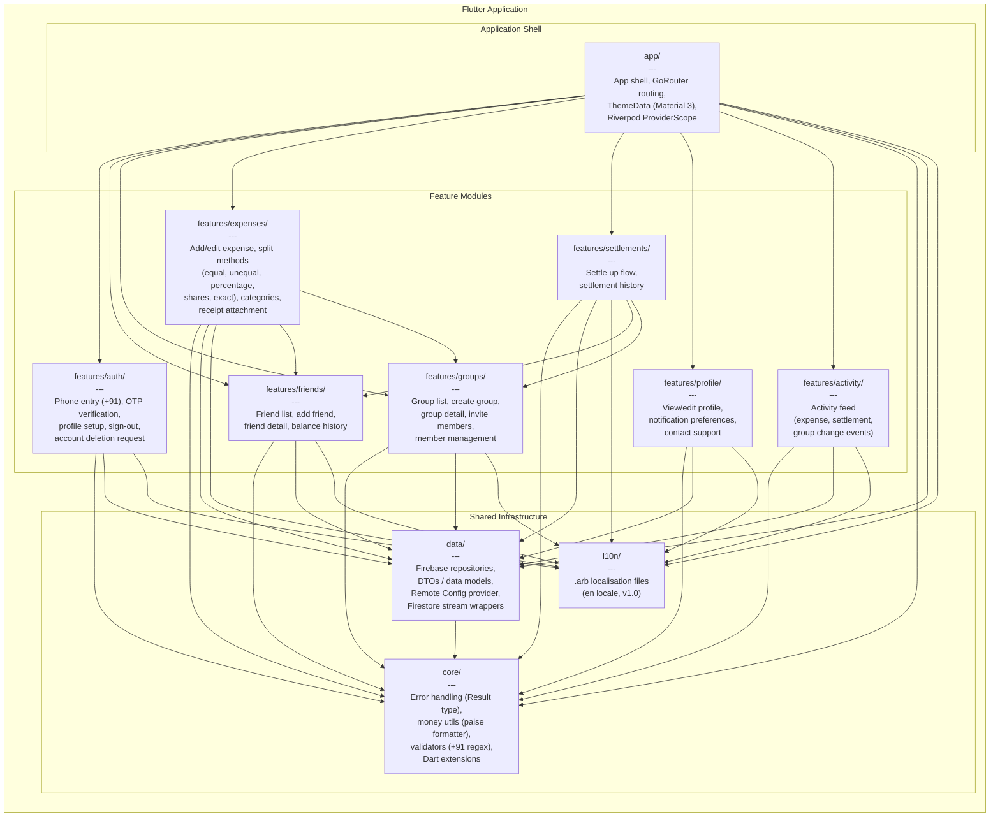
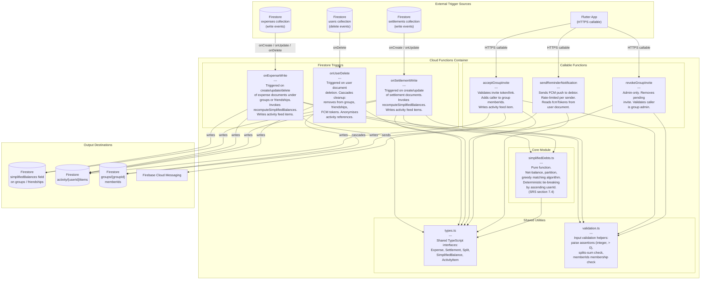

# C4 Component Diagrams -- OneByTwo

**Document type:** Architecture design -- C4 Level 3 (Component)
**Version:** 1.0
**Last updated:** 2025-01-27

This document provides C4 component-level views for the two primary containers
in the OneByTwo system: the Flutter mobile application and the Cloud Functions
backend. The diagrams use Mermaid syntax and follow the module boundaries
defined in the SRS (sections 5.7, 7.1, 13.1).

---

## 1. Flutter Application Components

The Flutter app follows a feature-first folder layout (SRS section 5.7,
section 13.1). Modules are organised into four tiers: the application shell
(`app/`), shared infrastructure (`core/`, `data/`, `l10n/`), and
domain-specific feature modules under `features/`. Arrows indicate compile-time
dependencies -- a module at the tail depends on the module at the head.

State management uses Riverpod 2.x (ADR-0004, confirmed). Navigation uses
GoRouter (ADR-0007, proposed). Both are wired in the `app/` shell.

### Key dependency rules

1. **Feature modules never depend on each other**, with two justified
   exceptions: `expenses` and `settlements` reference `friends` and `groups`
   because expense creation and settlement flows require selecting a friend or
   group context (SRS sections 4.5, 4.6). These cross-feature references are
   restricted to shared identifiers and provider reads, not widget imports.

2. **All feature modules depend on `core/`, `data/`, and `l10n/`** for
   shared utilities, repository access, and localised strings respectively.

3. **`data/` depends on `core/`** for error types, money utilities, and
   validators. It does not depend on any feature module.

4. **`l10n/` and `core/` are leaf modules** with no internal dependencies on
   other application modules.

5. **`app/` is the composition root.** It wires the `ProviderScope`, registers
   GoRouter routes that reference feature-module screens, and applies the
   global `ThemeData`. It depends on every other module but no module depends
   on it.

---

## 2. Cloud Functions Components

The Cloud Functions backend (Node.js 20, TypeScript, region `asia-south1`) is
organised by trigger type, with a shared core module for the simplified-debts
algorithm and common utilities (SRS sections 7.1, 7.3, 7.4, 13.1).

### Trigger and data-flow notes

1. **`onExpenseWrite` and `onSettlementWrite`** are the only paths that invoke
   `simplifiedDebts.ts` and write to the `simplifiedBalances` field. This
   enforces Invariant 2 -- clients never write to `simplifiedBalances`
   (SRS sections 4.6, 7.3, 7.5).

2. **`simplifiedDebts.ts` is a pure function** with no Firestore or network
   dependencies. It accepts an array of expenses and settlements, returns a
   list of `{ from, to, amountPaise }` transfers. All monetary values are
   integer paise (Invariant 1). The algorithm is specified in SRS section 7.4
   and must be covered by its own unit-test suite (SRS section 5.7).

3. **`onUserDelete`** handles account deletion cascading. The deletion itself
   is initiated by the client calling Firebase Auth delete, which triggers
   this function. Heavy operations run server-side so the client cannot bypass
   invariants (SRS section 7.3).

4. **`acceptGroupInvite` and `revokeGroupInvite`** are callable functions
   rather than direct Firestore writes because group membership changes
   require server-side validation that the client cannot be trusted to perform
   (SRS section 7.3). Invite link resolution follows ADR-0015 (deep linking
   via Universal Links / App Links rather than deprecated Dynamic Links).

5. **`sendReminderNotification`** is callable rather than triggered because
   the reminder is user-initiated (SRS section 4.7). It reads `fcmTokens`
   from the target user's document and dispatches via Firebase Cloud
   Messaging.

6. **`validation.ts`** provides shared checks used by both triggers and
   callables: paise integrity (integer, greater than zero), splits-sum
   equality with expense amount, and membership verification. These mirror
   the Firestore Security Rules checks but are applied within function
   transactions for defence in depth (SRS section 7.5).

---

## References

| Section | Source |
|---|---|
| High-level architecture | SRS section 7.1 |
| Data model | SRS section 7.2 |
| Key architectural decisions | SRS section 7.3 |
| Simplified-debts algorithm | SRS section 7.4 |
| Security rules principles | SRS section 7.5 |
| Maintainability and feature-first structure | SRS section 5.7 |
| Suggested project structure | SRS section 13.1 |
| State management (Riverpod 2.x) | ADR-0004 |
| Navigation (GoRouter) | ADR-0007 |
| Deep linking (Universal Links / App Links) | ADR-0015 |
