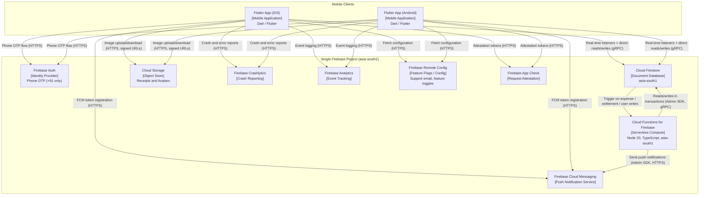

# C4 Container Diagram -- One By Two

> **Level:** Container (C4 Level 2)
> **System:** One By Two -- Expense Sharing Mobile Application
> **Author:** Solution Architect
> **SRS baseline:** v1.1

---

## Purpose

This document provides a C4 container-level view of the One By Two system. It
identifies every deployable unit (container), the technology each uses, and the
communication protocols between them. The diagram is the authoritative
reference for integration boundaries and data-flow direction.

All containers reside within a **single Firebase project** (Invariant 4; SRS
sections 3.4, 9.1). There are no staging or development projects. Pre-merge
testing runs exclusively against the Firebase Emulator Suite.

---

## Container Diagram

---

## Data-Flow Direction Notes

| Flow | Direction | Protocol | Notes |
|---|---|---|---|
| Flutter Apps to Firestore | Bidirectional | gRPC (Firebase SDK) | Clients open real-time snapshot listeners and perform direct reads/writes for user-authored data (SRS 7.1). |
| Flutter Apps to Auth | Client to server | HTTPS | Phone OTP request and verification; +91 only (SRS 3.4). |
| Flutter Apps to Storage | Bidirectional | HTTPS with signed URLs | Upload receipt images and avatars; download for display (SRS 7.1). |
| Flutter Apps to FCM | Client to server | HTTPS | Register device token stored in `users/{userId}.fcmTokens` (SRS 7.2). |
| Flutter Apps to Crashlytics | Client to server | HTTPS | Automatic crash reports and non-fatal error logs (SRS 7.1). |
| Flutter Apps to Analytics | Client to server | HTTPS | Structured event logging (SRS 7.1). |
| Flutter Apps to Remote Config | Client to server | HTTPS | Fetch feature flags and support email address (SRS 3.4). |
| Flutter Apps to App Check | Client to server | HTTPS | Attestation token sent with every backend request (SRS 7.1). |
| Firestore to Cloud Functions | Server-side trigger | Internal (Eventarc) | Document `onCreate`, `onUpdate`, `onDelete` triggers on expense, settlement, and user collections (SRS 7.3). |
| Cloud Functions to Firestore | Server to database | gRPC (Admin SDK) | Transactional reads/writes; computes and writes `simplifiedBalances` (SRS 7.3, 7.4; Invariant 2). |
| Cloud Functions to FCM | Server to service | HTTPS (Admin SDK) | Send notifications on expense creation, settlement, and group changes (SRS 7.1). |

---

## Invariant 4 -- Single Firebase Project

> *There is exactly one Firebase project: production. No staging or development
> projects exist. All pre-merge testing runs against the Firebase Emulator
> Suite. Introducing a second project ID in `firebase.json`, `.firebaserc`, or
> workflow files is forbidden.* -- Invariants (SRS sections 3.4, 9.1)

Every container shown in the diagram above belongs to this single project.
The Emulator Suite replicates Auth, Firestore, Functions, and Storage locally
for development and CI, removing the need for a separate environment (SRS 8.1,
8.2).

---

## Key Architectural Constraints

| Constraint | Source | Impact on Diagram |
|---|---|---|
| Single Firebase project, no staging | SRS 3.4, 9.1; Invariant 4 | All containers share one project boundary. |
| `simplifiedBalances` is server-maintained | SRS 7.3, 7.5; Invariant 2 | Only the Cloud Functions container writes this field; clients read only. |
| Money as integer paise | SRS 7.3; Invariant 1 | All `amountPaise` fields crossing container boundaries are integers. |
| System share sheet only | SRS 3.4; Invariant 3 | No external messaging-app containers appear; sharing is OS-level. |
| Cloud Functions region: asia-south1 | SRS 7.1 | Co-located with Firestore for low latency. |
| Node 20, TypeScript | SRS 7.1 | Cloud Functions runtime constraint. |
| +91 phone numbers only | SRS 3.4 | Auth container configured for Indian mobile numbers exclusively. |

---

## References

- SRS section 3.4 -- Design and Implementation Constraints
- SRS section 7.1 -- High-Level Architecture
- SRS section 7.2 -- Firestore Data Model
- SRS section 7.3 -- Key Architectural Decisions
- SRS section 9.1 -- Environment Reality
- `.github/shared/invariants.md` -- Non-negotiable invariants
