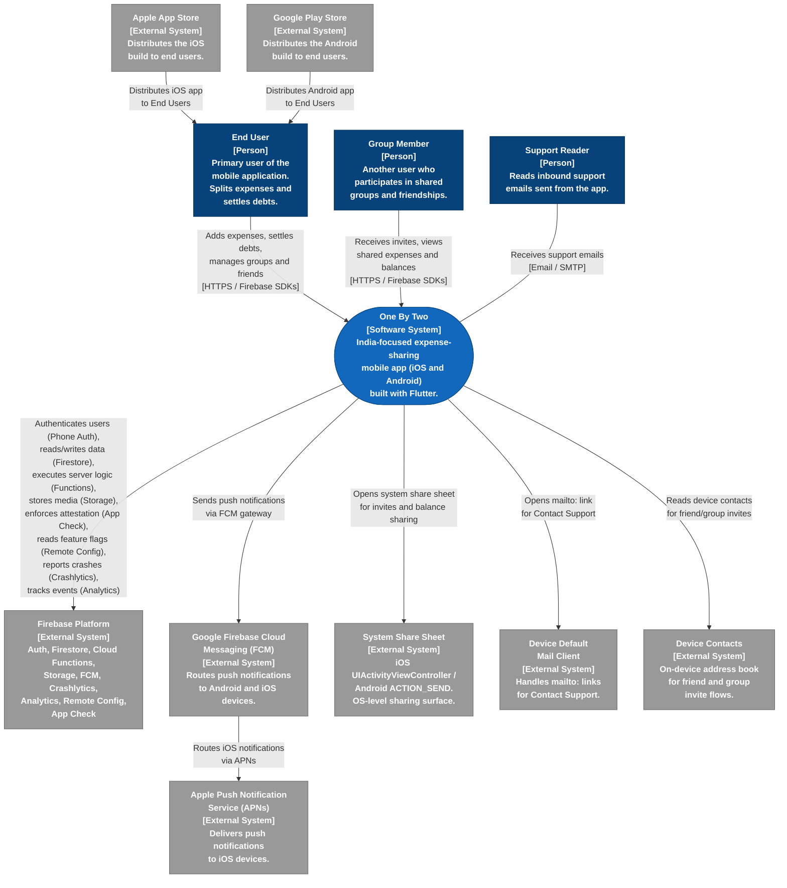

# C4 System-Context Diagram -- One By Two

> **C4 Level:** 1 -- System Context
> **Version:** 1.0
> **Date:** 2025-01-27
> **SRS baseline:** v1.1

This document presents the C4 system-context diagram for One By Two. It identifies
every actor (person) and external system with which the One By Two mobile application
interacts at the highest level of abstraction.

---

## Diagram

### Legend

| Colour / Shape | C4 Element | Meaning |
|---|---|---|
| Dark blue rectangle | Person | A human actor who interacts with the system. |
| Mid-blue rounded rectangle | Software System | The system under design (One By Two). |
| Grey rectangle | External System | A system outside the trust boundary that One By Two depends upon. |

Arrows indicate the direction of the primary interaction. Labels describe the
nature of the communication and, where relevant, the protocol.

---

## Explanatory Notes

The diagram above captures every external boundary of the One By Two system as
defined in the Software Requirements Specification v1.1.

**Actors.** Three actor types are shown. The *End User* and *Group Member* are
both holders of One By Two accounts authenticated via Firebase Phone Auth with a
locked +91 country code (SRS section 3.4). They are distinguished at the context
level because group-based interactions (expense sharing, simplified-debt
settlement, group invites) create a distinct relationship pattern. The *Support
Reader* is the human who triages inbound support emails; the app opens a `mailto:`
link pre-filled with diagnostic context (SRS sections 4.7 / FR-PR-05, 4.11 /
FR-SH-03), and the support address is held in Firebase Remote Config so it can
change without an app update (SRS section 3.5).

**Firebase Platform.** One By Two uses a single Firebase project for production
(SRS section 3.4; Invariant 4). Local development and pre-merge testing run
against the Firebase Emulator Suite -- no staging project exists. The Firebase
Platform box aggregates Auth, Firestore, Cloud Functions (Node 22 / TypeScript,
`asia-south1`), Cloud Storage, FCM, Crashlytics, Analytics, Remote Config, and
App Check (SRS sections 3.3, 7.1).

**Push Notifications.** FCM is the entry point for all push notifications. On
Android, FCM delivers directly; on iOS, FCM routes through APNs (SRS section
3.3). Both services are shown as separate external systems because they are
independently operated by Google and Apple respectively.

**App Distribution.** Signed builds are distributed through the Apple App Store
(iOS) and Google Play Store (Android) (SRS section 3.4). No alternative
distribution channels (side-loading, ad hoc) are supported in v1.0.

**System Share Sheet.** All outbound sharing -- friend invites, group invites,
balance sharing -- uses the platform's native share sheet (iOS
`UIActivityViewController`, Android `ACTION_SEND`). The app must not target or
import packages for any specific messaging application (SRS section 3.4;
Invariant 3).

**Device Contacts and Mail Client.** The app reads the on-device address book to
support friend and group invite flows (SRS section 3.1). The device default mail
client is invoked via a `mailto:` link for the Contact Support feature (SRS
section 3.4). Both are OS-level services outside the One By Two trust boundary.
