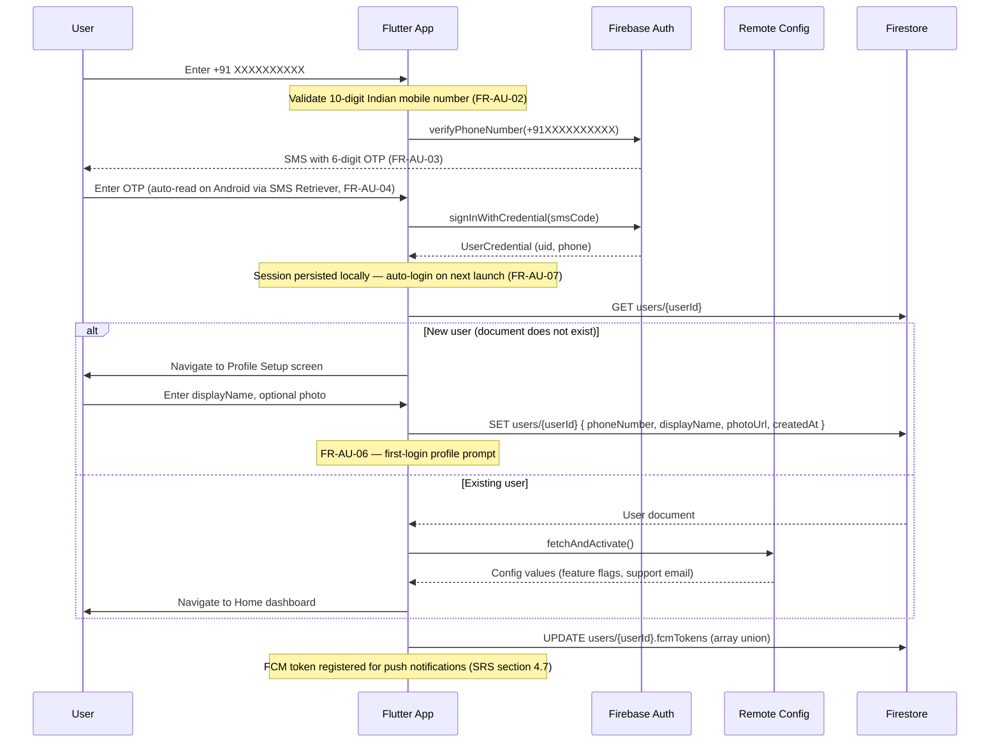
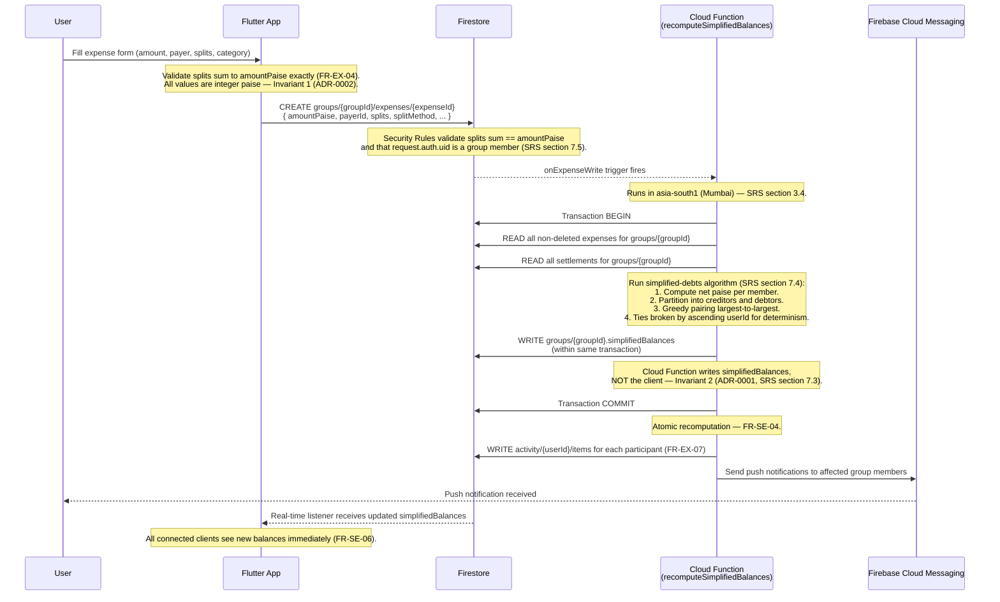
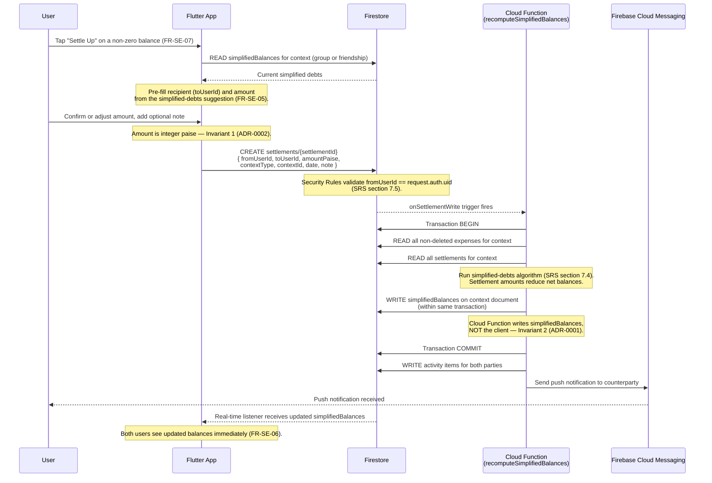
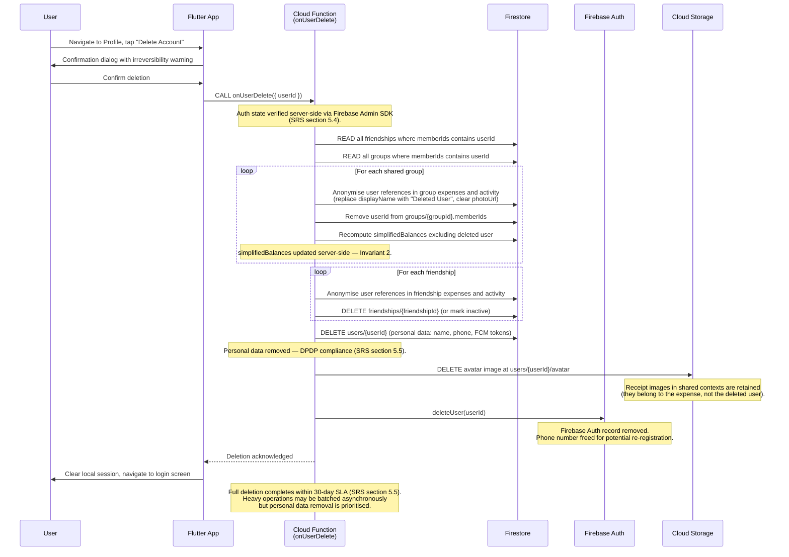

# Data Flow Diagrams

This document captures sequence diagrams for the four most critical data flows in
OneByTwo. Each diagram is rendered via Mermaid and annotated with the invariants
and SRS sections it enforces.

References:

- SRS: `docs/OneByTwo_Requirements_Spec.md` (version 1.1)
- Invariants: `.github/shared/invariants.md`
- Decision log: `.github/shared/decision-log.md`

---

## Flow 1 — Phone OTP Login

**Relevant requirements:** FR-AU-01 through FR-AU-07 (SRS section 4.1).
**Relevant decisions:** ADR-0003 (single Firebase project), ADR-0004 (Riverpod).

### Invariants enforced

- **Invariant 4 (single Firebase project):** The app authenticates against the
  sole production Firebase project. All pre-merge testing uses the Emulator Suite
  (ADR-0003, SRS section 9.1).
- Phone number is restricted to `+91` prefix — no multi-country auth paths exist
  (SRS section 3.4).

---

## Flow 2 — Add Expense in a Group

**Relevant requirements:** FR-EX-01 through FR-EX-07 (SRS section 4.5),
FR-SE-03, FR-SE-04 (SRS section 4.6).
**Relevant decisions:** ADR-0001 (simplified debts is the sole mechanism),
ADR-0002 (money as integer paise).

### Invariants enforced

- **Invariant 1 (money is integer paise):** `amountPaise` and every `sharePaise`
  value are integers. No floats cross any boundary — client, Firestore, or Cloud
  Function (ADR-0002, SRS section 7.3).
- **Invariant 2 (simplifiedBalances is server-maintained):** The client writes
  the expense document only. The `simplifiedBalances` field is written exclusively
  by the `recomputeSimplifiedBalances` Cloud Function inside a Firestore
  transaction. Security Rules block client writes to that field (SRS sections 4.6,
  7.3, 7.5).
- Split-sum validation is enforced at two layers: client-side before save
  (FR-EX-04) and server-side via Security Rules (SRS section 7.5).

---

## Flow 3 — Record Settlement

**Relevant requirements:** FR-SE-05 through FR-SE-08 (SRS section 4.6).
**Relevant decisions:** ADR-0001 (simplified debts is the sole mechanism),
ADR-0002 (money as integer paise).

### Invariants enforced

- **Invariant 1 (money is integer paise):** The settlement `amountPaise` is an
  integer. The pre-filled suggestion is read directly from `simplifiedBalances`,
  which is itself computed using integer arithmetic (ADR-0002).
- **Invariant 2 (simplifiedBalances is server-maintained):** Identical to Flow 2.
  The client creates a settlement document; the Cloud Function recomputes
  `simplifiedBalances` atomically (FR-SE-04, SRS section 7.3).
- **Security Rules:** `fromUserId` must equal `request.auth.uid`, preventing a
  user from recording a payment on behalf of someone else (SRS section 7.5).

---

## Flow 4 — Account Deletion

**Relevant requirements:** FR-AU-09 (SRS section 4.1), SRS section 5.5
(30-day SLA, DPDP compliance).
**Relevant decisions:** ADR-0003 (single Firebase project).

### Invariants enforced

- **Invariant 2 (simplifiedBalances is server-maintained):** When a user is
  removed from groups, the Cloud Function recomputes `simplifiedBalances` to
  reflect the removal. The client never touches this field.
- **Invariant 4 (single Firebase project):** Deletion operates against the sole
  production project. Auth record, Firestore documents, and Storage objects all
  reside in the same project (ADR-0003).
- **Security (SRS section 5.4):** The Cloud Function verifies authentication
  server-side via the Admin SDK. PII is never logged to Crashlytics or Analytics.
- **Privacy (SRS section 5.5):** All personal data (phone number, display name,
  photo, FCM tokens) is deleted or anonymised within 30 days. Shared financial
  records (expenses, settlements) are anonymised but retained for audit integrity,
  consistent with the soft-delete principle (SRS section 7.3).

---

## Cross-cutting notes

1. **Offline support (SRS section 4.10):** Flows 1 (login) and 4 (deletion)
   require network connectivity. Flows 2 and 3 benefit from Firestore's offline
   queue — the client write lands locally and syncs when connectivity resumes. The
   Cloud Function trigger fires only after the write reaches the server, so
   `simplifiedBalances` updates are not available offline.

2. **App Check (SRS section 5.4):** All Firestore, Storage, and Cloud Function
   requests are gated by App Check (Play Integrity on Android, DeviceCheck on
   iOS). This is not shown in the diagrams for clarity but applies to every
   client-to-backend arrow.

3. **Region:** All Cloud Functions execute in `asia-south1` (Mumbai) to minimise
   latency for the India-focused user base (SRS section 3.4).

4. **Determinism (SRS section 7.4):** The simplified-debts algorithm breaks ties
   by ascending `userId`, guaranteeing that any two executions over the same
   input produce identical output. This is critical because ADR-0001 establishes
   simplified debts as the sole debt mechanism — there is no fallback view.
