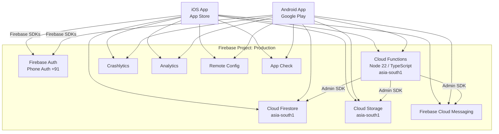
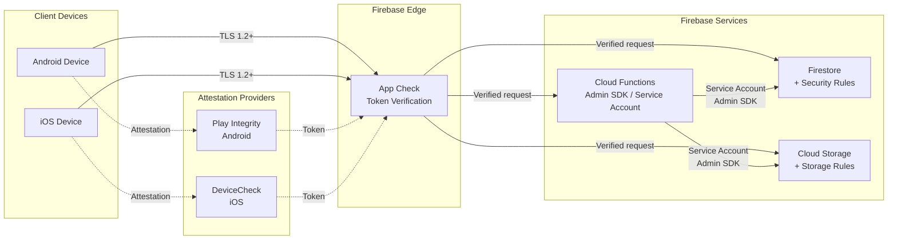

# Deployment Topology

This document describes the deployment topology for One By Two, covering the
single-project architecture, regional configuration, network security posture,
environment strategy, deployment pipeline, and production safety controls.

All statements herein are derived from the Software Requirements Specification
(SRS) version 1.1 and the Architecture Decision Records in
`.github/shared/decision-log.md`.

---

## 1. Single-Project Architecture

One By Two operates on exactly **one** Firebase project: production. No staging,
QA, or development Firebase projects exist (SRS section 9.1; invariant 4;
ADR-0003).

This constraint is non-negotiable. Introducing a second project ID in
`firebase.json`, `.firebaserc`, or any workflow file is a blocking defect
(invariant 4). All pre-merge testing runs against the Firebase Emulator Suite,
both locally and in CI (SRS section 8.1).

The rationale, recorded in ADR-0003, is that multi-environment setups add
operational complexity, cost, and configuration-drift risk that are not justified
for a v1.0 product. Feature flags via Firebase Remote Config and a staged rollout
strategy compensate for the absence of a pre-production environment.

---

## 2. Regional Configuration

All data-plane services are pinned to `asia-south1` (Mumbai) to minimise latency
for the Indian user base (SRS section 5.2). Global services are multi-region by
default and do not require regional configuration.

| Service | Region | Notes |
|---|---|---|
| Cloud Firestore | `asia-south1` (Mumbai) | Primary data store. Region is immutable after project creation. |
| Cloud Functions | `asia-south1` (Mumbai) | All functions region-pinned to co-locate with Firestore (SRS section 5.2). |
| Cloud Storage | `asia-south1` (Mumbai) | Receipts and avatar images. Co-located with Firestore. |
| Firebase Auth | Global | Multi-region by default. Phone Auth restricted to +91 numbers (SRS section 3.4). |
| Firebase Cloud Messaging | Global | Push notification delivery is managed globally by Google infrastructure. |
| Crashlytics | Global | Crash reporting aggregated globally. PII must never be logged (SRS section 5.4). |
| Analytics | Global | Event data processed globally. PII exclusion rules apply (SRS section 5.4). |
| Remote Config | Global | Feature flags and support email address (ADR-0006). |
| App Check | Global | Attestation verification is global; enforcement is per-service. |

---

## 3. Network Architecture

All client-to-Firebase traffic is encrypted with TLS 1.2 or higher, enforced by
Firebase by default (SRS section 5.4). App Check provides an additional layer of
attestation to ensure that only genuine app instances can access backend
resources.

**Enforcement points:**

- **Firestore Security Rules** enforce that a user can only read or write data
  for which they are a participant (`memberIds` / own profile). The
  `simplifiedBalances` field is read-only to clients; only the Cloud Functions
  service account may write it (SRS section 7.5; invariant 2).
- **Storage Security Rules** enforce that receipt images are accessible only to
  expense participants. Images are served via signed URLs (SRS section 5.4).
- **Cloud Functions** verify authentication state server-side via the Firebase
  Admin SDK on every invocation (SRS section 5.4).
- **App Check** is enabled for Firestore, Storage, and Cloud Functions, using
  Play Integrity on Android and DeviceCheck on iOS (SRS section 5.4).

---

## 4. Environment Strategy

| Environment | Infrastructure | Purpose |
|---|---|---|
| Production | Single Firebase project | Live user traffic. The only real Firebase project (invariant 4). |
| Development | Firebase Emulator Suite (localhost) | Local development and manual testing (SRS section 8.1). |
| CI | Firebase Emulator Suite (GitHub Actions runner) | Automated testing on every pull request (SRS section 9.2.1). |

There is no staging project (invariant 4; ADR-0003). The absence of a
pre-production environment is mitigated by:

1. **Firebase Emulator Suite** — provides a high-fidelity local replica of Auth,
   Firestore, Cloud Functions, and Storage for integration testing (SRS section
   8.1).
2. **Feature flags via Remote Config** — critical new features ship behind
   Remote Config flags so they can be disabled without a client rollback (SRS
   section 9.4; ADR-0003).
3. **Staged rollout** — app updates are promoted through percentage-based
   rollout tiers (10%, 50%, 100%) to limit blast radius (SRS section 9.4).
4. **Manual approval gates** — GitHub Environments require explicit approval
   before any deployment reaches production (SRS section 9.4).

If One By Two's scale grows significantly beyond v1.0, a staging project may be
reconsidered in a future ADR (ADR-0003).

---

## 5. Deployment Pipeline

The deployment pipeline is split into two workflows: the PR pipeline (continuous
integration) and the release pipeline (continuous delivery). Both are
implemented as GitHub Actions workflows (SRS section 9.2).

```mermaid
flowchart LR
    subgraph "PR Pipeline"
        direction LR
        PR[Pull Request] --> CI_TESTS["CI Tests<br/>(Emulator Suite)"]
        CI_TESTS --> MERGE[Merge to main]
    end

    subgraph "Release Pipeline"
        direction LR
        TAG["Tag v*.*.*<br/>on main"] --> GUARD[Full Test Suite<br/>Guard Run]
        GUARD --> DEPLOY_RULES[Deploy Rules<br/>and Indexes]
        DEPLOY_RULES --> DEPLOY_CF[Deploy<br/>Cloud Functions]
        DEPLOY_CF --> BUILD_APPS[Build Signed<br/>Apps]
        BUILD_APPS --> UPLOAD[Upload to<br/>Play / TestFlight]
        UPLOAD --> APPROVAL[Manual Approval<br/>GitHub Environments]
        APPROVAL --> ROLLOUT["Staged Rollout<br/>10% → 50% → 100%"]
    end

    MERGE --> TAG
```

**PR pipeline** (SRS section 9.2.1):

1. Triggered on `pull_request` to `main`.
2. Checkout, set up Flutter and Node 22.
3. `dart format --set-exit-if-changed`, `flutter analyze`, `flutter test --coverage`.
4. Cloud Functions: `npm ci`, `npm run lint`, `npm test`.
5. Spin up Firebase Emulator Suite; run integration tests including
   simplified-debts canonical cases.
6. Build (unsigned) for both iOS and Android to catch build errors.
7. Fail if coverage is below threshold.

**Release pipeline** (SRS section 9.2.2):

1. Triggered by a Git tag matching `v*.*.*` on `main`, or manual
   `workflow_dispatch`.
2. Full test suite re-run as a guard.
3. Deploy Firestore Security Rules, indexes, and Cloud Functions to the
   production Firebase project via Firebase CLI (using `FIREBASE_TOKEN` secret).
4. Build signed Android App Bundle (`.aab`) via Fastlane; upload to Google Play
   Internal Track.
5. Build signed iOS `.ipa` via Fastlane `match`; upload to TestFlight.
6. Promotion to Play Production and App Store Review requires manual approval
   via GitHub Environments protection rules, with QA sign-off (SRS section
   9.2.2).
7. Post-deploy: smoke-test production Cloud Functions via synthetic monitor;
   create GitHub Release with auto-generated release notes.

---

## 6. Production Safety Controls

The following controls protect the single production project from regressions
and reduce blast radius (SRS section 9.4).

### Branch Protection on `main`

- No direct pushes to `main`; all changes arrive via pull request.
- No force-push permitted.
- Signed commits required.
- The PR pipeline must pass before merge (required status checks).

### GitHub Environments with Manual Approval

Three GitHub Environments gate production deployments (SRS section 9.4):

| Environment | Approver | Scope |
|---|---|---|
| `production-firebase` | Architect | Firestore rules, indexes, Cloud Functions |
| `production-android` | QA | Google Play upload and promotion |
| `production-ios` | QA | TestFlight upload and App Store submission |

No deployment proceeds without explicit approval from the designated reviewer.

### Staged Rollout

App updates are promoted through percentage-based tiers to limit the impact of
undetected defects:

1. **10%** — initial canary release to a small user segment.
2. **50%** — expanded release after monitoring for regressions.
3. **100%** — full rollout.

### Remote Config Feature Flags

Critical new features ship behind Firebase Remote Config flags (SRS section 9.4;
ADR-0003). If a feature causes issues in production, it can be disabled
server-side without requiring a client rollback or app store review cycle. The
support email address is also held in Remote Config (ADR-0006).

### Rollback Strategy

Previous release artefacts — `.aab`, `.ipa`, and Cloud Function source — are
retained for 90 days as GitHub Actions workflow artefacts (SRS section 9.4).
In the event of a critical defect:

- **Cloud Functions and rules:** redeploy the previous version from retained
  artefacts.
- **Client apps:** halt the staged rollout and revert to the previous version
  on the respective app store, or disable the faulty feature via Remote Config.
