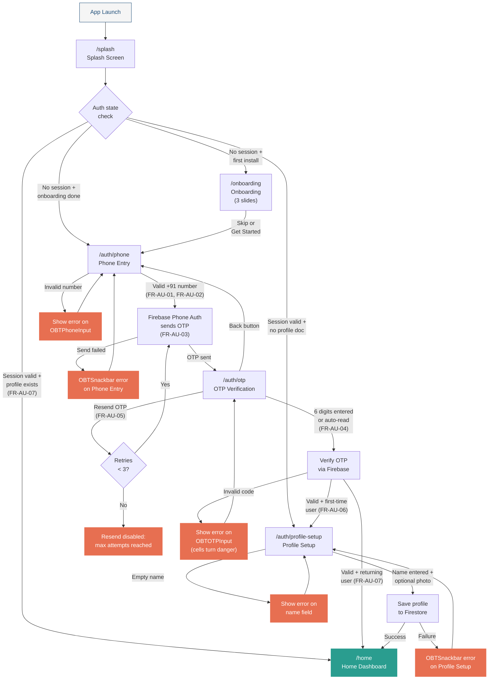

# Auth Flow Wireframes

> **Document status:** Draft
> **SRS version:** 1.1
> **Audience:** Flutter Developer, Solution Architect, QA Engineer
> **Design system reference:** `docs/design/02-design-system/components.md`
> **Information architecture reference:** `docs/design/01-information-architecture/site-map.md`

This document provides screen-by-screen wireframe specifications for the One By Two authentication and onboarding flow. Each screen includes an ASCII layout diagram, all interactive states, the component catalogue entries consumed, and the SRS requirements satisfied.

> **Status.** Splash, Phone Entry, OTP, Profile Setup are implemented (`lib/features/auth/presentation/`). **Onboarding is not implemented** (Splash routes straight to Phone Entry). Routes shown are illustrative — there is no GoRouter; navigation is auth-state-switched + `Navigator.push`.

---

## 1. Splash Screen

**Route:** `/splash`
**Navigation type:** Initial route. Replaces to `/onboarding`, `/auth/phone`, or `/home` based on auth state (site-map section 2.1).

### 1.1 Layout Diagram

```
+--------------------------------------+
|            STATUS BAR                |
|                                      |
|                                      |
|                                      |
|                                      |
|                                      |
|          +------------+              |
|          |            |              |
|          |  APP LOGO  |              |
|          |  (centred) |              |
|          +------------+              |
|                                      |
|       "Split it. Settle it.          |
|            Simple."                  |
|        [tagline, muted]             |
|                                      |
|                                      |
|        [indeterminate dot            |
|         loader, primary]            |
|                                      |
|                                      |
|                                      |
+--------------------------------------+
```

### 1.2 Behaviour

The splash screen is non-interactive. On mount, it initiates an auth state check against Firebase Auth:

1. If the user holds a valid session **and** a `users/{userId}` document exists in Firestore, navigate to `/home` via `replace` (FR-AU-07).
2. If the user holds a valid session but no profile document exists, navigate to `/auth/profile-setup` via `replace` (FR-AU-06).
3. If no session exists and the local `onboardingCompleted` flag is `false` (first install), navigate to `/onboarding` via `replace`.
4. If no session exists and onboarding has been completed previously, navigate to `/auth/phone` via `replace`.

The auth check and navigation must complete within the motion window of 200--300 ms after the logo animation finishes (SRS section 6.2). A minimum display time of 1500 ms ensures the logo is visible even on fast connections.

### 1.3 States

| State | Visual | Duration |
|---|---|---|
| Default (loading) | Logo centred, tagline below, indeterminate three-dot loader beneath tagline in `primary` (`#1F4E79`). | 1500 ms minimum. |
| Auth check failed (network) | Logo remains. Loader replaced by inline error text: `"Could not connect. Check your internet and try again."` A `"Retry"` text button appears below in `primary`. | Persists until user taps Retry or connectivity restores. |

### 1.4 Components Used

| Component | Catalogue ref | Usage |
|---|---|---|
| -- | -- | No catalogue components; bespoke branded layout. The loader is a custom three-dot animation in `primary`. |

### 1.5 Accessibility

- Logo image carries semantic label: `"One By Two app logo"`.
- Tagline is announced as body text.
- Loader announces `"Loading, please wait"` as a live region.
- Error state announces the error message and Retry button.
- Contrast: tagline text on `surface` background must meet 4.5:1 ratio (SRS section 5.6).

### 1.6 SRS Requirements Covered

| Requirement | How satisfied |
|---|---|
| FR-AU-07 | Auto-login check; persisted session navigates directly to Home. |
| Section 6.3 item 1 | Splash screen with logo. |
| Section 6.4 | Error state with retry affordance for network failure. |

---

## 2. Onboarding

**Route:** `/onboarding`
**Navigation type:** Shown only on first install. Replaces to `/auth/phone` on completion (site-map section 2.1).

### 2.1 Layout Diagram

```
+--------------------------------------+
|            STATUS BAR                |
|                                [Skip]|
|                                      |
|                                      |
|          +------------------+        |
|          |                  |        |
|          |   ILLUSTRATION   |        |
|          |   (slide N/3)    |        |
|          |   ~200dp tall    |        |
|          |                  |        |
|          +------------------+        |
|                                      |
|       "Slide Title"                  |
|       [heading, primary, centred]    |
|                                      |
|       "Slide description text        |
|        explaining the feature."      |
|       [body, muted, centred]         |
|                                      |
|           o  .  .                    |
|       [dot pagination indicator]     |
|                                      |
|    +----------------------------+    |
|    |     NEXT / GET STARTED     |    |
|    |  [primary filled button]   |    |
|    +----------------------------+    |
|           24dp bottom padding        |
+--------------------------------------+
```

### 2.2 Slide Content

| Slide | Title | Description | Illustration theme |
|---|---|---|---|
| 1 | "Track every rupee" | "Add expenses with friends and groups. We handle the maths." | Two friends splitting a restaurant bill, Indian setting. |
| 2 | "See who owes what" | "Simplified balances show you the easiest way to settle up." | Balance summary with arrows between avatars. |
| 3 | "Settle up, stress-free" | "Record payments and stay on top of shared spending." | A checkmark over a completed settlement. |

Microcopy follows the friendly, concise tone specified in SRS section 6.5.

### 2.3 Behaviour

- Slides are horizontally swipeable with a `PageView`.
- Dot pagination reflects the current slide index (3 dots, active dot in `primary`, inactive in muted grey).
- **"Skip"** text button in the top-right corner navigates directly to `/auth/phone` via `replace`. Visible on slides 1 and 2; hidden on slide 3.
- **"Next"** button advances to the next slide (slides 1 and 2).
- **"Get Started"** button replaces the "Next" button on slide 3 and navigates to `/auth/phone` via `replace`.
- On completion (Skip or Get Started), the local `onboardingCompleted` flag is set to `true` so the slides are never shown again.

### 2.4 States

| State | Visual |
|---|---|
| Default (slide 1) | First illustration, "Skip" visible, "Next" button, first dot active. |
| Slide 2 | Second illustration, dot 2 active. |
| Slide 3 | Third illustration, "Skip" hidden, "Get Started" button replaces "Next", dot 3 active. |
| Swiping | Crossfade between illustrations; dots animate position; 200--300 ms ease-in-out (SRS section 6.2). |

There is no error or loading state for onboarding; all content is bundled locally.

### 2.5 Components Used

| Component | Catalogue ref | Usage |
|---|---|---|
| -- | -- | No catalogue components; bespoke onboarding layout. Buttons follow the standard filled-button style from the design tokens (corner radius 16 dp, `primary` fill, white label). |

### 2.6 Accessibility

- Each illustration is decorative: `excludeSemantics: true`.
- Slide title announced as a heading.
- Slide description announced as body text.
- Dot pagination announced as `"Page [N] of 3"`.
- "Skip" button labelled `"Skip onboarding"`.
- "Next" / "Get Started" buttons use their visible text as semantic labels.
- All buttons meet 48x48 dp minimum tap target (SRS section 5.6).

### 2.7 SRS Requirements Covered

| Requirement | How satisfied |
|---|---|
| Section 6.3 item 1 | Three illustrated onboarding slides. |
| Section 5.6 | Tap targets, contrast ratios, screen-reader labels. |
| Section 6.5 | Friendly, concise microcopy. |

---

## 3. Phone Entry

**Route:** `/auth/phone`
**Navigation type:** `push` to `/auth/otp` on success. User can navigate back to correct their number from OTP screen (site-map section 2.1).

### 3.1 Layout Diagram

```
+--------------------------------------+
|            STATUS BAR                |
|                                      |
|                                      |
|       "Enter your mobile             |
|        number"                       |
|       [heading, primary]             |
|                                      |
|       "We'll send you a 6-digit      |
|        code to verify."             |
|       [body, muted]                  |
|                                      |
|    +------+--------------------------+
|    | +91  |  Enter mobile number     |
|    | [locked] [10-digit input]       |
|    +------+--------------------------+
|    | "Please enter a valid 10-digit  |
|    |  mobile number"                 |
|    | [error text, danger, hidden     |
|    |  until validation fails]        |
|    +------+--------------------------+
|                                      |
|                                      |
|                                      |
|                                      |
|                                      |
|                                      |
|    +----------------------------+    |
|    |        CONTINUE            |    |
|    |  [primary filled button]   |    |
|    +----------------------------+    |
|           24dp bottom padding        |
+--------------------------------------+
```

### 3.2 Behaviour

- The `+91` country code prefix is locked and non-editable (FR-AU-01).
- The numeric keyboard opens automatically on screen mount (`autoFocus: true`).
- Input is formatted as `XXXXX XXXXX` with a space after the fifth digit for readability.
- **"Continue" button** is disabled (muted appearance, non-interactive) until exactly 10 digits have been entered.
- On press of "Continue":
  1. Client-side validation runs: the number must start with 6, 7, 8, or 9 (FR-AU-02). If invalid, the error state is shown.
  2. If valid, the screen transitions to loading state and triggers Firebase Phone Auth to send a 6-digit OTP (FR-AU-03).
  3. On success, `push` navigates to `/auth/otp`, passing the phone number as a route parameter.
  4. On failure (e.g., too many requests, network error), the error state is shown with the Firebase error mapped to user-friendly copy.

### 3.3 States

| State | Visual | Trigger |
|---|---|---|
| Default (empty) | Heading, subtitle, empty `OBTPhoneInput` with placeholder, "Continue" button disabled (muted fill, no ripple). | Screen mount. |
| Focused (typing) | `OBTPhoneInput` bottom border in `primary`; digits appear with live formatting; "Continue" remains disabled until 10 digits. | User begins typing. |
| Valid (10 digits) | `OBTPhoneInput` filled; "Continue" button becomes active (`primary` fill, white label). | 10 valid digits entered. |
| Error (invalid number) | `OBTPhoneInput` border turns `danger`; `errorText` appears: `"Please enter a valid 10-digit mobile number"`. "Continue" button remains disabled. | Submit attempted with number not starting with 6/7/8/9 or fewer than 10 digits. |
| Loading (sending OTP) | "Continue" button label replaced by an indeterminate circular progress indicator in white; button non-interactive. `OBTPhoneInput` disabled (greyed, keyboard dismissed). | "Continue" tapped with valid number. |
| Error (OTP send failed) | Loading ends. `OBTPhoneInput` re-enabled. An `OBTSnackbar` of type `error` appears: `"Could not send the code. Please try again."`. "Continue" button returns to active state. | Firebase Phone Auth returns an error. |

### 3.4 Components Used

| Component | Catalogue ref | Usage |
|---|---|---|
| `OBTPhoneInput` | Component 8 | Locked `+91` prefix, 10-digit input, formatting, validation states. |
| `OBTSnackbar` | Component 25 | Error feedback when OTP send fails. Type: `error`. |

### 3.5 Accessibility

- Heading announced as a heading (`Semantics(header: true)`).
- `OBTPhoneInput` semantic label: `"Phone number, India country code plus 91"` (catalogue spec).
- Error text announced on state change.
- "Continue" button labelled `"Continue"`. When disabled, announced as `"Continue, disabled"`.
- All tap targets meet 48x48 dp minimum (SRS section 5.6).
- Contrast: heading (`primary` `#1F4E79`) on `surface` (`#FFFFFF`) = approximately 8.5:1, exceeds 4.5:1 (SRS section 5.6).

### 3.6 SRS Requirements Covered

| Requirement | How satisfied |
|---|---|
| FR-AU-01 | Locked `+91` prefix; phone-number-only authentication. |
| FR-AU-02 | Client-side validation rejects non-10-digit and non-Indian-mobile prefixes. |
| FR-AU-03 | Triggers Firebase Phone Auth OTP on valid submission. |
| Section 6.3 item 2 | Phone-number entry screen layout. |
| Section 6.4 | Error state with actionable retry (snackbar); loading state replaces button. |
| Section 5.6 | Tap targets, contrast, screen-reader labels, dynamic font scaling. |

---

## 4. OTP Verification

**Route:** `/auth/otp`
**Navigation type:** `replace` to `/auth/profile-setup` (first-time user) or `/home` (returning user). User can `pop` back to `/auth/phone` to correct their number (site-map section 2.1).

### 4.1 Layout Diagram

```
+--------------------------------------+
|  [<- Back]     STATUS BAR            |
|                                      |
|       "Verify your number"           |
|       [heading, primary]             |
|                                      |
|       "Enter the 6-digit code sent   |
|        to +91 98765 43210"           |
|       [body, muted; number in bold]  |
|                                      |
|    +----+----+----+----+----+----+   |
|    |    |    |    |    |    |    |   |
|    | _  | _  | _  | _  | _  | _  |   |
|    |    |    |    |    |    |    |   |
|    +----+----+----+----+----+----+   |
|    | "Incorrect code, try again"     |
|    | [error text, danger, hidden     |
|    |  until verification fails]      |
|    +----+----+----+----+----+----+   |
|                                      |
|      [Android: auto-reading...       |
|       indicator, muted, optional]    |
|                                      |
|       "Resend code in 0:27"          |
|       [countdown, muted, centred]    |
|                                      |
|       "Resend OTP"                   |
|       [text button, disabled         |
|        during cooldown]              |
|                                      |
|                                      |
|                                      |
+--------------------------------------+
```

### 4.2 Behaviour

- Six individual cells, each 48x48 dp, accept one digit each (FR-AU-03).
- Cursor auto-advances to the next cell on digit entry; auto-retreats on backspace.
- On Android, the SMS Retriever API attempts to auto-read the OTP. While listening, a muted indicator reads `"Reading code automatically..."`. On successful auto-read, all six cells populate and `onCompleted` fires immediately (FR-AU-04).
- On iOS, clipboard paste is supported if the pasted string is exactly six digits.
- When all six digits are entered (`onCompleted` fires), verification begins automatically -- no separate "Verify" button is needed.
- **Back button** (top-left) pops to `/auth/phone` so the user can correct their number.

#### Resend Logic (FR-AU-05)

- A 30-second countdown timer begins when the screen mounts. Displayed as `"Resend code in 0:XX"` in muted text.
- **"Resend OTP"** text button is disabled (muted, non-interactive) while the countdown is active.
- When the countdown reaches zero, the button becomes active (`primary` colour).
- Each tap of "Resend OTP" resets the 30-second countdown and decrements the retry counter.
- After 3 resend attempts within a 10-minute window, the button is permanently disabled with text: `"Maximum resend attempts reached. Please try again later."`.

### 4.3 States

| State | Visual | Trigger |
|---|---|---|
| Default (empty) | Six empty cells with muted bottom borders. Countdown running. "Resend OTP" disabled. | Screen mount. |
| Focused (typing) | Active cell has `primary` bottom border and blinking cursor. Filled cells show centred digits. | User enters digits. |
| Auto-reading (Android) | Muted text below cells: `"Reading code automatically..."`. Cells remain empty until auto-read completes. | SMS Retriever listening. |
| Verifying (loading) | All six cells filled. Cells replaced by a centred indeterminate progress indicator in `primary`. Input disabled. | All 6 digits entered or auto-read completes. |
| Error (invalid OTP) | All cell borders turn `danger`. Error text: `"Incorrect code, try again"`. Cells clear after 1 second. Input re-enabled for retry. | Firebase returns invalid-code error. |
| Error (network) | `OBTSnackbar` of type `error`: `"Could not verify. Check your connection and try again."`. Cells retain entered digits. Input re-enabled. | Network failure during verification. |
| Resend available | Countdown text hidden. "Resend OTP" button in `primary`, interactive. | Countdown reaches zero. |
| Resend exhausted | "Resend OTP" button permanently disabled. Text: `"Maximum resend attempts reached. Please try again later."` in muted colour. | 3 retries used within 10-minute window. |
| Success | Brief checkmark animation in `success` colour replaces the cells (200 ms); then navigates. | OTP verified successfully. |

### 4.4 Components Used

| Component | Catalogue ref | Usage |
|---|---|---|
| `OBTOTPInput` | Component 7 | Six-cell OTP entry with auto-advance, auto-read, error, and loading states. |
| `OBTAppBar` | Component 1 | Back button to return to Phone Entry. `showBackButton: true`. |
| `OBTSnackbar` | Component 25 | Network error feedback. Type: `error`. |

### 4.5 Accessibility

- `OBTOTPInput` group label: `"Enter 6-digit verification code"` (catalogue spec).
- Each cell announces `"Digit [N] of 6"` on focus.
- On completion, announces `"Verification code entered"`.
- Error state announces error text.
- Countdown timer is a live region, announcing remaining time periodically (every 10 seconds) to avoid excessive announcements.
- "Resend OTP" button: when disabled, announced as `"Resend OTP, disabled, [remaining seconds] seconds remaining"`. When active, announced as `"Resend OTP, button"`.
- "Back" button labelled `"Navigate back"` (catalogue spec for `OBTAppBar`).
- Auto-read indicator announces `"Attempting to read verification code automatically"`.
- All tap targets meet 48x48 dp minimum (SRS section 5.6).

### 4.6 SRS Requirements Covered

| Requirement | How satisfied |
|---|---|
| FR-AU-03 | 6-digit OTP entry and verification via Firebase Phone Auth. |
| FR-AU-04 | Auto-read via SMS Retriever on Android; manual entry on iOS; clipboard paste on iOS. |
| FR-AU-05 | 30-second cooldown; 3-retry cap per 10-minute window; UI disables resend accordingly. |
| Section 6.3 item 3 | OTP verification screen layout. |
| Section 6.4 | Error states (invalid code, network) with retry; loading state (progress indicator). |
| Section 5.6 | Tap targets, contrast, screen-reader labels. |
| Section 6.2 | 200--300 ms transitions; spring physics not applicable here. |

---

## 5. Profile Setup

**Route:** `/auth/profile-setup`
**Navigation type:** `replace` to `/home` on completion. No back navigation -- the user cannot return to the OTP screen (site-map section 2.1).

### 5.1 Layout Diagram

```
+--------------------------------------+
|            STATUS BAR                |
|                                      |
|       "Set up your profile"          |
|       [heading, primary]             |
|                                      |
|       "Tell us your name so your     |
|        friends recognise you."       |
|       [body, muted]                  |
|                                      |
|          +----------+                |
|          |          |                |
|          |  AVATAR  |                |
|          | (80 dp)  |                |
|          | initials |                |
|          | fallback |                |
|          +----------+                |
|            [camera]                  |
|          [edit badge]                |
|                                      |
|    +----------------------------+    |
|    | Display name               |    |
|    | [text field, required]     |    |
|    +----------------------------+    |
|    | "Please enter your name"   |    |
|    | [error, danger, hidden     |    |
|    |  until submit with empty]  |    |
|    +----------------------------+    |
|                                      |
|                                      |
|                                      |
|    +----------------------------+    |
|    |        CONTINUE            |    |
|    |  [primary filled button]   |    |
|    +----------------------------+    |
|           24dp bottom padding        |
+--------------------------------------+
```

### 5.2 Behaviour

- **Avatar picker:** A circular 80 dp avatar area centred horizontally. On first load, it shows the user's initial (derived from the first character typed into the display name field, or a generic person icon if the field is empty) on a hashed-colour background, matching `OBTUserAvatar` fallback behaviour.
- A small camera badge icon (24 dp, `primary` background, white icon) overlaps the bottom-right of the avatar circle.
- Tapping the avatar or the camera badge opens a bottom sheet with two options: `"Take photo"` (camera) and `"Choose from gallery"`. The photo is optional (FR-AU-06).
- If a photo is selected, it is cropped to a circle and displayed in the avatar area. The initials fallback is replaced.
- **Display name field:** A standard text field with label `"Display name"`. Required. Max 50 characters. Keyboard type: text (default).
- **"Continue" button:** Disabled (muted) until the display name field contains at least one non-whitespace character.
- On press of "Continue":
  1. Validate: display name must not be empty after trimming. If empty, show error state.
  2. If a photo was selected, upload it to Firebase Storage.
  3. Create or update the `users/{userId}` document in Firestore with `displayName` and optionally `photoUrl`.
  4. On success, `replace` navigate to `/home`.

### 5.3 States

| State | Visual | Trigger |
|---|---|---|
| Default (empty) | Generic person icon in avatar circle. Empty display name field with placeholder. "Continue" disabled. | Screen mount. |
| Typing | Avatar initial updates live as user types the first character. Field has `primary` bottom border. "Continue" becomes active once at least one non-whitespace character is entered. | User types in display name. |
| Photo selected | Avatar shows cropped photo. Camera badge remains for changing the selection. | User picks a photo from camera or gallery. |
| Error (empty name) | Display name field border turns `danger`. Error text: `"Please enter your name"`. "Continue" remains disabled. | "Continue" tapped with empty/whitespace-only name. |
| Loading (saving) | "Continue" button label replaced by circular progress indicator in white. Display name field and avatar picker disabled. | "Continue" tapped with valid input. |
| Error (save failed) | Loading ends. Fields re-enabled. `OBTSnackbar` of type `error`: `"Could not save your profile. Please try again."`. "Continue" returns to active. | Firestore write or Storage upload fails. |
| Success | Brief transition; navigates to `/home`. | Profile saved successfully. |

### 5.4 Components Used

| Component | Catalogue ref | Usage |
|---|---|---|
| `OBTUserAvatar` | Component 11 | 80 dp size; displays selected photo or initials fallback. |
| `OBTSnackbar` | Component 25 | Error feedback on save failure. Type: `error`. |

### 5.5 Accessibility

- Heading announced as a heading.
- Avatar area semantic label: `"Profile photo. Tap to add a photo."`. When a photo is set: `"Profile photo set. Tap to change."`.
- Camera badge is excluded from semantics (the avatar carries the combined label).
- Bottom sheet options: `"Take photo, button"` and `"Choose from gallery, button"`.
- Display name field semantic label: `"Display name, required"`.
- Error text announced on state change.
- "Continue" button: disabled state announced as `"Continue, disabled"`.
- All tap targets meet 48x48 dp minimum. The avatar tap area is 80 dp (exceeds minimum). (SRS section 5.6.)

### 5.6 SRS Requirements Covered

| Requirement | How satisfied |
|---|---|
| FR-AU-06 | First-time user prompted for display name (required) and profile photo (optional). |
| Section 6.3 item 4 | Profile setup screen (name, photo). |
| Section 6.4 | Error states (empty name, save failure) with actionable copy; loading state on button. |
| Section 5.6 | Tap targets, contrast, screen-reader labels, dynamic font scaling. |
| Section 6.5 | Friendly microcopy: "Tell us your name so your friends recognise you." |

---

## 6. Authentication Flow Diagram

The following Mermaid flowchart traces all navigation paths through the authentication flow, including the returning-user shortcut.



### 6.1 Navigation Summary Table

| From | To | Type | Condition | SRS ref |
|---|---|---|---|---|
| Splash | Onboarding | `replace` | First install, no session | Section 6.3 item 1 |
| Splash | Phone Entry | `replace` | No session, onboarding done | FR-AU-07 |
| Splash | Profile Setup | `replace` | Session valid, no profile doc | FR-AU-06 |
| Splash | Home | `replace` | Session valid, profile exists | FR-AU-07 |
| Onboarding | Phone Entry | `replace` | Skip or Get Started | Section 6.3 item 1 |
| Phone Entry | OTP Verification | `push` | Valid number, OTP sent | FR-AU-03 |
| OTP Verification | Phone Entry | `pop` | Back button | -- |
| OTP Verification | Profile Setup | `replace` | Valid OTP, first-time user | FR-AU-06 |
| OTP Verification | Home | `replace` | Valid OTP, returning user | FR-AU-07 |
| Profile Setup | Home | `replace` | Profile saved | FR-AU-06 |

All `replace` transitions prevent the user from navigating backwards into completed auth steps (site-map section 2.1).

---

## 7. Extension Points

### 7.1 Consent and Privacy Checkboxes (v1.1 candidate)

The onboarding flow is the natural location for consent collection. In a future iteration:

- **Slide 3** (or a new slide 4) could include a mandatory checkbox: `"I agree to the Terms of Service and Privacy Policy"` with linked text opening in-app web views.
- The "Get Started" button would remain disabled until the checkbox is ticked.
- This does not affect the current screen count or routing; it extends the existing onboarding `PageView` with an additional page or an overlay on the final page.
- Design consideration: the checkbox and linked text must meet 48x48 dp tap target (SRS section 5.6) and 4.5:1 contrast ratio. The linked text should use `secondary` (`#F4A261`) on `surface` -- verify dark-mode contrast.

### 7.2 Social Login Providers (currently phone-only per FR-AU-01)

The Phone Entry screen is designed to accommodate future social login buttons below the phone input area:

```
+--------------------------------------+
|       ...existing layout...          |
|                                      |
|    +----------------------------+    |
|    |        CONTINUE            |    |
|    +----------------------------+    |
|                                      |
|       ---- or sign in with ----      |
|       [divider with centred text]    |
|                                      |
|    +----------------------------+    |
|    |  [G]  Continue with Google |    |
|    +----------------------------+    |
|                                      |
|    +----------------------------+    |
|    |  [A]  Continue with Apple  |    |
|    +----------------------------+    |
|                                      |
+--------------------------------------+
```

- Social login buttons would sit below a `"or sign in with"` divider, between the "Continue" button and the bottom safe area.
- Each button uses an outlined style (surface background, `primary` border, provider icon on the left).
- This extension does not require changes to the OTP or Profile Setup screens; the post-authentication routing logic (first-time vs. returning user) applies identically regardless of auth provider.
- **Not in scope for v1.0.** FR-AU-01 restricts authentication to phone number only.

---

## 8. Cross-Screen Design Tokens Applied

For reference, the following design token values from SRS section 6.2 are applied consistently across all five auth screens:

| Token | Value | Application in auth flow |
|---|---|---|
| `primary` | `#1F4E79` (light) / `#2E86AB` (dark) | Headings, active input borders, buttons, progress indicators. |
| `secondary` | `#F4A261` | Not used in auth flow (reserved for FAB and highlights in authenticated screens). |
| `success` | `#2A9D8F` | OTP success checkmark animation. |
| `danger` | `#E76F51` | Error text, error borders on inputs. |
| `surface` | `#FFFFFF` (light) / `#121212` (dark) | Screen backgrounds, input backgrounds. |
| `cornerRadiusSmall` | 16 dp | Buttons, input fields. |
| `cornerRadiusLarge` | 24 dp | Not used in auth flow (reserved for cards and sheets). |
| `motionStandard` | 200--300 ms ease-in-out | Screen transitions, button state changes, onboarding slide swipes. |
| `tapTargetMin` | 48x48 dp (Android) / 44x44 pt (iOS) | All buttons, OTP cells, avatar picker, back button. |
| Typography | Inter / Plus Jakarta Sans; system fallback | All text elements. Headings: semi-bold, 24 sp. Body: regular, 16 sp. Muted: regular, 14 sp. |