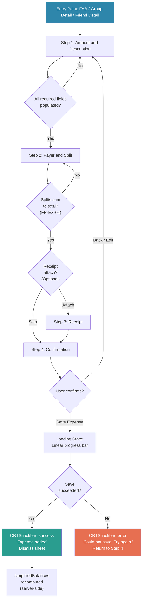
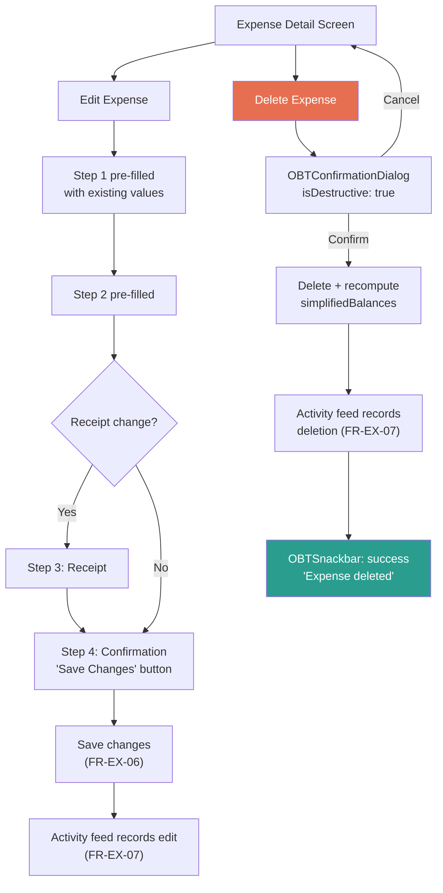

# Expense Flow Wireframes

> **Document owner:** UX/UI Designer
> **Version:** 1.0
> **Status:** Draft
> **Audience:** Flutter Developer, Solution Architect, QA Engineer
> **SRS baseline:** v1.1, sections 4.5 (FR-EX-01 through FR-EX-09), 6.3 (Core Screen 8), 6.4

This document specifies the Add/Edit/Delete Expense flow -- the most complex interaction in OneByTwo v1.0. The flow is implemented as a multi-step modal bottom sheet (SRS section 6.3, item 8) with four creation steps, plus edit and delete variants.

All monetary values arriving as props are **integer paise** (Invariant 1). Conversion to rupees with Indian numbering formatting is the responsibility of the UI layer. Currency symbol is always `₹` and amounts use the Indian numbering system (FR-EX-09).

---

## Flow Diagram



### Edit and Delete Sub-Flows



---

## Step 1: Amount and Description

### SRS Requirements

| ID | Requirement | Coverage |
|---|---|---|
| FR-EX-01 | Amount in ₹, description, date, category, optional notes | All fields on this step |
| FR-EX-08 | 8 predefined categories with icons | OBTCategoryChip grid |
| FR-EX-09 | ₹ symbol, Indian numbering system | OBTAmountInput live formatting |

### ASCII Layout

```
+--------------------------------------------------+
|  [x Close]        Add Expense (1/3)       [Next >]|
+--------------------------------------------------+
|                                                    |
|  Amount *                                          |
|  +----------------------------------------------+ |
|  | ₹  0.00                                      | |
|  +----------------------------------------------+ |
|  Preview: ₹1,23,456.00 (Indian numbering)         |
|                                                    |
|  Description *                                     |
|  +----------------------------------------------+ |
|  | e.g., Dinner at Dosa Plaza                    | |
|  +----------------------------------------------+ |
|                                                    |
|  Date                                              |
|  +----------------------------------------------+ |
|  | [calendar icon]  Today, 15 Jan 2025           | |
|  +----------------------------------------------+ |
|  {-- IA-EXT-02 slot: "Make this recurring" --}     |
|                                                    |
|  Category *                                        |
|  +----------+ +----------+ +----------+ +-------+ |
|  |[F] Food  | |[P] Travel| |[H] Rent  | |[B]Util| |
|  +----------+ +----------+ +----------+ +-------+ |
|  +----------+ +----------+ +----------+ +-------+ |
|  |[C] Grocer| |[M] Enter.| |[S] Shop  | |[..]Oth| |
|  +----------+ +----------+ +----------+ +-------+ |
|                                                    |
|  Notes (optional)                                  |
|  +----------------------------------------------+ |
|  | Add any extra details...                      | |
|  +----------------------------------------------+ |
|                                                    |
|  +----------------------------------------------+ |
|  |              [ Next: Split ---> ]             | |
|  +----------------------------------------------+ |
+--------------------------------------------------+
```

### Components Used

| Component | Props / Configuration | Reference |
|---|---|---|
| `OBTAmountInput` | `autoFocus: true`, `onChanged` returns paise, max `₹99,99,999.99` | Components catalogue, item 6 |
| `OBTCategoryChip` | 8 chips in 4x2 grid, `isSelected` toggles on tap | Components catalogue, item 12 |
| Date picker | Platform date picker, defaults to today, max date = today | Standard Flutter `showDatePicker` |
| Description field | Standard text input, max 100 characters | -- |
| Notes field | Multi-line text input, max 500 characters | -- |

### States

| State | Behaviour |
|---|---|
| **Default (empty)** | Amount shows `₹0.00` placeholder. Description empty. Date = today. No category selected. "Next" button disabled (`disabled` token). |
| **Partially filled** | "Next" button remains disabled until amount > 0, description non-empty, and category selected. |
| **Valid** | "Next" button becomes active in `primary` colour. |
| **Amount error** | `OBTAmountInput` shows `danger` border. Error text: "Enter an amount greater than zero." |
| **Description error** | `danger` border on description field. Error text: "Add a short description." |
| **Category missing** | Inline label in `danger` below the grid: "Pick a category." |
| **Loading (edit flow)** | `OBTSkeletonLoader` type `expenseDetail` while fetching existing values (SRS section 6.4). |

### Accessibility

- Sheet announced as: "Add expense, step 1 of 3."
- Close button label: "Close, discard expense."
- Each category chip: "[Category name] category, [selected/not selected]" (per components catalogue, item 12).
- Amount field semantic label: "Enter amount in rupees" (per components catalogue, item 6).
- All interactive elements meet 48x48 dp minimum tap target (SRS section 5.6).

---

## Step 2: Payer and Split

### SRS Requirements

| ID | Requirement | Coverage |
|---|---|---|
| FR-EX-01 | Payer, split method | Payer selector + split method selector |
| FR-EX-02 | Expense within friend or group context | Member list derived from context |
| FR-EX-03 | 5 split methods: Equal, Unequal, Percentage, Shares, Exact | OBTSplitMethodSelector |
| FR-EX-04 | Splits must sum to total; discrepancy blocks save with inline error | Running total + validation |

### ASCII Layout

```
+--------------------------------------------------+
|  [< Back]       Add Expense (2/3)         [Next >]|
+--------------------------------------------------+
|                                                    |
|  Total: ₹1,500.00                                  |
|                                                    |
|  Paid by                                           |
|  +----------------------------------------------+ |
|  | [avatar] You (default)              [v]       | |
|  +----------------------------------------------+ |
|                                                    |
|  Split method                                      |
|  [ Equal ] [ Unequal ] [ % ] [ Shares ] [ Exact ] |
|  ~~~~~~~~~~~~                                      |
|  "Split equally among all"                         |
|                                                    |
|  ---- Split breakdown ----                         |
|                                                    |
|  +----------------------------------------------+ |
|  | [av] You                          ₹500.00     | |
|  +----------------------------------------------+ |
|  | [av] Rahul                        ₹500.00     | |
|  +----------------------------------------------+ |
|  | [av] Priya                        ₹500.00     | |
|  +----------------------------------------------+ |
|                                                    |
|  Split total: ₹1,500.00  /  ₹1,500.00        [ok] |
|                                                    |
|  +----------------------------------------------+ |
|  |              [ Next: Review ---> ]            | |
|  +----------------------------------------------+ |
+--------------------------------------------------+
```

#### Unequal / By Amount Variant

```
+--------------------------------------------------+
|  Split method                                      |
|  [ Equal ] [*Unequal*] [ % ] [ Shares ] [ Exact ] |
|            ~~~~~~~~~~                              |
|  "Enter exact amounts for each person"             |
|                                                    |
|  +----------------------------------------------+ |
|  | [av] You           ₹ [  750.00         ]     | |
|  +----------------------------------------------+ |
|  | [av] Rahul         ₹ [  500.00         ]     | |
|  +----------------------------------------------+ |
|  | [av] Priya         ₹ [  250.00         ]     | |
|  +----------------------------------------------+ |
|                                                    |
|  Split total: ₹1,500.00  /  ₹1,500.00        [ok] |
+--------------------------------------------------+
```

#### By Percentage Variant

```
+--------------------------------------------------+
|  Split method                                      |
|  [ Equal ] [ Unequal ] [*%*] [ Shares ] [ Exact ] |
|                         ~~~                        |
|  "Assign a percentage to each person"              |
|                                                    |
|  +----------------------------------------------+ |
|  | [av] You           [  50  ] %    = ₹750.00   | |
|  +----------------------------------------------+ |
|  | [av] Rahul         [  30  ] %    = ₹450.00   | |
|  +----------------------------------------------+ |
|  | [av] Priya         [  20  ] %    = ₹300.00   | |
|  +----------------------------------------------+ |
|                                                    |
|  Percentage total: 100%  /  100%              [ok] |
+--------------------------------------------------+
```

#### By Shares Variant

```
+--------------------------------------------------+
|  Split method                                      |
|  [ Equal ] [ Unequal ] [ % ] [*Shares*] [ Exact ] |
|                               ~~~~~~~~~            |
|  "Assign share units to each person"               |
|                                                    |
|  +----------------------------------------------+ |
|  | [av] You          [-] 2 [+] shares  = ₹600.00| |
|  +----------------------------------------------+ |
|  | [av] Rahul        [-] 2 [+] shares  = ₹600.00| |
|  +----------------------------------------------+ |
|  | [av] Priya        [-] 1 [+] shares  = ₹300.00| |
|  +----------------------------------------------+ |
|                                                    |
|  Total shares: 5        Split total: ₹1,500.00    |
+--------------------------------------------------+
```

### Components Used

| Component | Props / Configuration | Reference |
|---|---|---|
| `OBTSplitMethodSelector` | `selectedMethod`, `onMethodChanged`, `availableMethods` (all five shown) | Components catalogue, item 21 |
| `OBTSplitEntryRow` | One per participant; `splitMethod` determines input type and suffix | Components catalogue, item 22 |
| `OBTUserAvatar` | Leading avatar in payer selector and each split row | Components catalogue, item 11 |
| `OBTRupeeText` | Calculated share display in Equal mode; running total display | Components catalogue, item 5 |

### Payer Selector Behaviour

- Defaults to the current user ("You").
- Tapping opens a scrollable list of all participants (group members or the friend pair per FR-EX-02).
- Selected payer is indicated with a `primary` checkmark.
- Changing payer does not alter split amounts.

### Split Validation (FR-EX-04)

| Condition | UI Feedback |
|---|---|
| Splits sum equals total | Green checkmark beside running total. Running total in `success` colour. "Next" button enabled. |
| Splits sum less than total | Running total in `danger` colour. Difference shown: "₹X remaining." "Next" button disabled. |
| Splits sum exceeds total | Running total in `danger` colour. Difference shown: "₹X over." "Next" button disabled. |
| Percentage does not sum to 100% | Percentage total in `danger` colour. Message: "Percentages must add up to 100%." |
| Individual split is zero or negative | Per-row `errorText`: "Share must be greater than zero." |

### Error State

```
+--------------------------------------------------+
|                                                    |
|  Split total: ₹1,200.00  /  ₹1,500.00    [error]  |
|  [!] Splits don't add up -- ₹300.00 remaining     |
|                                                    |
|  +----------------------------------------------+ |
|  |       [ Next: Review ---> ]  (disabled)       | |
|  +----------------------------------------------+ |
+--------------------------------------------------+
```

- Error text rendered in `danger` colour (`#E76F51`).
- Accompanied by `HapticFeedback.lightImpact` when validation fails on "Next" tap attempt (per motion spec, section 2).
- Error clears automatically as the user adjusts values and the sum matches.

### States

| State | Behaviour |
|---|---|
| **Default (Equal)** | Auto-calculated shares displayed as read-only `OBTRupeeText`. "Next" enabled. |
| **Unequal / Percentage / Shares / Exact** | Editable `OBTSplitEntryRow` per member. "Next" disabled until validation passes. |
| **Validation error** | Running total highlighted in `danger`. Inline error message. "Next" disabled. |
| **Payer picker open** | Modal overlay listing participants with radio selection. |

### Accessibility

- Sheet announced as: "Add expense, step 2 of 3."
- `OBTSplitMethodSelector` announced as radio group: "Split method selector" (per components catalogue, item 21).
- Each `OBTSplitEntryRow` announced as: "[Name]'s share: rupees [amount]" or "[Name]'s share: [value] percent" (per components catalogue, item 22).
- Validation error announced as live region: "Splits don't add up. [Amount] remaining."
- Payer selector: "Paid by [name]. Double-tap to change."

---

## Step 3: Receipt (Optional)

### SRS Requirements

| ID | Requirement | Coverage |
|---|---|---|
| FR-EX-05 | Attach receipt image (camera or gallery), stored in Firebase Storage | Camera/gallery picker, preview |

### ASCII Layout

```
+--------------------------------------------------+
|  [< Back]       Add Expense (3/3)         [Next >]|
+--------------------------------------------------+
|                                                    |
|  Attach a receipt (optional)                       |
|                                                    |
|         +----------------------------+             |
|         |                            |             |
|         |      [camera icon]         |             |
|         |                            |             |
|         |   Tap to take a photo      |             |
|         |   or pick from gallery     |             |
|         |                            |             |
|         +----------------------------+             |
|                                                    |
|  +--------------------+  +---------------------+  |
|  | [cam] Take Photo   |  | [img] From Gallery  |  |
|  +--------------------+  +---------------------+  |
|                                                    |
|  {-- IA-EXT-06 slot: "Scan receipt" button --}     |
|                                                    |
|  +----------------------------------------------+ |
|  |              [ Skip & Review ]                | |
|  +----------------------------------------------+ |
|  +----------------------------------------------+ |
|  |              [ Next: Review ---> ]            | |
|  +----------------------------------------------+ |
+--------------------------------------------------+
```

#### With Receipt Attached

```
+--------------------------------------------------+
|  [< Back]       Add Expense (3/3)         [Next >]|
+--------------------------------------------------+
|                                                    |
|  Receipt attached                                  |
|                                                    |
|         +----------------------------+             |
|         |                            |             |
|         |    [receipt thumbnail]      |             |
|         |       240 x 320 dp         |             |
|         |                            |             |
|         +----------------------------+             |
|                                                    |
|  +--------------------+  +---------------------+  |
|  | [swap] Replace     |  | [x] Remove          |  |
|  +--------------------+  +---------------------+  |
|                                                    |
|  {-- IA-EXT-06 slot: "Scan receipt" button --}     |
|                                                    |
|  +----------------------------------------------+ |
|  |              [ Next: Review ---> ]            | |
|  +----------------------------------------------+ |
+--------------------------------------------------+
```

### Components Used

| Component | Description | Reference |
|---|---|---|
| Image picker area | Dashed-border container, 240 dp height, `cornerRadiusLarge` (16 dp) | -- |
| "Take Photo" button | Outlined button, leading camera icon, 48 dp height | Tokens: `radiusMedium` (12 dp) |
| "From Gallery" button | Outlined button, leading image icon, 48 dp height | Tokens: `radiusMedium` (12 dp) |
| Receipt thumbnail | Image preview with `cornerRadiusLarge`, constrained to 240x320 dp | -- |
| "Skip and Review" button | Text button in `textSecondary` colour | -- |

### States

| State | Behaviour |
|---|---|
| **Default (no receipt)** | Placeholder area with camera icon and instructional text. Both action buttons visible. "Skip and Review" and "Next" both available. |
| **Image picker open** | Platform image picker (camera or gallery) overlays the sheet. |
| **Uploading** | Thumbnail area shows a circular progress indicator in `primary` on top of the image preview at reduced opacity. "Next" button disabled. |
| **Attached** | Thumbnail displayed. "Replace" and "Remove" buttons replace "Take Photo" and "From Gallery". "Next" enabled. |
| **Upload error** | `OBTSnackbar` type `error`: "Could not attach receipt. Try again." Image picker area returns to default state. |

### Accessibility

- Sheet announced as: "Add expense, step 3 of 3. Attach a receipt, optional."
- "Take Photo" label: "Take photo of receipt."
- "From Gallery" label: "Choose receipt from photo library."
- "Skip and Review" label: "Skip receipt, go to review."
- Receipt thumbnail: "Receipt image attached. Double-tap to view full size."
- "Remove" button: "Remove receipt."

---

## Step 4: Confirmation

### SRS Requirements

| ID | Requirement | Coverage |
|---|---|---|
| FR-EX-01 | All expense fields captured | Summary card displays all values |
| FR-EX-04 | Splits validated | Summary shows verified split breakdown |
| FR-EX-09 | Indian numbering | All amounts formatted via `OBTRupeeText` |

### ASCII Layout

```
+--------------------------------------------------+
|  [< Back]       Review Expense            [Edit]  |
+--------------------------------------------------+
|                                                    |
|  +----------------------------------------------+ |
|  |  Summary                          cornerR=24 | |
|  |                                              | |
|  |  Amount          ₹1,500.00                   | |
|  |  Description     Dinner at Dosa Plaza        | |
|  |  Date            15 Jan 2025                 | |
|  |  Category        [F] Food                    | |
|  |  Notes           Birthday treat              | |
|  |                                              | |
|  |  -------------------------------------------  | |
|  |                                              | |
|  |  Paid by         [av] You                    | |
|  |  Split method    Equal                       | |
|  |                                              | |
|  |  [av] You                       ₹500.00      | |
|  |  [av] Rahul                     ₹500.00      | |
|  |  [av] Priya                     ₹500.00      | |
|  |                                              | |
|  |  -------------------------------------------  | |
|  |                                              | |
|  |  Receipt         [thumbnail]  or  "None"     | |
|  +----------------------------------------------+ |
|                                                    |
|  +----------------------------------------------+ |
|  |            [ Save Expense ]                   | |
|  |         primary filled, 48dp height           | |
|  +----------------------------------------------+ |
+--------------------------------------------------+
```

### Components Used

| Component | Props / Configuration | Reference |
|---|---|---|
| Summary card | `surface` background, `cornerRadiusXL` (24 dp), `elevationLow` | Tokens |
| `OBTRupeeText` | Amount and each split share formatted in Indian numbering | Components catalogue, item 5 |
| `OBTCategoryChip` | Read-only display of selected category | Components catalogue, item 12 |
| `OBTUserAvatar` | Payer avatar and each participant avatar | Components catalogue, item 11 |
| "Save Expense" button | Filled button, `primary` colour, `radiusMedium`, 48 dp height | Tokens |

### States

| State | Behaviour |
|---|---|
| **Default** | Summary card displayed. "Save Expense" button in `primary`. |
| **Loading** | "Save Expense" button label replaced with 16x16 dp circular progress indicator. Button disabled. Thin linear progress bar (2 dp, `primaryVariant`) at sheet top (per motion spec, section 3.5). |
| **Success** | Sheet dismisses (250 ms slide-down per motion spec). `OBTSnackbar` type `success`: "Expense added -- done!" `HapticFeedback.mediumImpact`. |
| **Error** | `OBTSnackbar` type `error`: "Could not save. Try again." Button returns to default state. |
| **Edit tap** | Navigates back to Step 1 with all values preserved. |

### Accessibility

- Sheet announced as: "Review expense before saving."
- Summary card: each row announced as "[Label]: [Value]" (e.g., "Amount: rupees 1,500 point zero zero").
- "Save Expense" button: "Save expense, rupees [total]."
- Loading state: live region announces "Saving expense, please wait."
- Success: live region announces "Expense added."

---

## Step 5: Edit Expense

### SRS Requirements

| ID | Requirement | Coverage |
|---|---|---|
| FR-EX-06 | Edit any expense the user created; reflected in real time; triggers recomputation | Pre-filled form, "Save Changes" button |
| FR-EX-07 | Edit recorded in activity feed | Server-side; UI confirms via snackbar |

### Behaviour

The edit flow reuses the same four-step bottom sheet with the following differences:

| Aspect | Add Expense | Edit Expense |
|---|---|---|
| Sheet title | "Add Expense (N/3)" | "Edit Expense (N/3)" |
| Field values | Empty defaults | Pre-filled from existing expense document |
| Amount input | `initialAmountPaise: null` | `initialAmountPaise: existingAmountPaise` |
| Category | No selection | Existing category pre-selected |
| Date | Today | Existing expense date |
| Payer | Current user | Existing payer |
| Split method | Equal (default) | Existing method with existing values |
| Receipt | Empty | Existing thumbnail displayed (if attached) |
| Primary CTA | "Save Expense" | "Save Changes" |
| CTA colour | `primary` | `primary` |
| Success snackbar | "Expense added -- done!" | "Changes saved." |

### ASCII Layout (Confirmation Step -- Edit Variant)

```
+--------------------------------------------------+
|  [< Back]       Review Changes            [Edit]  |
+--------------------------------------------------+
|                                                    |
|  +----------------------------------------------+ |
|  |  Summary (same layout as Step 4)             | |
|  |  Changed fields highlighted with a subtle    | |
|  |  left border in `secondary` (#F4A261)        | |
|  +----------------------------------------------+ |
|                                                    |
|  +----------------------------------------------+ |
|  |            [ Save Changes ]                   | |
|  |         primary filled, 48dp height           | |
|  +----------------------------------------------+ |
+--------------------------------------------------+
```

### States

| State | Behaviour |
|---|---|
| **Loading (initial)** | `OBTSkeletonLoader` type `expenseDetail` while fetching existing values (SRS section 6.4). |
| **Pre-filled** | All fields populated. User may modify any field. |
| **No changes** | "Save Changes" button disabled if no modifications detected. |
| **Saving** | Same loading state as Step 4. |
| **Success** | Sheet dismisses. `OBTSnackbar` type `success`: "Changes saved." Activity feed records the edit (FR-EX-07). |
| **Error** | `OBTSnackbar` type `error`: "Could not save changes. Try again." |
| **Fetch error** | `OBTErrorState` with title "Could not load expense", subtitle "We could not load this. Please try again.", and "Retry" button (SRS section 6.4). |

---

## Step 6: Delete Expense

### SRS Requirements

| ID | Requirement | Coverage |
|---|---|---|
| FR-EX-06 | Delete any expense the user created; triggers recomputation of simplified balances | Confirmation dialog, server-side recomputation |
| FR-EX-07 | Deletion recorded in activity feed | Server-side; UI confirms via snackbar |

### ASCII Layout

```
+--------------------------------------------------+
|  (dimmed scrim over expense detail screen)         |
|                                                    |
|     +------------------------------------------+   |
|     |       Delete this expense?                |   |
|     |                                          |   |
|     |  This will update balances for all       |   |
|     |  participants. This cannot be undone.     |   |
|     |                                          |   |
|     |  +----------+    +-------------------+   |   |
|     |  | Cancel   |    |     Delete        |   |   |
|     |  | outlined |    | danger filled     |   |   |
|     |  +----------+    +-------------------+   |   |
|     +------------------------------------------+   |
|                                       cornerR=24   |
+--------------------------------------------------+
```

### Component Used

| Component | Props | Reference |
|---|---|---|
| `OBTConfirmationDialog` | `title: "Delete this expense?"`, `body: "This will update balances for all participants. This cannot be undone."`, `confirmLabel: "Delete"`, `isDestructive: true` | Components catalogue, item 24 |

### States

| State | Behaviour |
|---|---|
| **Default** | Dialog displayed with dimmed scrim (opacity 0.32). Cancel and Delete buttons idle. |
| **Cancel pressed** | Dialog dismisses with 150 ms fade-out (per motion spec, section 1). Returns to expense detail. |
| **Delete pressed** | Delete button shows 16x16 dp progress indicator. Both buttons disabled. |
| **Delete success** | Dialog dismisses. `OBTSnackbar` type `success`: "Expense deleted." `HapticFeedback.heavyImpact` (per motion spec, section 2). Navigate back to parent list. `simplifiedBalances` recomputed server-side (Invariant 2). |
| **Delete error** | `OBTSnackbar` type `error`: "Could not delete. Try again." Dialog returns to default state. |

### Accessibility

- Dialog announced as modal: "Alert: Delete this expense?"
- Body text read after title.
- Cancel button: "Cancel."
- Delete button: "Delete."
- Focus trapped within dialog (per components catalogue, item 24).
- Back gesture / Escape key triggers Cancel.

---

## Empty, Error, and Loading States

Per SRS section 6.4, every screen must have explicit empty, loading, and error states with actionable copy.

### Loading States

| Screen / Step | Loading Pattern | Specification |
|---|---|---|
| Step 1 (edit flow, fetching existing data) | `OBTSkeletonLoader` type `expenseDetail` | Shimmer animation, 1500 ms loop. Matches the shape of the amount input, description field, date picker, and category grid. |
| Step 2 (computing split previews) | Inline circular indicator | 24x24 dp in `primary`, displayed in the split breakdown area. 300 ms delay before display. |
| Step 4 (saving) | Linear progress bar + button spinner | 2 dp linear bar at sheet top; 16x16 dp circular indicator replaces button label. |
| Receipt upload (Step 3) | Circular indicator over thumbnail | Overlaid on the image preview at reduced opacity. |

### Error States

| Context | Component | Title | Subtitle | Microcopy Tone (SRS 6.5) |
|---|---|---|---|---|
| Failed to load expense for edit | `OBTErrorState` | "Could not load expense" | "We could not load this. Please try again." | Friendly, non-alarming |
| Failed to save expense | `OBTSnackbar` (error) | -- | "Could not save. Try again." | Concise, actionable |
| Failed to save changes | `OBTSnackbar` (error) | -- | "Could not save changes. Try again." | Concise, actionable |
| Failed to delete | `OBTSnackbar` (error) | -- | "Could not delete. Try again." | Concise, actionable |
| Failed to upload receipt | `OBTSnackbar` (error) | -- | "Could not attach receipt. Try again." | Concise, actionable |
| Split validation failure | Inline error text | -- | "Splits don't add up -- ₹X remaining" | Clear, specific |
| Percentage validation | Inline error text | -- | "Percentages must add up to 100%" | Clear, specific |

### Empty States

| Context | Component | Title | Subtitle | CTA |
|---|---|---|---|---|
| Expense list (parent screen) | `OBTEmptyState` | "No expenses yet" | "Tap the + button to add your first expense." | "Add Expense" |

---

## Motion Specifications

All transitions follow the motion and interaction specification (SRS section 6.2: 200--300 ms ease-in-out).

| Transition | Duration | Curve | Description |
|---|---|---|---|
| Bottom sheet appear | 300 ms | `easeOutCubic` | Sheet slides up from bottom edge. Scrim fades in (0 to 0.32 opacity). |
| Bottom sheet dismiss | 250 ms | `easeInCubic` | Sheet slides down. Scrim fades out. Fling-dismiss if velocity > 700 dp/s. |
| Step transition (forward) | 300 ms | `easeInOut` | Current step content cross-fades to next step. Subtle 16 dp upward translate on incoming content. |
| Step transition (backward) | 250 ms | `easeInOut` | Reverse of forward transition. |
| Split method change | 200 ms | `easeInOut` | Split entry rows cross-fade between layouts. |
| Category chip selection | 200 ms | `easeInOut` | Background tint transitions from 12% to 20% opacity. Border appears. |
| Validation error appear | 200 ms | `easeOut` | Error text fades in and translates up by 4 dp. `HapticFeedback.lightImpact`. |
| Save button loading | 100 ms | `easeIn` | Label fades out, spinner fades in. Button dimensions unchanged. |
| Success dismiss | 250 ms | `easeInCubic` | Sheet slides down. Snackbar slides up simultaneously. |

---

## Extension Points

### IA-EXT-02: Recurring Expense Toggle

| Field | Detail |
|---|---|
| **Location** | Step 1, immediately below the date picker field |
| **v1.0 state** | Absent. The slot is reserved in the layout but no UI is rendered. No vertical space is consumed. |
| **v1.1 behaviour** | A "Make this recurring" toggle appears. When enabled, a frequency picker (Weekly, Fortnightly, Monthly, Custom) and an optional end-date field are revealed with a 200 ms expand animation. |
| **Design constraint** | The Step 1 layout must use a `Column` (or equivalent vertical list) that accommodates additional children between the date picker and the category grid without reflowing existing elements. |
| **SRS reference** | SRS section 12.3, bullet 3 (out of scope for v1.0); IA-EXT-02; DS-EXT-02 (RecurrenceChip) |

### IA-EXT-06: Receipt OCR Auto-Fill

| Field | Detail |
|---|---|
| **Location** | Step 3, below the "Replace" / "From Gallery" action buttons, above "Skip and Review" |
| **v1.0 state** | Absent. The slot is reserved but no UI is rendered. |
| **v1.1 behaviour** | After a receipt image is attached, a "Scan receipt" button appears. Tapping triggers OCR processing. Extracted values (amount, description, date, category) are presented in an AI Suggestion Card (DS-EXT-06) on Step 1, with per-field confirm/override affordances. |
| **Design constraint** | Step 3 layout must accommodate an additional action button below the image action row. Step 1 fields must support a `suggested` visual state (tinted `primary` at 10% opacity background) that can be applied per-field. |
| **SRS reference** | SRS section 12.3, bullet 5 (out of scope for v1.0); IA-EXT-06; DS-EXT-06 (AI Suggestion Card) |

---

## Cross-Reference Matrix

| Wireframe Element | SRS Requirement | Component | Design Token |
|---|---|---|---|
| Amount input | FR-EX-01, FR-EX-09 | `OBTAmountInput` | `primary`, `danger` (error) |
| Description field | FR-EX-01 | Standard text field | `outline`, `primary` (focus) |
| Date picker | FR-EX-01 | Platform date picker | -- |
| Category grid | FR-EX-08 | `OBTCategoryChip` (x8) | Category colour map |
| Notes field | FR-EX-01 | Standard text field | `outline`, `textTertiary` (placeholder) |
| Payer selector | FR-EX-01 | `OBTUserAvatar` + dropdown | `primary` (selected) |
| Split method selector | FR-EX-03 | `OBTSplitMethodSelector` | `primary` (selected chip) |
| Split entry rows | FR-EX-03, FR-EX-04 | `OBTSplitEntryRow` | `danger` (validation error) |
| Running total / validation | FR-EX-04 | `OBTRupeeText` + inline text | `success` (valid), `danger` (invalid) |
| Receipt attach | FR-EX-05 | Image picker + thumbnail | `cornerRadiusLarge` |
| Summary card | FR-EX-01 | Composite card | `surface`, `cornerRadiusXL`, `elevationLow` |
| Save button | FR-EX-01 | Filled button | `primary`, `radiusMedium` |
| Delete dialog | FR-EX-06 | `OBTConfirmationDialog` | `danger` (confirm button) |
| Edit form | FR-EX-06 | Same as add (pre-filled) | `secondary` (changed-field indicator) |
| Activity feed entry | FR-EX-07 | `OBTActivityRow` | Event-type colour |
| INR formatting (all amounts) | FR-EX-09 | `OBTRupeeText` | Indian numbering system |
| Friend/group context | FR-EX-02 | Member list derivation | -- |
| Empty state (expense list) | SRS 6.4 | `OBTEmptyState` | `primary` (CTA) |
| Loading state | SRS 6.4 | `OBTSkeletonLoader` | Shimmer tokens |
| Error state | SRS 6.4 | `OBTErrorState`, `OBTSnackbar` | `danger` |
| Microcopy | SRS 6.5 | -- | -- |