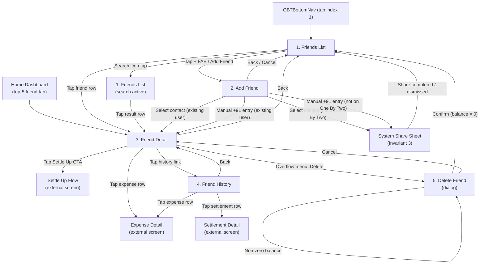

> [!WARNING]
> **Superseded — historical reference only.** As of **ADR-0024** the Haldi visual
> system (`design_handoff_one_by_two/`) is the canonical source of truth for colour,
> type, shape, motion and visuals. This document predates the Sprint-3 Haldi
> conversion and is retained for history; do **not** build new work against its
> tokens, type, or visuals. See `.github/shared/decision-log.md` (ADR-0024).

# Friends Flow Wireframes

> Visual specifications for the Friends feature flow in One By Two v1.0.
> Covers SRS sections 4.3 (FR-FR-01 through FR-FR-05), 4.11 (FR-SH-01, FR-SH-02),
> and 6.3 Core Screen 6 (Friends list and Friend detail).

| Field | Value |
|---|---|
| Document version | 1.0 |
| Status | Draft -- pending PM and Flutter Dev review |
| Author | UX/UI Designer Agent |
| SRS baseline | v1.1 |
| Last updated | 2025-07-11 |

> **Status.** Friends List, Friend Detail, Add Friend, and Match-and-Invite are implemented (invite via `share_plus`). **Delete Friend (FR-FR-05) is not yet implemented** — Friend Detail's app bar has no delete action.

---

## Navigation Flow

The following Mermaid diagram shows how a user moves between the five screens in the
Friends flow, including entry points from the bottom navigation and the Home dashboard.



---

## 1. Friends List

**SRS requirements:** FR-FR-03 (list of friends with net balance); FR-SE-01 (simplified
debts as canonical view); section 6.3 screen 6; section 6.4 (empty, loading, error
states).

**Components used:** `OBTAppBar`, `OBTBottomNav`, `OBTSearchBar`, `OBTFriendListTile`,
`OBTFloatingActionButton`, `OBTEmptyState`, `OBTErrorState`, `OBTSkeletonLoader`.

### ASCII Layout -- Populated State

```
+--------------------------------------------------+
| OBTAppBar                                        |
|  "Friends"                        [Search] [+]   |
+--------------------------------------------------+
| OBTSearchBar (collapsed -- appears on search tap)|
+--------------------------------------------------+
|                                                  |
| OBTFriendListTile                                |
| +----------------------------------------------+ |
| | [Avatar]  Priya Sharma     [you are owed     ]| |
| |           (40dp circle)    [ Rs.1,250.00     ]| |
| +----------------------------------------------+ |
|                                                  |
| +----------------------------------------------+ |
| | [Avatar]  Rahul Verma      [you owe          ]| |
| |                            [ Rs.350.00       ]| |
| +----------------------------------------------+ |
|                                                  |
| +----------------------------------------------+ |
| | [Avatar]  Ananya Iyer      [settled up       ]| |
| |                            [                 ]| |
| +----------------------------------------------+ |
|                                                  |
| +----------------------------------------------+ |
| | [Avatar]  Karthik Nair     [you are owed     ]| |
| |                            [ Rs.4,500.00     ]| |
| +----------------------------------------------+ |
|                                                  |
|                  ... scrollable ...              |
|                                                  |
+--------------------------------------------------+
|              OBTBottomNav                        |
| [Home] [*Friends*] [Groups] [Activity] [Profile] |
+--------------------------------------------------+
```

**Layout notes:**

- The Friends tab (index 1) is the active tab in `OBTBottomNav`.
- The `+` action in the app bar navigates to the Add Friend screen.
- The search icon reveals `OBTSearchBar` inline below the app bar, filtering the list
  in real time by friend display name.
- Each `OBTFriendListTile` is 56 dp minimum height (section 5.6 tap target compliance).
- The trailing `OBTBalancePill` is colour-coded: `success` for credit, `danger` for
  debit, muted `onSurface` for settled (component 4 specification).
- Balance values are integer paise converted to rupees at the UI layer (Invariant 1).
- Balance data is read from the `simplifiedBalances` field on the friendship document;
  the client never writes to this field (Invariant 2).
- The list is sorted by `lastActivityAt` descending (most recently active friend first).

### ASCII Layout -- Search Active State

```
+--------------------------------------------------+
| OBTAppBar                                        |
|  "Friends"                        [Search] [+]   |
+--------------------------------------------------+
| OBTSearchBar                                     |
| [magnifier] Search friends              [clear]  |
+--------------------------------------------------+
|                                                  |
| OBTFriendListTile (filtered results)             |
| +----------------------------------------------+ |
| | [Avatar]  Priya Sharma     [you are owed     ]| |
| |                            [ Rs.1,250.00     ]| |
| +----------------------------------------------+ |
|                                                  |
+--------------------------------------------------+
|              OBTBottomNav                        |
+--------------------------------------------------+
```

**Search behaviour:**

- Filter is client-side on the already-loaded list.
- Matches against `displayName` (case-insensitive substring).
- If no matches: show inline text "No friends match your search" centred in the list
  area -- not a full `OBTEmptyState`, as the list itself is not empty.

### States

| State | Visual | Behaviour |
|---|---|---|
| **Loading** | `OBTSkeletonLoader(type: listTile, itemCount: 5)` shimmer rows replace the list area. App bar and bottom nav remain visible. | Displayed while the Firestore snapshot listener has not yet delivered the first result. Transition to populated or empty on data arrival with 200 ms fade-in (section 6.2 motion). |
| **Populated** | As per the ASCII layout above. | Standard interactive state. Tapping a row navigates to Friend Detail. |
| **Empty** | `OBTEmptyState` centred in the list area. Title: "No friends yet". Subtitle: "Add a friend and start sharing expenses." CTA button: "Add Friend" (navigates to Add Friend screen). | Displayed when the friends collection query returns zero documents. The illustration is decorative (`excludeSemantics: true`). |
| **Error** | `OBTErrorState` centred in the list area. Title: "Something went wrong". Subtitle: "We could not load your friends list. Please try again." Retry button re-triggers the Firestore listener. Contact Support link opens the support flow (FR-SH-03). | Displayed on Firestore read failure or network error. |

### Accessibility

- Screen title announced as heading: "Friends".
- Each `OBTFriendListTile` semantic label: "[Display name], [balance pill text]"
  (component 16 spec).
- Avatar is excluded from semantics (name is already announced).
- Search bar label: "Search friends" (component 23 spec).
- All tap targets meet 48x48 dp minimum (section 5.6).

---

## 2. Add Friend

**SRS requirements:** FR-FR-01 (add friend via contact picker or manual +91 entry);
FR-FR-02 (link existing user immediately; invite non-user via system share sheet);
FR-SH-01 (system share sheet only -- Invariant 3); FR-SH-02 (deep link with install
fallback URL).

**Components used:** `OBTAppBar`, `OBTContactPicker`, `OBTPhoneInput`,
`OBTSnackbar`, `OBTConfirmationDialog` (for invite prompt).

### ASCII Layout -- Two-Path Entry

```
+--------------------------------------------------+
| OBTAppBar                                        |
|  [Back]  "Add Friend"                            |
+--------------------------------------------------+
|                                                  |
|  Segmented control / tab toggle:                 |
|  [ From Contacts ]  [ Enter Number ]             |
|                                                  |
+--------------------------------------------------+
|                                                  |
|  PATH A: From Contacts                           |
|  (renders OBTContactPicker full-height)           |
|                                                  |
|  OBTSearchBar                                    |
|  [magnifier] Search contacts          [clear]    |
|                                                  |
|  --- A ---                                       |
|  [Avatar] Aarav Patel                            |
|           +91 98765 43210    [on One By Two]        |
|                                                  |
|  [Avatar] Aditi Gupta                            |
|           +91 87654 32109                        |
|                                                  |
|  --- D ---                                       |
|  [Avatar] Deepak Sharma                          |
|           +91 76543 21098    [on One By Two]        |
|                                                  |
|                  ... scrollable ...              |
|                                                  |
+--------------------------------------------------+
```

```
+--------------------------------------------------+
| OBTAppBar                                        |
|  [Back]  "Add Friend"                            |
+--------------------------------------------------+
|                                                  |
|  Segmented control / tab toggle:                 |
|  [ From Contacts ]  [*Enter Number*]             |
|                                                  |
+--------------------------------------------------+
|                                                  |
|  PATH B: Enter Number                            |
|                                                  |
|  OBTPhoneInput                                   |
|  +----------------------------------------------+|
|  | +91 |  Enter mobile number                   ||
|  +----------------------------------------------+|
|                                                  |
|  [        Add Friend (primary button)           ]|
|                                                  |
|  Helper text (muted):                            |
|  "Enter a 10-digit Indian mobile number."        |
|                                                  |
+--------------------------------------------------+
```

### Interaction Flow

1. **Path A -- Contact Picker:**
   - User taps "From Contacts".
   - `OBTContactPicker` renders with alphabetical sections and search.
   - Contacts whose phone numbers match existing One By Two users show an
     "on One By Two" chip (component 9, `existingUserIds` prop).
   - **Tap on an existing user:** Friendship document is created immediately; navigate
     to Friend Detail. Show `OBTSnackbar(type: success, message: "[Name] added as a
     friend")`.
   - **Tap on a non-user:** Show a confirmation prompt -- title: "Invite [Name]?",
     body: "[Name] is not on One By Two yet. Send them an invite?", cancel: "Cancel",
     confirm: "Invite". On confirm, open the system share sheet (Invariant 3) with a
     pre-filled message containing the install deep link (FR-SH-02). The app must not
     import or target any specific messaging application.

2. **Path B -- Manual Entry:**
   - User taps "Enter Number" and types a 10-digit number into `OBTPhoneInput`.
   - Client-side validation: must be exactly 10 digits, starting with 6, 7, 8, or 9
     (FR-AU-02 validation rules reused).
   - On "Add Friend" tap:
     - **Number matches an existing user:** Create friendship; navigate to Friend
       Detail. Snackbar confirmation.
     - **Number not found:** Show invite prompt identical to Path A.
     - **Number is the user's own:** Show inline error "You cannot add yourself as a
       friend."

### States

| State | Visual | Behaviour |
|---|---|---|
| **Loading (contacts)** | `OBTSkeletonLoader(type: listTile, itemCount: 8)` in the contact list area. | Displayed while device contacts are being read. |
| **Populated (contacts)** | Full contact list with alphabetical headers and search. | Standard interactive state. |
| **Empty (no contacts)** | `OBTEmptyState` in the contact list area. Title: "No contacts found". Subtitle: "You can enter a number manually." No CTA (the "Enter Number" tab serves as the alternative). | Displayed when the device returns zero contacts. |
| **Permission denied** | `OBTErrorState` with title: "Contact access needed". Subtitle: "To add friends from your contacts, grant contact permission in Settings." CTA: "Open Settings" (launches device settings). | Displayed when the user has denied the contacts permission. |
| **Validation error (manual)** | `OBTPhoneInput` in error state with `errorText` below the field. | Inline error; "Add Friend" button remains enabled for retry. |
| **Looking up number** | "Add Friend" button shows a loading indicator; input is disabled. | Brief state while the app queries Firestore for the phone number. |
| **Invite share sheet** | System share sheet overlays the screen (Invariant 3). Pre-filled text: "Hey! I use One By Two to split expenses. Join me: [install link]" | The app does not control which sharing channel the user selects. FR-SH-01. |

### Accessibility

- Screen title announced as heading: "Add Friend".
- Segmented control announces "From Contacts, selected" or "Enter Number, selected".
- Contact list items announce: "[Name], [phone number], [on One By Two / not on
  One By Two]" (component 9 spec).
- `OBTPhoneInput` label: "Phone number, India country code plus 91" (component 8 spec).
- "Add Friend" button label: "Add friend".
- All interactive elements meet 48x48 dp tap target (section 5.6).

---

## 3. Friend Detail

**SRS requirements:** FR-FR-03 (net balance for each friend); FR-FR-04 (per-friend
transaction history); FR-SE-01 (simplified debts only); FR-SE-07 (Settle Up CTA on
every screen with non-zero balance); FR-FR-05 (delete friend only if balance is zero);
section 6.3 screen 6.

**Components used:** `OBTAppBar`, `OBTUserAvatar`, `OBTBalancePill`, `OBTSettleUpCard`,
`OBTExpenseListTile`, `OBTEmptyState`, `OBTErrorState`, `OBTSkeletonLoader`.

### ASCII Layout -- Populated State (Non-Zero Balance)

```
+--------------------------------------------------+
| OBTAppBar                                        |
|  [Back]  "Priya Sharma"              [overflow]  |
+--------------------------------------------------+
|                                                  |
|  +----------------------------------------------+|
|  |                                              ||
|  |        [OBTUserAvatar -- 80dp]               ||
|  |          Priya Sharma                        ||
|  |                                              ||
|  |   OBTBalancePill (large variant)             ||
|  |   [ you are owed Rs.1,250.00 ]              ||
|  |                                              ||
|  +----------------------------------------------+|
|                                                  |
|  OBTSettleUpCard (corner radius 24dp)            |
|  +----------------------------------------------+|
|  |  [Your     ]  ----->  [Priya's  ]           ||
|  |  [Avatar   ]          [Avatar   ]           ||
|  |                                              ||
|  |  Priya owes you Rs.1,250.00                  ||
|  |                                              ||
|  |  [ ====== Settle Up (primary) ====== ]       ||
|  +----------------------------------------------+|
|                                                  |
|  --- Recent Expenses ---                         |
|  "View full history >"  (text link, right-align) |
|                                                  |
|  OBTExpenseListTile                              |
|  +----------------------------------------------+|
|  | [Food]  Dinner at Dosa Plaza                 ||
|  |         Priya paid -- 14 Mar    you lent     ||
|  |                                 Rs.625.00    ||
|  +----------------------------------------------+|
|                                                  |
|  +----------------------------------------------+|
|  | [Travel] Uber to Airport                     ||
|  |          You paid -- 12 Mar     you lent     ||
|  |                                 Rs.625.00    ||
|  +----------------------------------------------+|
|                                                  |
|                  ... max 5 recent ...            |
|                                                  |
+--------------------------------------------------+
```

### ASCII Layout -- Populated State (Settled Up)

```
+--------------------------------------------------+
| OBTAppBar                                        |
|  [Back]  "Ananya Iyer"               [overflow]  |
+--------------------------------------------------+
|                                                  |
|  +----------------------------------------------+|
|  |        [OBTUserAvatar -- 80dp]               ||
|  |          Ananya Iyer                         ||
|  |                                              ||
|  |   OBTBalancePill (large variant)             ||
|  |   [ settled up ]                             ||
|  +----------------------------------------------+|
|                                                  |
|  (No OBTSettleUpCard -- balance is zero)         |
|                                                  |
|  --- Recent Expenses ---                         |
|  "View full history >"                           |
|                                                  |
|  OBTExpenseListTile rows ...                     |
|                                                  |
+--------------------------------------------------+
```

**Layout notes:**

- The profile header section uses a large `OBTUserAvatar` (80 dp diameter) centred
  horizontally, with the display name below and the `OBTBalancePill` beneath that.
- `OBTBalancePill` uses `size: medium` but with larger font weight to serve as the
  primary visual balance indicator on this screen.
- `OBTSettleUpCard` is rendered only when `balancePaise != 0` (FR-SE-07). It pre-fills
  the settlement amount from the simplified balance (FR-SE-05).
- The "Recent Expenses" section shows the latest 5 expenses. Tapping "View full
  history" navigates to the Friend History screen.
- The overflow menu (three-dot icon) contains: "Delete Friend".

### States

| State | Visual | Behaviour |
|---|---|---|
| **Loading** | Profile header: `OBTSkeletonLoader(type: profileHeader)`. Expense list: `OBTSkeletonLoader(type: listTile, itemCount: 3)`. | Displayed while friendship data and expenses are loading. |
| **Populated (non-zero balance)** | Full layout with `OBTSettleUpCard` visible. | Standard interactive state. |
| **Populated (settled up)** | Full layout without `OBTSettleUpCard`. Balance pill shows "settled up" in muted colour. | Settle Up CTA is hidden per FR-SE-07 (only shown for non-zero). |
| **No expenses** | Profile header and balance pill render normally. Expense area shows `OBTEmptyState` with title: "No expenses yet", subtitle: "Add an expense with [Friend name] to start tracking." CTA: "Add Expense". | The balance pill may still show a non-zero value if a settlement was recorded without expenses (edge case). |
| **Error** | `OBTErrorState` replaces the entire content area below the app bar. Title: "Something went wrong". Retry re-fetches the friendship and expense data. | Network or Firestore error. |

### Accessibility

- Screen title is the friend's display name, announced as heading.
- Profile avatar at 80 dp is decorative when adjacent to the name text
  (`excludeSemantics: true`).
- `OBTBalancePill` semantic label as per component 4 spec.
- `OBTSettleUpCard` semantic label: "[Payer name] owes [Payee name] rupees [amount].
  Settle up button available." (component 13 spec).
- Overflow menu icon label: "More options".
- "View full history" link label: "View full history with [Friend name]".

---

## 4. Friend History

**SRS requirements:** FR-FR-04 (per-friend transaction history, reverse chronological);
FR-SE-08 (settlement history per friend); section 6.4 (empty, loading, error states).

**Components used:** `OBTAppBar`, `OBTExpenseListTile`, `OBTActivityRow` (repurposed
for settlement entries), `OBTEmptyState`, `OBTErrorState`, `OBTSkeletonLoader`.

### ASCII Layout -- Populated State

```
+--------------------------------------------------+
| OBTAppBar                                        |
|  [Back]  "History with Priya"                    |
+--------------------------------------------------+
|                                                  |
|  --- March 2025 ---                              |
|                                                  |
|  OBTExpenseListTile                              |
|  +----------------------------------------------+|
|  | [Food]  Dinner at Dosa Plaza                 ||
|  |         Priya paid -- 14 Mar    you lent     ||
|  |                                 Rs.625.00    ||
|  +----------------------------------------------+|
|                                                  |
|  +----------------------------------------------+|
|  | [Travel] Uber to Airport                     ||
|  |          You paid -- 12 Mar     you lent     ||
|  |                                 Rs.625.00    ||
|  +----------------------------------------------+|
|                                                  |
|  Settlement row                                  |
|  +----------------------------------------------+|
|  | [check]  Priya paid you Rs.500.00            ||
|  |          8 Mar                               ||
|  +----------------------------------------------+|
|                                                  |
|  --- February 2025 ---                           |
|                                                  |
|  OBTExpenseListTile                              |
|  +----------------------------------------------+|
|  | [Groceries] BigBasket order                  ||
|  |             You paid -- 22 Feb  you lent     ||
|  |                                 Rs.375.00    ||
|  +----------------------------------------------+|
|                                                  |
|                  ... scrollable ...              |
|                                                  |
+--------------------------------------------------+
```

**Layout notes:**

- Entries are grouped by month with sticky section headers (e.g., "March 2025").
- Expenses render as `OBTExpenseListTile` (component 15).
- Settlements render as a distinct row with a `check_circle` icon in `success` colour,
  using the `OBTActivityRow` pattern with `eventType: settlementRecorded`.
- The list is sorted reverse chronologically as required by FR-FR-04.
- Pagination: load 20 items initially; infinite scroll loads the next batch on approach
  to the bottom (Firestore cursor-based pagination).

### States

| State | Visual | Behaviour |
|---|---|---|
| **Loading** | `OBTSkeletonLoader(type: listTile, itemCount: 6)` with alternating widths to suggest varied content. | Initial load. |
| **Populated** | As per the ASCII layout above, grouped by month. | Tapping an expense row navigates to Expense Detail. Tapping a settlement row navigates to Settlement Detail. |
| **Empty** | `OBTEmptyState` centred. Title: "No history yet". Subtitle: "Expenses and settlements with [Friend name] will appear here." No CTA. | Displayed when neither expenses nor settlements exist for this friendship. |
| **Error** | `OBTErrorState`. Title: "Could not load history". Subtitle: "Please check your connection and try again." Retry re-fetches. | Network or Firestore error. |
| **Loading more (pagination)** | A small circular progress indicator at the bottom of the list, 32 dp, in `primary` colour. | Displayed while the next page of results is being fetched. Disappears on data arrival. |

### Accessibility

- Screen title announced as heading: "History with [Friend name]".
- Month section headers announced as headings (semantic `header: true`).
- Expense rows follow `OBTExpenseListTile` accessibility spec (component 15).
- Settlement rows follow `OBTActivityRow` accessibility spec (component 14).
- All rows meet 56 dp minimum height for tap target compliance (section 5.6).

---

## 5. Delete Friend

**SRS requirements:** FR-FR-05 (delete friend only if outstanding balance is zero);
section 6.4 (error states with actionable copy); section 6.5 (microcopy tone).

**Components used:** `OBTConfirmationDialog`.

This is a modal dialog, not a full screen. It is triggered from the overflow menu on
the Friend Detail screen.

### ASCII Layout -- Zero Balance (Deletion Permitted)

```
+--------------------------------------------------+
|                                                  |
|           (dimmed scrim overlay)                 |
|                                                  |
|  +------------------------------------------+    |
|  |                                          |    |
|  |  Delete Friend?                          |    |
|  |                                          |    |
|  |  Are you sure you want to remove         |    |
|  |  Priya Sharma from your friends?         |    |
|  |  This will not delete any shared          |    |
|  |  expenses.                               |    |
|  |                                          |    |
|  |  [  Cancel  ]     [ Delete (danger) ]    |    |
|  |                                          |    |
|  +------------------------------------------+    |
|                                                  |
+--------------------------------------------------+
```

### ASCII Layout -- Non-Zero Balance (Deletion Blocked)

```
+--------------------------------------------------+
|                                                  |
|           (dimmed scrim overlay)                 |
|                                                  |
|  +------------------------------------------+    |
|  |                                          |    |
|  |  Cannot Delete Friend                    |    |
|  |                                          |    |
|  |  You have an outstanding balance of       |    |
|  |  Rs.1,250.00 with Priya Sharma.           |    |
|  |  Please settle up before removing         |    |
|  |  this friend.                             |    |
|  |                                          |    |
|  |                       [ OK (primary) ]   |    |
|  |                                          |    |
|  +------------------------------------------+    |
|                                                  |
+--------------------------------------------------+
```

**Interaction flow:**

1. User taps "Delete Friend" in the Friend Detail overflow menu.
2. The app checks the `simplifiedBalances` field on the friendship document
   (Invariant 2 -- client reads only).
3. **If balance is zero:** Show the confirmation dialog with `isDestructive: true`.
   Cancel dismisses the dialog. Confirm deletes the friendship and navigates back to
   the Friends List with `OBTSnackbar(type: success, message: "[Name] removed from
   friends")`.
4. **If balance is non-zero:** Show the error dialog with the outstanding amount. The
   confirm button is replaced with a single "OK" button that dismisses the dialog. No
   delete action is available. The balance amount is formatted using `OBTRupeeText`
   logic (Indian numbering, paise-to-rupees conversion at UI layer, Invariant 1).

### States

| State | Visual | Behaviour |
|---|---|---|
| **Zero balance -- confirmation** | `OBTConfirmationDialog` with `isDestructive: true`. Title: "Delete Friend?". Body as above. Cancel and Delete buttons. | Cancel dismisses. Delete triggers the deletion and shows a success snackbar. |
| **Non-zero balance -- error** | Modified dialog (single button). Title: "Cannot Delete Friend". Body includes the formatted outstanding balance. Single "OK" dismiss button. | "OK" dismisses the dialog. User must settle up first. |
| **Deleting (loading)** | Delete button shows a small progress indicator. Both buttons are disabled. | Brief state while the Firestore delete operation completes. |
| **Delete failed** | Dialog dismisses. `OBTSnackbar(type: error, message: "Could not remove friend. Please try again.")` appears. | Snackbar auto-dismisses after 4 seconds. User can retry from the overflow menu. |

### Accessibility

- Dialog announced as modal: "Alert: Delete Friend?" or "Alert: Cannot Delete Friend".
- Body text read after the title.
- Cancel button label: "Cancel".
- Delete button label: "Delete" (when available).
- OK button label: "OK" (error variant).
- Focus is trapped within the dialog while open (component 24 spec).
- Back gesture or Escape key dismisses the dialog (equivalent to Cancel / OK).

---

## Component Cross-Reference

The following table maps each screen to the components from the component catalogue
(`docs/design/02-design-system/components.md`) that it consumes.

| Screen | Components |
|---|---|
| Friends List | OBTAppBar (1), OBTBottomNav (2), OBTFloatingActionButton (3), OBTBalancePill (4), OBTFriendListTile (16), OBTSearchBar (23), OBTEmptyState (18), OBTErrorState (19), OBTSkeletonLoader (20) |
| Add Friend | OBTAppBar (1), OBTContactPicker (9), OBTPhoneInput (8), OBTSnackbar (25), OBTEmptyState (18), OBTErrorState (19), OBTSkeletonLoader (20) |
| Friend Detail | OBTAppBar (1), OBTUserAvatar (11), OBTBalancePill (4), OBTSettleUpCard (13), OBTExpenseListTile (15), OBTEmptyState (18), OBTErrorState (19), OBTSkeletonLoader (20) |
| Friend History | OBTAppBar (1), OBTExpenseListTile (15), OBTActivityRow (14), OBTEmptyState (18), OBTErrorState (19), OBTSkeletonLoader (20) |
| Delete Friend | OBTConfirmationDialog (24), OBTSnackbar (25) |

---

## SRS Traceability Matrix

| SRS Requirement | Screen(s) | How Satisfied |
|---|---|---|
| FR-FR-01 | Add Friend | Two paths: contact picker and manual +91 entry. |
| FR-FR-02 | Add Friend | Existing users linked immediately; non-users offered invite via system share sheet. |
| FR-FR-03 | Friends List, Friend Detail | Net simplified balance shown via `OBTBalancePill` on every friend row and on the detail header. |
| FR-FR-04 | Friend Detail, Friend History | Per-friend expense and settlement history, reverse chronological. |
| FR-FR-05 | Delete Friend | Deletion blocked with error message when balance is non-zero; permitted only at zero. |
| FR-SH-01 | Add Friend | System share sheet only; no specific messaging app targeted (Invariant 3). |
| FR-SH-02 | Add Friend | Shared invite message includes deep link with install fallback URL. |
| FR-SE-01 | Friends List, Friend Detail | Only simplified debts shown; raw debt graph never exposed. |
| FR-SE-07 | Friend Detail | `OBTSettleUpCard` rendered when balance is non-zero. |
| Section 6.3 (screen 6) | Friends List, Friend Detail | Both screens specified as core screens for v1.0. |
| Section 6.4 | All screens | Explicit empty, loading (skeleton), and error states with actionable copy and Retry affordance. |
| Section 6.5 | All screens | Microcopy is friendly, concise, and lightly playful. |
| Section 5.6 | All screens | 48x48 dp tap targets; WCAG 2.1 AA contrast; semantic labels on all interactive elements. |
| Invariant 1 | All screens | All monetary values stored and transmitted as integer paise; conversion at UI layer only. |
| Invariant 2 | Friends List, Friend Detail, Delete Friend | `simplifiedBalances` read from server; never written by client. |
| Invariant 3 | Add Friend | System share sheet only for invitations. |

---

## Extension Points

- **Suggested friends from contacts (v1.1):** The Friends List could include a
  "Suggested" section above the main list, showing contacts who are already One By Two
  users but not yet added as friends. This section would use the same
  `OBTFriendListTile` component with a trailing "Add" button instead of
  `OBTBalancePill`. The `existingUserIds` set from `OBTContactPicker` would be reused
  to populate this section. This feature is out of scope for v1.0 per SRS section 12.3.