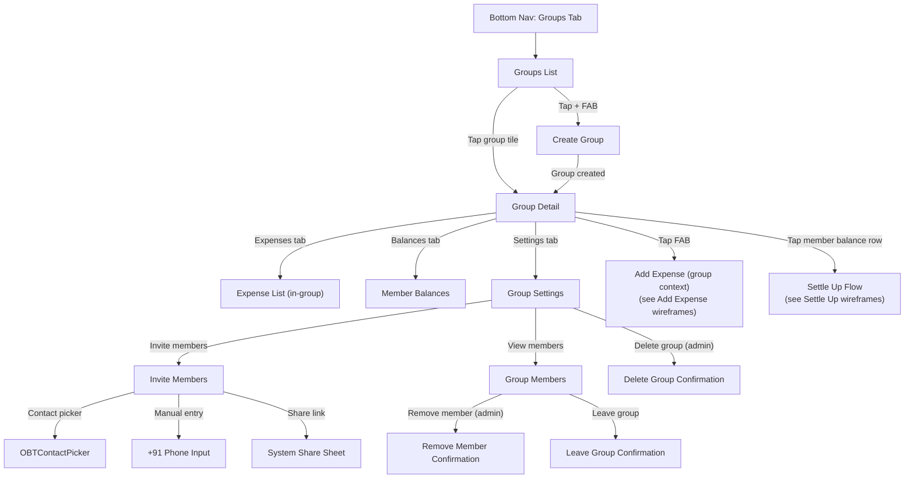

> [!WARNING]
> **Superseded — historical reference only.** As of **ADR-0024** the Haldi visual
> system (`design_handoff_one_by_two/`) is the canonical source of truth for colour,
> type, shape, motion and visuals. This document predates the Sprint-3 Haldi
> conversion and is retained for history; do **not** build new work against its
> tokens, type, or visuals. See `.github/shared/decision-log.md` (ADR-0024).

# Groups Flow Wireframes

> **Status: planned — not yet implemented in the client.** `lib/features/groups/` contains no UI; the Groups tab renders `GroupsListPlaceholder` ('Coming in Sprint 3') and the Add-Expense picker shows a disabled Groups stub. The Firestore schema/rules exist server-side. This spec is retained as the build target.

This document defines the screen-by-screen wireframes, states, component mappings, and navigation flow for the Groups feature of One By Two v1.0. All specifications derive from the Software Requirements Specification (SRS) sections 4.4 (FR-GR-01 through FR-GR-07), 4.11 (FR-SH-01, FR-SH-02), and 6.3 (Core Screen 7), and from the Component Catalogue (`docs/design/02-design-system/components.md`).

All monetary values are integer paise; conversion to rupees occurs at the UI layer (Invariant 1). The `simplifiedBalances` field is server-maintained and client-read-only (Invariant 2). All outbound sharing uses the system share sheet exclusively (Invariant 3).

---

## Navigation Flow



---

## Screen 1: Groups List

**SRS references:** FR-GR-01, FR-GR-04, section 6.3 (Core Screen 7), section 6.4 (empty/error/loading states), section 6.5 (microcopy tone).

### Layout

```
+--------------------------------------------------+
|  OBTAppBar                                        |
|  [title: "Groups"]              [action: Search]  |
+--------------------------------------------------+
|                                                    |
|  +----------------------------------------------+ |
|  | OBTGroupListTile                              | |
|  | [OBTGroupAvatar]  Goa Trip 2024               | |
|  |                   [Trip] . 5 members           | |
|  |                            [OBTBalancePill]    | |
|  +----------------------------------------------+ |
|                                                    |
|  +----------------------------------------------+ |
|  | OBTGroupListTile                              | |
|  | [OBTGroupAvatar]  Flat 302                    | |
|  |                   [Home] . 3 members           | |
|  |                            [OBTBalancePill]    | |
|  +----------------------------------------------+ |
|                                                    |
|  +----------------------------------------------+ |
|  | OBTGroupListTile                              | |
|  | [OBTGroupAvatar]  Us                          | |
|  |                   [Couple] . 2 members         | |
|  |                            [OBTBalancePill]    | |
|  +----------------------------------------------+ |
|                                                    |
|                                                    |
|                            +--------------------+ |
|                            | OBTFloatingAction  | |
|                            | Button  [ + ]      | |
|                            +--------------------+ |
+--------------------------------------------------+
|  OBTBottomNav  [Home] [Friends] [*Groups*]        |
|                [Activity] [Profile]               |
+--------------------------------------------------+
```

### Components Used

| Component | Configuration |
|---|---|
| `OBTAppBar` | `title: "Groups"`, `showBackButton: false`, `actions: [Search]`. |
| `OBTGroupListTile` | One per group. Displays `OBTGroupAvatar` (leading), group name, type badge, member count, trailing `OBTBalancePill`. `onTap` navigates to Group Detail. |
| `OBTFloatingActionButton` | `semanticLabel: "Create new group"`. `onPressed` navigates to Create Group. |
| `OBTBottomNav` | `currentIndex: 2` (Groups tab active). |

### States

| State | Specification |
|---|---|
| **Loading** | `OBTSkeletonLoader` with `type: listTile`, `itemCount: 5`. Shimmer animation; respects `reduceMotion`. Semantic label: `"Loading content"`. |
| **Loaded (populated)** | Scrollable list of `OBTGroupListTile` widgets, sorted by `lastActivityAt` descending. |
| **Empty** | `OBTEmptyState` -- `illustration: groups_empty`, `title: "No groups yet"`, `subtitle: "Create a group for your flat, trip, or couple."`, `ctaLabel: "Create Group"`, `onCtaTap: navigateToCreateGroup`. (SRS section 6.4, 6.5.) |
| **Error** | `OBTErrorState` -- `title: "Something went wrong"`, `subtitle: "We could not load your groups. Please try again."`, `onRetry: reloadGroups`, `onContactSupport: openSupportEmail`. (SRS section 6.4; FR-PR-05 for Contact Support.) |

### Accessibility

- Each `OBTGroupListTile` semantic label: `"[Group name], [group type], [member count] members, [balance pill text]"`. (Component Catalogue, section 17.)
- Group avatars excluded from semantics when adjacent to text label.
- Minimum tile height: 64 dp. All tap targets at least 48x48 dp. (SRS section 5.6.)
- Search action labelled `"Search groups"`.

---

## Screen 2: Create Group

**SRS references:** FR-GR-01, section 6.3 (Core Screen 7), section 6.2 (corner radius, tokens).

### Layout

```
+--------------------------------------------------+
|  OBTAppBar                                        |
|  [<- Back]  "Create Group"                        |
+--------------------------------------------------+
|                                                    |
|  +----------------------------------------------+ |
|  |  Cover Photo Area                             | |
|  |  +------------------------------------------+| |
|  |  |                                          || |
|  |  |   [camera icon]                          || |
|  |  |   "Add cover photo"                     || |
|  |  |   (optional)                             || |
|  |  |                                          || |
|  |  +------------------------------------------+| |
|  +----------------------------------------------+ |
|                                                    |
|  +----------------------------------------------+ |
|  |  Group Name                                   | |
|  |  +------------------------------------------+| |
|  |  | [text field: "e.g. Goa Trip 2024"]       || |
|  |  +------------------------------------------+| |
|  +----------------------------------------------+ |
|                                                    |
|  +----------------------------------------------+ |
|  |  Group Type                                   | |
|  |  +--------+ +--------+ +--------+ +--------+ | |
|  |  | Trip   | | Home   | | Couple | | Other  | | |
|  |  +--------+ +--------+ +--------+ +--------+ | |
|  +----------------------------------------------+ |
|                                                    |
|                                                    |
|  +----------------------------------------------+ |
|  |         [ Create Group ]  (primary, filled)   | |
|  +----------------------------------------------+ |
|                                                    |
+--------------------------------------------------+
```

### Components Used

| Component | Configuration |
|---|---|
| `OBTAppBar` | `title: "Create Group"`, `showBackButton: true`. |
| Cover photo area | Tappable area; opens image picker (camera or gallery). Circular or rounded rectangle preview. Corner radius 24 dp. |
| Group name field | Standard text input. Placeholder: `"e.g. Goa Trip 2024"`. Max length: 50 characters. Semantic label: `"Group name"`. |
| Group type selector | Row of four selectable chips, styled similarly to `OBTCategoryChip`. Selected state uses the type-specific colour (see `OBTGroupListTile` type badge colours). Default selection: `Trip`. |
| Create button | Full-width filled button in `primary`. Label: `"Create Group"`. Corner radius 16 dp. Minimum height: 48 dp. |

### Type Chip Colours

| Type | Label | Selected Colour |
|---|---|---|
| Trip | `"Trip"` | `#2E86AB` |
| Home | `"Home"` | `#1F4E79` |
| Couple | `"Couple"` | `#E76F51` |
| Other | `"Other"` | `#7F8C8D` |

### States

| State | Specification |
|---|---|
| **Default** | Form empty; type selector defaults to `Trip`. Create button disabled (name is required). |
| **Valid** | Name field has at least one non-whitespace character; type selected. Create button enabled in `primary`. |
| **Name error** | Inline error below name field: `"Group name is required"` in `danger`. Shown on submit attempt with empty name. |
| **Photo uploading** | Progress overlay on the cover photo area; Create button disabled. |
| **Submitting** | Create button shows loading indicator; all inputs disabled. 200--300 ms transition. |
| **Success** | Navigates to Group Detail for the newly created group. `OBTSnackbar` with `type: success`, `message: "Group created"`. |
| **Error** | `OBTSnackbar` with `type: error`, `message: "Could not create group. Try again."`, `actionLabel: "Retry"`. |

### Accessibility

- All form fields have explicit semantic labels.
- Type selector chips announce `"[Type] group type, [selected/not selected]"`.
- Cover photo area: `"Add cover photo, optional, button"`.
- Create button: `"Create group, button"`.
- Minimum tap targets: 48x48 dp for all interactive elements. (SRS section 5.6.)

---

## Screen 3: Group Detail

**SRS references:** FR-GR-04, FR-SE-01, FR-SE-07, FR-HD-04, FR-EX-02, section 6.3 (Core Screen 7), section 6.4.

### Layout

```
+--------------------------------------------------+
|  OBTAppBar                                        |
|  [<- Back]  "Goa Trip 2024"     [action: Settings]|
+--------------------------------------------------+
|                                                    |
|  +----------------------------------------------+ |
|  |  Group Header Card (cornerRadius: 24 dp)      | |
|  |  +------------------------------------------+| |
|  |  | [Cover Photo / Gradient Fallback]        || |
|  |  |                                          || |
|  |  |  Goa Trip 2024                           || |
|  |  |  [Trip badge]   5 members                || |
|  |  |                                          || |
|  |  |  Net balance:  [OBTBalancePill]          || |
|  |  +------------------------------------------+| |
|  +----------------------------------------------+ |
|                                                    |
|  +----------------------------------------------+ |
|  |  [ Expenses ]  [ Balances ]  [ Settings ]     | |
|  +----------------------------------------------+ |
|                                                    |
|  === EXPENSES TAB =============================== |
|                                                    |
|  +----------------------------------------------+ |
|  | OBTExpenseListTile                            | |
|  | [Food icon]  Dinner at Dosa Plaza             | |
|  |              Paid by Rahul . 14 Mar           | |
|  |                        you owe Rs 350.00      | |
|  +----------------------------------------------+ |
|                                                    |
|  +----------------------------------------------+ |
|  | OBTExpenseListTile                            | |
|  | [Travel icon]  Cab to Airport                 | |
|  |                Paid by You . 13 Mar           | |
|  |                     you lent Rs 600.00        | |
|  +----------------------------------------------+ |
|                                                    |
|  === BALANCES TAB ================================ |
|                                                    |
|  +----------------------------------------------+ |
|  | OBTSettleUpCard                               | |
|  | [You] ---Rs 350.00---> [Rahul]               | |
|  |                        [ Settle Up ]          | |
|  +----------------------------------------------+ |
|                                                    |
|  +----------------------------------------------+ |
|  | Member Balance Row                            | |
|  | [avatar] Priya        [OBTBalancePill]        | |
|  +----------------------------------------------+ |
|  | [avatar] Amit         [settled up]            | |
|  +----------------------------------------------+ |
|                                                    |
|  === SETTINGS TAB ================================ |
|                                                    |
|  [ Invite Members  >]                             |
|  [ View Members    >]                             |
|  [ Delete Group    >]  (admin only, danger text)  |
|                                                    |
|                            +--------------------+ |
|                            | OBTFloatingAction  | |
|                            | Button  [ + ]      | |
|                            +--------------------+ |
+--------------------------------------------------+
```

### Tab Specifications

#### Expenses Tab

- Scrollable list of `OBTExpenseListTile` widgets, filtered to this group's expenses.
- Sorted by date descending.
- Tapping a tile navigates to Expense Detail.
- **Empty state:** `OBTEmptyState` -- `title: "No expenses yet"`, `subtitle: "Tap the + button to add your first group expense."`, `ctaLabel: "Add Expense"`.

#### Balances Tab

- Displays simplified balances only (FR-SE-01). Data read from `simplifiedBalances` field (Invariant 2).
- Where the current user has a non-zero balance with another member, render an `OBTSettleUpCard` (FR-SE-07).
- Remaining members shown as balance rows with `OBTUserAvatar` and `OBTBalancePill`.
- **Empty/settled state:** All members at zero -- show a celebratory message: `"Everyone is settled up -- well done!"` (SRS section 6.5.)

#### Settings Tab

- List of settings rows, each with a chevron trailing icon.
- `"Invite Members"` -- navigates to Invite Members screen.
- `"View Members"` -- navigates to Group Members screen.
- `"Delete Group"` -- visible only to the group admin. Label in `danger` colour. Navigates to Delete Group confirmation.

### Components Used

| Component | Configuration |
|---|---|
| `OBTAppBar` | `title: groupName`, `showBackButton: true`, `actions: [Settings (gear icon)]`. |
| Group header card | Custom layout. Corner radius 24 dp, `elevationLow`. Cover photo or gradient fallback. Group name, type badge, member count, `OBTBalancePill`. |
| Tab bar | Three tabs: Expenses, Balances, Settings. Active tab underlined in `primary`. |
| `OBTExpenseListTile` | Per expense. Leading `OBTCategoryChip` icon, description, payer, date, user share. |
| `OBTSettleUpCard` | Per non-zero simplified balance involving the current user. Payer/payee avatars, amount, Settle Up CTA. |
| `OBTBalancePill` | Used in header and per-member balance rows. |
| `OBTUserAvatar` | Used in balance rows and settle up cards. |
| `OBTFloatingActionButton` | `semanticLabel: "Add expense to group"`. Opens Add Expense flow in group context (FR-EX-02). Visible on Expenses and Balances tabs; hidden on Settings tab. |

### States

| State | Specification |
|---|---|
| **Loading** | Group header: `OBTSkeletonLoader type: profileHeader`. Tabs content: `OBTSkeletonLoader type: listTile, itemCount: 5`. |
| **Loaded** | Full content rendered per tab specifications above. |
| **Error** | `OBTErrorState` -- `title: "Could not load group"`, `subtitle: "Please check your connection and try again."`, `onRetry: reloadGroup`, `onContactSupport: openSupportEmail`. |

### Accessibility

- Tab bar: each tab announces `"[Tab name], tab, [selected/not selected]"`.
- Group header: `"[Group name], [type] group, [member count] members, [balance pill text]"`.
- Settle Up cards: `"[Payer] owes [Payee] rupees [amount]. Settle up button available."` (Component Catalogue, section 13.)
- Settings rows: `"[Label], button"`. Delete Group additionally announces `"destructive action"`.
- All tap targets: minimum 48x48 dp. (SRS section 5.6.)

---

## Screen 4: Invite Members

**SRS references:** FR-GR-02, FR-GR-03, FR-SH-01, FR-SH-02, section 6.3 (Core Screen 7).

### Layout

```
+--------------------------------------------------+
|  OBTAppBar                                        |
|  [<- Back]  "Invite Members"                      |
+--------------------------------------------------+
|                                                    |
|  +----------------------------------------------+ |
|  |  Section: From Contacts                       | |
|  |  +------------------------------------------+| |
|  |  | [ Select from contacts ]  (primary btn)  || |
|  |  +------------------------------------------+| |
|  +----------------------------------------------+ |
|                                                    |
|  +----------------------------------------------+ |
|  |  Section: Enter Number                        | |
|  |  +------------------------------------------+| |
|  |  | OBTPhoneInput  [+91 | XXXXX XXXXX ]      || |
|  |  +------------------------------------------+| |
|  |  | [ Invite ]  (primary, outlined)           || |
|  |  +------------------------------------------+| |
|  +----------------------------------------------+ |
|                                                    |
|  +----------------------------------------------+ |
|  |  Section: Share Invite Link                   | |
|  |  +------------------------------------------+| |
|  |  | "Share a link that lets anyone join this  || |
|  |  |  group. Link expires in 7 days."          || |
|  |  |                                          || |
|  |  | [ Share Invite Link ]  (secondary btn)   || |
|  |  +------------------------------------------+| |
|  |                                               | |
|  |  (if link active)                             | |
|  |  +------------------------------------------+| |
|  |  | Link active . Expires: 21 Mar 2025       || |
|  |  | [ Revoke Link ]  (danger text button)    || |
|  |  +------------------------------------------+| |
|  +----------------------------------------------+ |
|                                                    |
+--------------------------------------------------+
```

### Three Invitation Paths

#### Path 1: Contact Picker

- Tapping `"Select from contacts"` opens `OBTContactPicker` as a full-screen overlay.
- `excludeNumbers` is populated with phone numbers of current group members.
- On selection, the contact is invited. If the contact is an existing One By Two user, they are added directly. If not, an SMS/notification invite is sent.

#### Path 2: Manual +91 Entry

- Uses `OBTPhoneInput` with the locked `+91` prefix.
- Validation: exactly 10 digits, starts with 6/7/8/9 (FR-AU-02 pattern reused).
- Tapping `"Invite"` sends the invitation.
- Error states: `"Please enter a valid 10-digit mobile number"` (inline, `danger`).

#### Path 3: Shareable Invite Link

- Tapping `"Share Invite Link"` generates a link via Cloud Functions and opens the **system share sheet** (Invariant 3; FR-SH-01).
- The shared message includes a deep link (universal link on iOS, App Link on Android) and a fallback store URL (FR-SH-02).
- Link expiry: 7 days from creation (FR-GR-03).
- If a link is already active, the expiry date is displayed and a `"Revoke Link"` button is shown (admin only; FR-GR-03).

### Components Used

| Component | Configuration |
|---|---|
| `OBTAppBar` | `title: "Invite Members"`, `showBackButton: true`. |
| `OBTContactPicker` | `title: "Select contact"`, `excludeNumbers: currentMemberPhones`, `existingUserIds: obtUserPhones`. |
| `OBTPhoneInput` | Standard configuration. `autoFocus: false`. |
| Share button | Filled button in `secondary` colour. Label: `"Share Invite Link"`. |
| Revoke link button | Text button in `danger`. Label: `"Revoke Link"`. |

### States

| State | Specification |
|---|---|
| **Default** | All three paths available. No active link. |
| **Link active** | Expiry date shown below share section. Revoke button visible for admin. |
| **Inviting (contact/phone)** | Invite button shows loading indicator. Phone input disabled. |
| **Invite success** | `OBTSnackbar type: success`, `message: "[Name/number] invited to [Group name]"`. Return to previous screen or remain for further invitations. |
| **Invite error** | `OBTSnackbar type: error`, `message: "Could not send invite. Try again."`, `actionLabel: "Retry"`. |
| **Revoke confirmation** | `OBTConfirmationDialog` -- `title: "Revoke invite link?"`, `body: "Anyone with the current link will no longer be able to join."`, `confirmLabel: "Revoke"`, `isDestructive: true`. |
| **Link generating** | Share button shows loading indicator. |

### Accessibility

- Section headings announced as headings.
- `"Select from contacts"` button: `"Select from contacts, button"`.
- Phone input: `"Phone number, India country code plus 91"`. (Component Catalogue, section 8.)
- Share button: `"Share invite link, button"`.
- Revoke button: `"Revoke invite link, destructive action, button"`.
- Link expiry text: `"Invite link active, expires [date]"`.
- Minimum tap targets: 48x48 dp. (SRS section 5.6.)

---

## Screen 5: Group Members

**SRS references:** FR-GR-04, FR-GR-05, FR-GR-06, section 6.3 (Core Screen 7).

### Layout

```
+--------------------------------------------------+
|  OBTAppBar                                        |
|  [<- Back]  "Members"          [action: Invite]   |
+--------------------------------------------------+
|                                                    |
|  +----------------------------------------------+ |
|  | Member Row                                    | |
|  | [OBTUserAvatar]  Rahul  (Admin)               | |
|  |                          [OBTBalancePill]      | |
|  +----------------------------------------------+ |
|                                                    |
|  +----------------------------------------------+ |
|  | Member Row                                    | |
|  | [OBTUserAvatar]  Priya                        | |
|  |                          [OBTBalancePill]      | |
|  |                 [swipe: Remove] (admin only)   | |
|  +----------------------------------------------+ |
|                                                    |
|  +----------------------------------------------+ |
|  | Member Row                                    | |
|  | [OBTUserAvatar]  Amit                         | |
|  |                          [settled up]          | |
|  |                 [swipe: Remove] (admin only)   | |
|  +----------------------------------------------+ |
|                                                    |
|  +----------------------------------------------+ |
|  | Member Row (current user, non-admin)           | |
|  | [OBTUserAvatar]  You                          | |
|  |                          [OBTBalancePill]      | |
|  +----------------------------------------------+ |
|                                                    |
|  +----------------------------------------------+ |
|  |  [ Leave Group ]  (danger, outlined button)   | |
|  +----------------------------------------------+ |
|                                                    |
+--------------------------------------------------+
```

### Member Row Specification

Each row displays:
- `OBTUserAvatar` (leading).
- Display name. The admin has a trailing `"(Admin)"` label in muted text.
- `OBTBalancePill` showing the member's net simplified balance within the group.

### Admin Actions

- **Remove member:** Available via a trailing icon button or swipe-to-reveal action on non-admin member rows. Only enabled when the target member's simplified balance is zero (FR-GR-05).
- If balance is non-zero, the remove action shows a disabled state with a tooltip: `"[Name] must settle up before they can be removed."`.
- On tap (when enabled), shows `OBTConfirmationDialog`:
  - `title: "Remove [Name]?"`.
  - `body: "[Name] will be removed from [Group name]. They will no longer see group expenses."`.
  - `confirmLabel: "Remove"`.
  - `isDestructive: true`.

### Member Action: Leave Group

- `"Leave Group"` button shown at the bottom for the current user (non-admin and admin alike, but admin cannot leave if other members exist -- must transfer or delete).
- Only enabled when the current user's simplified balance is zero (FR-GR-06).
- If balance is non-zero, button is disabled with helper text: `"You must settle up before you can leave."`.
- On tap (when enabled), shows `OBTConfirmationDialog`:
  - `title: "Leave [Group name]?"`.
  - `body: "You will no longer see this group's expenses or balances."`.
  - `confirmLabel: "Leave Group"`.
  - `isDestructive: true`.

### States

| State | Specification |
|---|---|
| **Loading** | `OBTSkeletonLoader type: listTile, itemCount: 4`. |
| **Loaded** | Member list rendered. Admin badge shown on admin row. Remove actions conditionally enabled. |
| **Remove success** | `OBTSnackbar type: success`, `message: "[Name] removed from group"`. Member disappears from list with 200 ms fade-out. |
| **Remove error (non-zero balance)** | `OBTSnackbar type: error`, `message: "[Name] has an outstanding balance. They must settle up first."`. |
| **Leave success** | Navigates back to Groups List. `OBTSnackbar type: success`, `message: "You left [Group name]"`. |
| **Error** | `OBTErrorState` -- standard configuration with Retry and Contact Support. |

### Accessibility

- Each member row: `"[Name], [admin if applicable], [balance pill text]"`.
- Remove action: `"Remove [Name] from group, [enabled/disabled], button"`.
- Leave button: `"Leave group, [enabled/disabled], destructive action, button"`.
- Disabled states announce the reason (e.g., `"Disabled: [Name] must settle up first"`) via `Semantics(hint:)`.
- Minimum tap targets: 48x48 dp for all interactive elements. (SRS section 5.6.)

---

## Screen 6: Delete Group

**SRS references:** FR-GR-07, section 6.4, section 6.5.

### Layout

This is not a standalone screen but an `OBTConfirmationDialog` triggered from the Group Settings tab.

```
+--------------------------------------------------+
|                                                    |
|            (dimmed scrim overlay)                  |
|                                                    |
|    +------------------------------------------+    |
|    |  OBTConfirmationDialog                   |    |
|    |  (cornerRadius: 24 dp)                   |    |
|    |                                          |    |
|    |  Title: "Delete [Group name]?"           |    |
|    |                                          |    |
|    |  Body: "This will permanently delete     |    |
|    |  the group and all its data for every    |    |
|    |  member. This cannot be undone."          |    |
|    |                                          |    |
|    |  [ Cancel ]    [ Delete ] (danger)        |    |
|    |  (outlined)    (filled, danger colour)    |    |
|    +------------------------------------------+    |
|                                                    |
+--------------------------------------------------+
```

### Pre-condition Check

Before the dialog is shown, the client reads `simplifiedBalances` from the group document (Invariant 2). If any member balance is non-zero, the Delete action is blocked:

```
+--------------------------------------------------+
|                                                    |
|            (dimmed scrim overlay)                  |
|                                                    |
|    +------------------------------------------+    |
|    |  OBTConfirmationDialog                   |    |
|    |  (cornerRadius: 24 dp)                   |    |
|    |                                          |    |
|    |  Title: "Cannot delete group"            |    |
|    |                                          |    |
|    |  Body: "Some members still have          |    |
|    |  outstanding balances. Everyone must      |    |
|    |  settle up before the group can be        |    |
|    |  deleted."                                |    |
|    |                                          |    |
|    |  [ OK ]  (primary, filled)               |    |
|    +------------------------------------------+    |
|                                                    |
+--------------------------------------------------+
```

### Components Used

| Component | Configuration |
|---|---|
| `OBTConfirmationDialog` (deletable) | `title: "Delete [Group name]?"`, `body: "This will permanently delete the group and all its data for every member. This cannot be undone."`, `confirmLabel: "Delete"`, `isDestructive: true`. |
| `OBTConfirmationDialog` (blocked) | `title: "Cannot delete group"`, `body: "Some members still have outstanding balances. Everyone must settle up before the group can be deleted."`, `cancelLabel: "OK"`. Only a single dismiss button. |

### States

| State | Specification |
|---|---|
| **Pre-check: all balances zero** | Destructive confirmation dialog shown. Admin may proceed. |
| **Pre-check: non-zero balances exist** | Blocking information dialog shown. No delete action available. |
| **Deleting** | Confirm button shows loading indicator; both buttons disabled. (Component Catalogue, section 24.) |
| **Delete success** | Dialog dismisses. Navigates to Groups List. `OBTSnackbar type: success`, `message: "[Group name] deleted"`. |
| **Delete error** | `OBTSnackbar type: error`, `message: "Could not delete group. Try again."`, `actionLabel: "Retry"`. |

### Accessibility

- Dialog announced as modal: `"Alert: Delete [Group name]?"` or `"Alert: Cannot delete group"`.
- Body text read after title.
- Focus trapped within the dialog. (Component Catalogue, section 24.)
- Cancel/OK: `"Cancel, button"` or `"OK, button"`.
- Delete: `"Delete, destructive action, button"`.
- Escape or back gesture equivalent to Cancel/OK. (SRS section 5.6.)

---

## Cross-Cutting Specifications

### Design Tokens Applied

| Token | Application in Groups Flow |
|---|---|
| `primary` (`#1F4E79` / `#2E86AB`) | Tab bar active state, Create/Invite buttons, app bar actions. |
| `secondary` (`#F4A261`) | FAB background, Share Invite Link button. |
| `success` (`#2A9D8F`) | Positive balance pills ("you are owed"), success snackbars. |
| `danger` (`#E76F51`) | Negative balance pills ("you owe"), destructive buttons (Remove, Delete, Leave), error snackbars. |
| `surface` (`#FFFFFF` / `#121212`) | Card backgrounds, dialog backgrounds, sheet backgrounds. |
| `cornerRadiusSmall` (16 dp) | Buttons, pills, input fields. |
| `cornerRadiusLarge` (24 dp) | Group header card, confirmation dialogs, bottom sheets. |
| `elevationLow` (1 dp) | Resting cards, group header. |
| `elevationMedium` (4 dp) | FAB, raised cards. |
| `motionStandard` (200--300 ms ease-in-out) | Tab switches, tile press states, snackbar enter/exit, list item animations. |
| `motionSpring` (damping ~0.7) | FAB press/release. |

### Microcopy Reference (SRS section 6.5)

| Context | Copy |
|---|---|
| Groups list empty | `"No groups yet"` / `"Create a group for your flat, trip, or couple."` |
| Group expenses empty | `"No expenses yet"` / `"Tap the + button to add your first group expense."` |
| All settled in group | `"Everyone is settled up -- well done!"` |
| Invite link description | `"Share a link that lets anyone join this group. Link expires in 7 days."` |
| Cannot remove (balance) | `"[Name] must settle up before they can be removed."` |
| Cannot leave (balance) | `"You must settle up before you can leave."` |
| Cannot delete (balances) | `"Some members still have outstanding balances. Everyone must settle up before the group can be deleted."` |

### SRS Requirement Traceability

| Requirement | Screen(s) |
|---|---|
| FR-GR-01 | Create Group, Groups List, Group Detail header. |
| FR-GR-02 | Invite Members (all three paths). |
| FR-GR-03 | Invite Members (link expiry, revoke). |
| FR-GR-04 | Group Detail (expenses, balances, activity). |
| FR-GR-05 | Group Members (admin remove with zero-balance guard). |
| FR-GR-06 | Group Members (leave group with zero-balance guard). |
| FR-GR-07 | Delete Group (admin-only, all-zero-balance guard). |
| FR-SH-01 | Invite Members (system share sheet for invite link). |
| FR-SH-02 | Invite Members (deep link + fallback store URL in shared message). |
| FR-SE-01 | Group Detail Balances tab (simplified debts only). |
| FR-SE-07 | Group Detail Balances tab (Settle Up CTA on non-zero balance). |
| FR-EX-02 | Group Detail FAB (expense in group context). |
| FR-HD-04 | FAB on Groups List and Group Detail. |
| Section 6.3 | Core Screen 7: Groups list and Group detail. |
| Section 6.4 | Empty, error, and loading states on all screens. |
| Section 6.5 | All microcopy. |
| Section 5.6 | Tap targets (48x48 dp minimum), contrast, semantic labels, screen-reader compatibility. |
| Invariant 1 | All balance values stored and transmitted as integer paise; conversion at UI layer. |
| Invariant 2 | `simplifiedBalances` read-only on client; server-maintained. |
| Invariant 3 | System share sheet only for invite link sharing. |

---

## Extension Points

- **Group settings -- Budget or Category restrictions:** The Settings tab on Group Detail is designed as an extensible list. In v1.1, rows for `"Set Budget"` or `"Restrict Categories"` could be added below the existing settings items without altering the tab structure.
- **Custom group types:** The type selector on Create Group is implemented as a horizontal chip row. Additional types beyond Trip/Home/Couple/Other could be appended in future versions. The `OBTGroupAvatar` and `OBTGroupListTile` type badge colour mapping would need corresponding new entries.