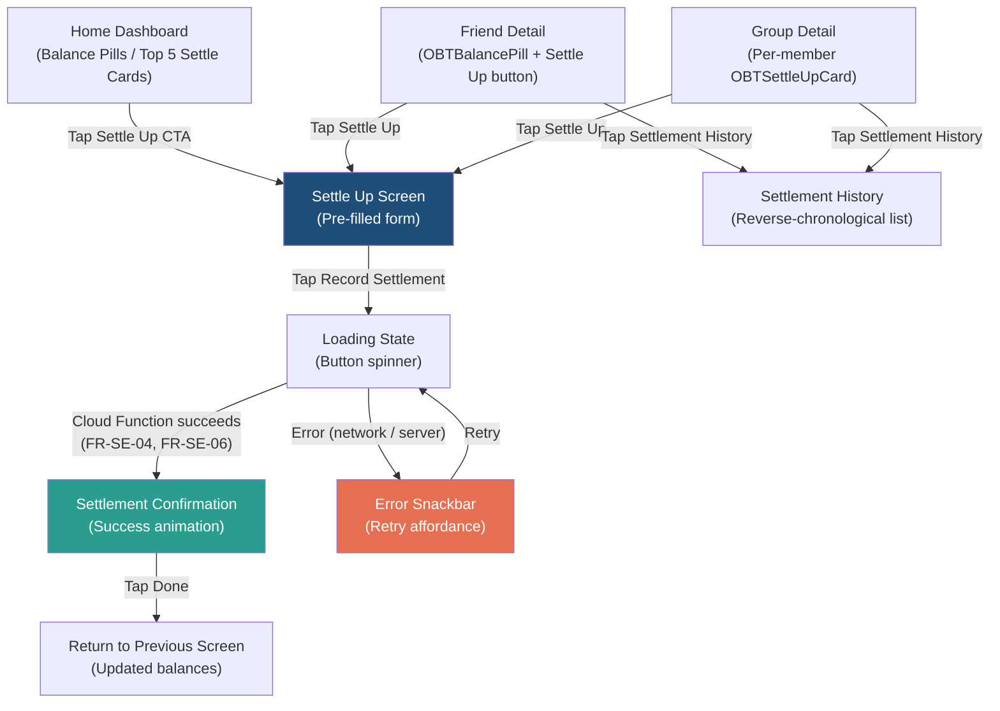

# Settle Up Flow Wireframes

> **Document owner:** UX/UI Designer
> **Version:** 1.0
> **Status:** Draft
> **SRS baseline:** v1.1
> **Core Screen:** 9 -- Settle Up flow (SRS section 6.3, item 9)

---

## Overview

The Settle Up flow enables users to record a payment from one user to another, closing or reducing a simplified-debt balance. The flow is driven entirely by the server-maintained `simplifiedBalances` projection (SRS section 7.3; Invariant 2). All monetary values are integer paise internally; conversion to rupees occurs at the UI layer (Invariant 1).

This document specifies layouts, states, components, and accessibility for four areas of the settle-up experience:

1. Entry points
2. Settle Up screen (the recording form)
3. Settlement confirmation
4. Settlement history

---

## Flow Diagram



---

## 1. Entry Points

The Settle Up CTA must appear on every screen that displays a non-zero simplified balance (FR-SE-07). The three entry points in v1.0 are:

### 1a. Home Dashboard -- Balance Pills and Top 5 Cards

**SRS references:** FR-HD-01, FR-HD-02, FR-SE-07, section 6.3 (item 5).

```
+--------------------------------------------------+
| OBTAppBar: "Home"                                |
+--------------------------------------------------+
|                                                  |
|  +--------------------------------------------+  |
|  |  Overall Balance                            |  |
|  |  [OBTBalancePill: "you owe Rs1,250.00"]     |  |
|  +--------------------------------------------+  |
|                                                  |
|  Top Balances                                    |
|  +--------------------------------------------+  |
|  | [OBTSettleUpCard]                           |  |
|  | (Avatar) Rahul  -->  (Avatar) You           |  |
|  | Rs750.00                                    |  |
|  | [ Settle Up ]  <-- primary CTA button       |  |
|  +--------------------------------------------+  |
|  +--------------------------------------------+  |
|  | [OBTSettleUpCard]                           |  |
|  | (Avatar) You  -->  (Avatar) Priya           |  |
|  | Rs500.00                                    |  |
|  | [ Settle Up ]  <-- primary CTA button       |  |
|  +--------------------------------------------+  |
|                                                  |
+--------------------------------------------------+
| [OBTBottomNav: Home | Friends | Groups | ... ]   |
+--------------------------------------------------+
```

**Components used:** `OBTAppBar`, `OBTBalancePill`, `OBTSettleUpCard`, `OBTBottomNav`.

**Behaviour:** Tapping "Settle Up" on any `OBTSettleUpCard` navigates to the Settle Up Screen (section 2) with `payerName`, `payeeName`, `amountPaise`, and `contextType`/`contextId` pre-filled from the simplified-debts suggestion.

### 1b. Friend Detail

**SRS references:** FR-FR-03, FR-FR-04, FR-SE-05, FR-SE-07, section 6.3 (item 6).

```
+--------------------------------------------------+
| OBTAppBar: "<-- Rahul"                           |
+--------------------------------------------------+
|                                                  |
|  (OBTUserAvatar: Rahul)                          |
|  Rahul Sharma                                    |
|  [OBTBalancePill: "you owe Rs750.00"]            |
|                                                  |
|  +--------------------------------------------+  |
|  | [ Settle Up  Rs750.00 ]  <-- primary btn    |  |
|  +--------------------------------------------+  |
|                                                  |
|  [ View Settlement History ]  <-- text link      |
|                                                  |
|  --- Transaction History -----------------------  |
|  [OBTExpenseListTile: "Dinner at Dosa Plaza"...] |
|  [OBTExpenseListTile: "Cab to Airport"...]       |
|  ...                                             |
+--------------------------------------------------+
```

**Components used:** `OBTAppBar`, `OBTUserAvatar`, `OBTBalancePill`, `OBTExpenseListTile`.

**Behaviour:** The "Settle Up" button is visible only when the simplified balance is non-zero (FR-SE-07). Tapping it opens the Settle Up Screen with the friend as the pre-filled recipient and the full suggested amount. The "View Settlement History" link navigates to the Settlement History screen (section 4).

### 1c. Group Detail

**SRS references:** FR-GR-04, FR-SE-05, FR-SE-07, section 6.3 (item 7).

```
+--------------------------------------------------+
| OBTAppBar: "<-- Goa Trip"                        |
+--------------------------------------------------+
|                                                  |
|  (OBTGroupAvatar)  Goa Trip                      |
|  [OBTBalancePill: "you owe Rs1,200.00"]          |
|                                                  |
|  Member Balances (Simplified)                    |
|  +--------------------------------------------+  |
|  | [OBTSettleUpCard]                           |  |
|  | You --> Priya   Rs800.00   [ Settle Up ]    |  |
|  +--------------------------------------------+  |
|  +--------------------------------------------+  |
|  | [OBTSettleUpCard]                           |  |
|  | You --> Amit    Rs400.00   [ Settle Up ]    |  |
|  +--------------------------------------------+  |
|                                                  |
|  [ View Settlement History ]  <-- text link      |
|                                                  |
|  --- Group Expenses ----------------------------  |
|  [OBTExpenseListTile: ...]                       |
|  ...                                             |
+--------------------------------------------------+
```

**Components used:** `OBTAppBar`, `OBTGroupAvatar`, `OBTBalancePill`, `OBTSettleUpCard`, `OBTExpenseListTile`.

**Behaviour:** Each `OBTSettleUpCard` within the group detail represents a single simplified-debt edge. Tapping "Settle Up" opens the Settle Up Screen with `contextType: 'group'`, the appropriate `contextId`, and the pre-filled payer-payee-amount triple.

---

## 2. Settle Up Screen

**SRS references:** FR-SE-05 (record settlement with pre-fill), FR-SE-04 (triggers recomputation), FR-SE-06 (real-time balance update), section 6.3 (item 9), section 7.5 (settlement writes validate `fromUserId == request.auth.uid`).

### Layout

```
+--------------------------------------------------+
| OBTAppBar: "<-- Settle Up"                       |
+--------------------------------------------------+
|                                                  |
|  +--------------------------------------------+  |
|  |  (OBTUserAvatar)    -->    (OBTUserAvatar)  |  |
|  |     You                      Priya          |  |
|  +--------------------------------------------+  |
|                                                  |
|  Amount                                          |
|  +--------------------------------------------+  |
|  | [OBTAmountInput]                            |  |
|  | Rs  [  800.00  ]  <-- pre-filled, editable  |  |
|  +--------------------------------------------+  |
|                                                  |
|  Date                                            |
|  +--------------------------------------------+  |
|  | [OBTDatePicker]                             |  |
|  | [  25 Mar 2025  ]  <-- defaults to today    |  |
|  +--------------------------------------------+  |
|                                                  |
|  Note (optional)                                 |
|  +--------------------------------------------+  |
|  | [OBTTextField]                              |  |
|  | [  e.g. "GPay transfer"  ]                  |  |
|  +--------------------------------------------+  |
|                                                  |
|  <!-- IA-EXT-01 UPI SLOT: ABSENT IN v1.0 -->    |
|  <!-- Future: payment method selector here -->   |
|                                                  |
|  +--------------------------------------------+  |
|  | [  Record Settlement  ]  <-- primary btn    |  |
|  | full-width, primary colour, 48dp height     |  |
|  +--------------------------------------------+  |
|                                                  |
+--------------------------------------------------+
```

### Components

| Component | Role | Notes |
|---|---|---|
| `OBTAppBar` | Screen header with back navigation | `title: "Settle Up"`, `showBackButton: true` |
| `OBTUserAvatar` (x2) | Payer and payee identity | Connected by a directional arrow icon |
| `OBTAmountInput` | Editable amount field | `initialAmountPaise` pre-filled from simplified-debts suggestion; user may reduce for partial settlement |
| Date picker | Date selection | Platform-native or Material date picker; defaults to today; constrained to not exceed today |
| Text field | Optional note | Max 200 characters; placeholder: "Add a note (optional)" |
| Primary button | Submit action | Label: "Record Settlement"; full-width; `primary` colour |

### Data Flow

1. The screen receives `payerUserId`, `payeeUserId`, `suggestedAmountPaise`, `contextType`, and `contextId` as navigation arguments.
2. `OBTAmountInput` is pre-filled with `suggestedAmountPaise` (FR-SE-05).
3. On submission, the client writes a settlement document with `fromUserId`, `toUserId`, `amountPaise`, `contextType`, `contextId`, `date`, `note`, `method: 'manual'` (ARCH-EXT-01), and `verificationStatus: 'unverified'` (ARCH-EXT-06).
4. The `recomputeSimplifiedBalances` Cloud Function fires atomically (FR-SE-04), updating `simplifiedBalances` on the relevant friendship or group document.
5. Security rules validate `fromUserId == request.auth.uid` (SRS section 7.5).

### States

| State | Behaviour | Visual |
|---|---|---|
| Default | Form loaded with pre-filled values | All fields idle; button in `primary` |
| Editing | User modifies amount, date, or note | Focused field border in `primary`; keyboard visible |
| Validation error | Amount is zero or exceeds simplified balance | `OBTAmountInput` shows `errorText` in `danger`; button disabled |
| Loading | Settlement write in progress | Button text replaced by circular progress indicator; all fields disabled; 200--300 ms transition (SRS section 6.2) |
| Error | Network failure or server rejection | `OBTSnackbar` (type: `error`) with message: "Could not record settlement. Please try again." and "Retry" action; form returns to editable state |

### Validation Rules

- Amount must be greater than zero.
- Amount must not exceed the suggested simplified-debt amount (partial settlements are permitted; over-settlement is not).
- Date must not be in the future.
- All values are integer paise (Invariant 1).

### Accessibility

| Element | Semantic label | Role |
|---|---|---|
| Payer avatar + name | "[Your name] pays" | `text` |
| Arrow icon | "to" | Decorative; excluded from semantics if names are read in sequence |
| Payee avatar + name | "[Payee name]" | `text` |
| Amount input | "Enter amount in rupees" | `textField` (from `OBTAmountInput`) |
| Date picker | "Settlement date, [selected date]" | `button` |
| Note field | "Add a note, optional" | `textField` |
| Record Settlement button | "Record settlement of rupees [amount] to [payee name]" | `button` |

Minimum tap targets: 48x48 dp on all interactive elements (SRS section 5.6). WCAG 2.1 AA contrast ratios on all text (SRS section 5.6).

---

## 3. Settlement Confirmation

**SRS references:** FR-SE-06 (real-time balance update), section 6.4 (success states), section 6.5 (microcopy tone).

### Layout

```
+--------------------------------------------------+
| OBTAppBar: "Settle Up"  (no back button)         |
+--------------------------------------------------+
|                                                  |
|                                                  |
|              (checkmark animation)               |
|                  [success icon]                  |
|              animated scale-in, 300ms            |
|              spring physics                      |
|                                                  |
|          "Settlement recorded"                   |
|          Title -- bold, primary colour            |
|                                                  |
|      "You paid Priya Rs800.00"                   |
|      Subtitle -- muted, body text                |
|                                                  |
|  +--------------------------------------------+  |
|  |  Updated Balance                            |  |
|  |  [OBTBalancePill: "settled up"              |  |
|  |   or "you owe Rs400.00"]                    |  |
|  +--------------------------------------------+  |
|                                                  |
|  +--------------------------------------------+  |
|  | [  Done  ]  <-- primary btn, full-width     |  |
|  +--------------------------------------------+  |
|                                                  |
+--------------------------------------------------+
```

### Components

| Component | Role | Notes |
|---|---|---|
| `OBTAppBar` | Minimal header | No back button; prevents accidental double navigation |
| Animated checkmark | Success feedback | `success` colour (`#2A9D8F`); scale-in from 0 to 1 with spring physics; 300 ms duration (SRS section 6.2) |
| Title text | Confirmation heading | "Settlement recorded" |
| Subtitle text | Transaction summary | Pattern: "You paid [Name] Rs[amount]"; uses `OBTRupeeText` formatting |
| `OBTBalancePill` | Updated balance | Reads from the freshly recomputed `simplifiedBalances` (Invariant 2) |
| Primary button | Dismiss action | Label: "Done"; returns to the screen that initiated the flow |

### Microcopy Variants (SRS section 6.5)

| Condition | Subtitle | Balance pill |
|---|---|---|
| Full settlement (balance now zero) | "You paid [Name] Rs[amount]. You're all settled up -- high five!" | "settled up" (muted) |
| Partial settlement (balance remains) | "You paid [Name] Rs[amount]." | "you owe Rs[remaining]" (danger) |

### States

| State | Behaviour |
|---|---|
| Success (default) | Checkmark animates in; balance pill shows updated value |
| Done pressed | Navigates back; 200 ms fade transition |

### Accessibility

| Element | Semantic label | Notes |
|---|---|---|
| Checkmark animation | "Settlement successful" | Announced via live region |
| Title | "Settlement recorded" | Heading semantics |
| Subtitle | "You paid [Name] rupees [amount]" | Body text |
| Balance pill | Per `OBTBalancePill` spec | -- |
| Done button | "Done, return to previous screen" | `button` role |

Animation respects `AccessibilityFeatures.reduceMotion`; if reduced motion is active, the checkmark appears immediately without spring animation (SRS section 5.6, component catalogue cross-cutting requirements).

---

## 4. Settlement History

**SRS references:** FR-SE-08 (settlement history per friend and per group), FR-FR-04 (per-friend transaction history), section 6.3 (items 6, 7), section 6.4 (empty, loading, error states).

### Layout

```
+--------------------------------------------------+
| OBTAppBar: "<-- Settlement History"              |
+--------------------------------------------------+
|                                                  |
|  +--------------------------------------------+  |
|  | 25 Mar 2025                                 |  |
|  | (Avatar) You  -->  (Avatar) Priya           |  |
|  | Rs800.00                                    |  |
|  | "GPay transfer"  <-- note in muted text     |  |
|  +--------------------------------------------+  |
|  +--------------------------------------------+  |
|  | 18 Mar 2025                                 |  |
|  | (Avatar) Priya  -->  (Avatar) You           |  |
|  | Rs1,200.00                                  |  |
|  | (no note)                                   |  |
|  +--------------------------------------------+  |
|  +--------------------------------------------+  |
|  | 02 Feb 2025                                 |  |
|  | (Avatar) You  -->  (Avatar) Amit            |  |
|  | Rs350.00                                    |  |
|  | "For last month's rent"                     |  |
|  +--------------------------------------------+  |
|  ...                                             |
|                                                  |
+--------------------------------------------------+
```

### Settlement Row Component

Each settlement row displays:

| Element | Rendering |
|---|---|
| Date | Formatted as `dd MMM yyyy` in IST (SRS section 5.9); displayed as a section header or inline above the row |
| From avatar | `OBTUserAvatar` for the payer |
| Arrow | Directional `-->` icon in muted colour |
| To avatar | `OBTUserAvatar` for the payee |
| Amount | `OBTRupeeText` with `amountPaise`; displayed in `primary` colour |
| Note | Muted body text below the amount; hidden if `null` |

### States

| State | Visual | Notes |
|---|---|---|
| Loading | `OBTSkeletonLoader` (type: `listTile`, itemCount: 5) | Shimmer animation; respects reduced motion (SRS section 5.6) |
| Loaded | Reverse-chronological list of settlement rows | Sorted by `date` descending |
| Empty | `OBTEmptyState` | Title: "No settlements yet"; Subtitle: "Once you settle up, it will appear here."; No CTA button (settlement is initiated from Friend/Group detail) |
| Error | `OBTErrorState` | Title: "Something went wrong"; Subtitle: "We could not load settlement history. Please try again."; "Retry" button; "Contact Support" link (FR-PR-05) |

### Context Variants

| Context | Access point | Data scope |
|---|---|---|
| Friend | Friend detail screen -- "View Settlement History" link | Settlements where `contextType == 'friendship'` and `contextId` matches the friendship document |
| Group | Group detail screen -- "View Settlement History" link | Settlements where `contextType == 'group'` and `contextId` matches the group document |

### Accessibility

| Element | Semantic label |
|---|---|
| Screen | "Settlement history" (heading) |
| Settlement row | "[Payer name] paid [Payee name] rupees [amount] on [date]. Note: [note or 'no note']." |
| Empty state | Per `OBTEmptyState` specification |
| Error state | Per `OBTErrorState` specification |
| Each row | Role: `listItem` within a `list` semantic group |

Minimum row height: 64 dp to ensure 48x48 dp tap targets with padding (SRS section 5.6).

---

## Extension Points

### IA-EXT-01: UPI Payment Option Slot

**Status in v1.0:** Absent. The Settle Up Screen (section 2) contains only the manual settlement recorder. No payment-method selector exists.

**Future dock point:** A payment-method selector will appear below the note field and above the "Record Settlement" button. The selector will offer "Record manually" (current behaviour) and "Pay via UPI" (opens OS-level UPI app picker). The ASCII layout in section 2 marks this slot with a comment placeholder.

**SRS references:** SRS section 12.3 (bullet 1); SRS section 4.6; SRS section 6.3 (item 9).

### ARCH-EXT-01: Settlement Method Discriminator

**Status in v1.0:** Every settlement document includes `method: 'manual'` as an explicit field value. The UI does not display this field; it exists solely for forward-compatible querying.

**Future change:** The `method` field gains `'upi'` as a second permitted value, accompanied by `upiTransactionId` and `upiApp` fields. The Settlement History row component (section 4) will conditionally render a UPI logo badge when `method == 'upi'`.

### ARCH-EXT-06: Settlement Verification Status

**Status in v1.0:** Every settlement document includes `verificationStatus: 'unverified'` as an explicit field value. The field is client-read-only (writable only by Cloud Functions service account), mirroring the `simplifiedBalances` enforcement pattern (SRS section 7.5, Invariant 2). The UI does not display this field.

**Future change:** Settlements created via UPI will have `verificationStatus: 'pending'` initially, transitioning to `'verified'` upon payment confirmation or `'failed'` on timeout. The Settlement History row will display a verification badge (checkmark for verified, clock for pending, cross for failed). Failed settlements will be excluded from `simplifiedBalances` recomputation.

---

## Design Token Usage Summary

| Token | Application in this flow |
|---|---|
| `primary` (`#1F4E79` / `#2E86AB`) | "Record Settlement" button, "Settle Up" CTA on cards, focused input borders, amount text on history rows |
| `secondary` (`#F4A261`) | Not directly used in this flow; FAB on underlying screens only |
| `success` (`#2A9D8F`) | Confirmation checkmark animation, "settled up" balance pill, "you are owed" states |
| `danger` (`#E76F51`) | "you owe" balance pills, validation error text, error snackbar |
| `surface` (white / `#121212`) | Card backgrounds, screen backgrounds |
| `cornerRadiusSmall` (16 dp) | Input fields, buttons, balance pills |
| `cornerRadiusLarge` (24 dp) | `OBTSettleUpCard`, confirmation card |
| `elevationLow` (1 dp) | Settlement history rows, settle-up cards at rest |
| `motionStandard` (200--300 ms ease-in-out) | State transitions, button press feedback, screen navigation |
| `motionSpring` (damping ~0.7) | Confirmation checkmark scale-in animation |
| `tapTargetMin` (48x48 dp) | All interactive elements across all screens |

---

## SRS Traceability Matrix

| SRS Requirement | Addressed in section |
|---|---|
| FR-SE-01 (simplified debts as canonical view) | Sections 1a, 1b, 1c -- all entry points read `simplifiedBalances` |
| FR-SE-02 (deterministic algorithm) | Section 2 -- pre-fill values from deterministic server output |
| FR-SE-03 (Cloud Function writes `simplifiedBalances`) | Section 2 -- client reads only; Invariant 2 |
| FR-SE-04 (atomic recomputation) | Section 2 -- settlement triggers Cloud Function |
| FR-SE-05 (record settlement with pre-fill) | Section 2 -- full Settle Up Screen specification |
| FR-SE-06 (real-time update) | Section 3 -- confirmation shows updated balance |
| FR-SE-07 (CTA on every non-zero balance screen) | Sections 1a, 1b, 1c -- three entry points |
| FR-SE-08 (settlement history per friend and group) | Section 4 -- Settlement History screen |
| FR-SE-09 (send reminder) | Out of scope for this wireframe; handled in separate reminder flow |
| FR-HD-01 (overall net balance) | Section 1a -- home dashboard balance pill |
| FR-HD-02 (top 5 with quick settle) | Section 1a -- `OBTSettleUpCard` list |
| FR-FR-03 (friends list with balance) | Section 1b -- friend detail entry point |
| FR-FR-04 (per-friend transaction history) | Section 1b -- transaction history includes settlements |
| FR-GR-04 (group balances) | Section 1c -- group detail entry point |
| Section 5.6 (usability and accessibility) | All sections -- tap targets, contrast, semantic labels, dynamic font, dark mode |
| Section 6.2 (visual system) | Design token usage summary |
| Section 6.4 (empty, error, loading states) | Section 4 -- all three states specified |
| Section 6.5 (microcopy tone) | Section 3 -- friendly, concise confirmation copy |
| Invariant 1 (integer paise) | Section 2 -- `OBTAmountInput` outputs paise; all amounts stored as paise |
| Invariant 2 (`simplifiedBalances` client-read-only) | Sections 1, 3 -- client reads only; Cloud Function writes |