# Dependencies and Critical Path

This document maps the inter-story dependency graph for all v1.0 stories, identifies
the critical path from project start to general availability, catalogues parallel
work streams, and highlights risk points where the critical path is thinnest. All
story identifiers and priorities are drawn from the SRS (section 4) and the product
backlog (`docs/sprint-zero/backlog.md`).

---

## 1. Inter-Story Dependency DAG

The diagram below encodes every dependency declared in the backlog's per-epic tables
and the cross-epic dependency matrix. Arrows point from the upstream (blocking) story
to the downstream (dependent) story. Stories are grouped by the sprint in which they
are first eligible to begin; sprint assignment follows `docs/sprint-zero/sprint-1-plan.md`
for sprint 1 and the backlog priority ordering thereafter.

```mermaid
graph LR

    %% ---------------------------------------------------------------
    %% Sprint 1 -- Foundation
    %% ---------------------------------------------------------------
    subgraph Sprint_1 [Sprint 1]
        INFRA-01
        FR-AU-01
        FR-AU-02
        FR-AU-03
        FR-AU-04
        FR-AU-05
        FR-AU-06
        FR-AU-07
        FR-AU-08
        FR-PR-01
        FUNC-01
    end

    %% ---------------------------------------------------------------
    %% Sprint 2 -- Core Features
    %% ---------------------------------------------------------------
    subgraph Sprint_2 [Sprint 2]
        FR-EX-01
        FR-EX-02
        FR-EX-03
        FR-EX-04
        FR-EX-08
        FR-EX-09
        FR-FR-01
        FR-FR-02
        FR-FR-03
        FR-FR-04
        FR-GR-01
        FR-GR-02
        FR-GR-03
        FR-SH-01
        FR-SH-02
        FR-SE-02
        FR-SE-03
    end

    %% ---------------------------------------------------------------
    %% Sprint 3 -- Settlements, Groups, Activity
    %% ---------------------------------------------------------------
    subgraph Sprint_3 [Sprint 3]
        FR-SE-01
        FR-SE-04
        FR-SE-05
        FR-SE-06
        FR-SE-07
        FR-SE-08
        FR-GR-04
        FR-GR-05
        FR-GR-06
        FR-GR-07
        FR-EX-05
        FR-EX-06
        FR-EX-07
        FR-AC-01
        FR-AC-02
        FR-AC-03
    end

    %% ---------------------------------------------------------------
    %% Sprint 4 -- Dashboard, Offline, Polish
    %% ---------------------------------------------------------------
    subgraph Sprint_4 [Sprint 4]
        FR-HD-01
        FR-HD-02
        FR-HD-03
        FR-HD-04
        FR-AC-04
        FR-AC-05
        FR-FR-05
        FR-PR-02
        FR-PR-03
        FR-PR-04
        FR-PR-05
        FR-SH-03
        FR-SH-04
        FR-OF-01
        FR-OF-02
        FR-OF-03
        FR-SR-01
        FR-SR-02
        FR-SE-09
        FR-AU-09
        FR-EX-06b[FR-EX-06]
    end

    %% ---------------------------------------------------------------
    %% Infrastructure gate
    %% ---------------------------------------------------------------
    INFRA-01 --> FR-AU-01
    INFRA-01 --> FUNC-01

    %% ---------------------------------------------------------------
    %% Authentication chain
    %% ---------------------------------------------------------------
    FR-AU-01 --> FR-AU-02
    FR-AU-02 --> FR-AU-03
    FR-AU-03 --> FR-AU-04
    FR-AU-03 --> FR-AU-05
    FR-AU-03 --> FR-AU-06
    FR-AU-03 --> FR-AU-07
    FR-AU-06 --> FR-PR-01

    %% ---------------------------------------------------------------
    %% Session gate (FR-AU-07 gates feature areas -- SRS section 4.1)
    %% ---------------------------------------------------------------
    FR-AU-07 --> FR-FR-01
    FR-AU-07 --> FR-GR-01
    FR-AU-07 --> FR-EX-01
    FR-AU-07 --> FR-AC-01
    FR-AU-07 --> FR-AC-03
    FR-AU-07 --> FR-OF-01
    FR-AU-07 --> FR-AU-08
    FR-AU-07 --> FR-AU-09
    FR-PR-01 --> FR-AU-08

    %% ---------------------------------------------------------------
    %% Sharing (system share sheet -- invariant 3)
    %% ---------------------------------------------------------------
    FR-SH-01 --> FR-FR-02
    FR-SH-01 --> FR-GR-02
    FR-SH-01 --> FR-SH-02

    %% ---------------------------------------------------------------
    %% Friends chain
    %% ---------------------------------------------------------------
    FR-FR-01 --> FR-FR-02
    FR-FR-01 --> FR-FR-03
    FR-FR-01 --> FR-FR-04
    FR-FR-03 --> FR-FR-05
    FR-SE-01 --> FR-FR-03
    FR-SE-01 --> FR-FR-05
    FR-EX-01 --> FR-FR-04

    %% ---------------------------------------------------------------
    %% Groups chain
    %% ---------------------------------------------------------------
    FR-GR-01 --> FR-GR-02
    FR-GR-02 --> FR-GR-03
    FR-GR-01 --> FR-GR-04
    FR-EX-01 --> FR-GR-04
    FR-SE-01 --> FR-GR-04
    FR-GR-04 --> FR-GR-05
    FR-GR-04 --> FR-GR-06
    FR-GR-04 --> FR-GR-07
    FR-SE-01 --> FR-GR-05
    FR-SE-01 --> FR-GR-06
    FR-SE-01 --> FR-GR-07

    %% ---------------------------------------------------------------
    %% Expense chain
    %% ---------------------------------------------------------------
    FR-EX-01 --> FR-EX-02
    FR-EX-01 --> FR-EX-03
    FR-EX-01 --> FR-EX-05
    FR-EX-01 --> FR-EX-08
    FR-EX-03 --> FR-EX-04
    FR-EX-02 --> FR-FR-01
    FR-EX-02 --> FR-GR-01
    FR-EX-01 --> FR-EX-06
    FR-EX-06 --> FR-EX-07
    FR-SE-04 --> FR-EX-06
    FR-AC-01 --> FR-EX-07

    %% ---------------------------------------------------------------
    %% Settlements and Simplified Debts chain
    %% (invariant 2 -- simplifiedBalances is server-maintained)
    %% ---------------------------------------------------------------
    FUNC-01 --> FR-SE-02
    FR-SE-02 --> FR-SE-03
    FR-SE-03 --> FR-SE-01
    FR-SE-03 --> FR-SE-04
    FR-SE-04 --> FR-SE-06
    FR-SE-01 --> FR-SE-05
    FR-SE-05 --> FR-SE-06
    FR-SE-01 --> FR-SE-07
    FR-SE-05 --> FR-SE-08
    FR-FR-01 --> FR-SE-08
    FR-GR-01 --> FR-SE-08
    FR-SE-01 --> FR-SE-09
    FR-AC-03 --> FR-SE-09

    %% ---------------------------------------------------------------
    %% Activity and Notifications chain
    %% ---------------------------------------------------------------
    FR-AC-01 --> FR-AC-02
    FR-AC-03 --> FR-AC-04
    FR-AC-03 --> FR-AC-05
    FR-PR-03 --> FR-AC-04

    %% ---------------------------------------------------------------
    %% Home Dashboard chain
    %% ---------------------------------------------------------------
    FR-SE-01 --> FR-HD-01
    FR-SE-01 --> FR-HD-02
    FR-FR-03 --> FR-HD-02
    FR-GR-04 --> FR-HD-02
    FR-EX-01 --> FR-HD-03
    FR-EX-01 --> FR-HD-04

    %% ---------------------------------------------------------------
    %% Profile chain
    %% ---------------------------------------------------------------
    FR-AU-03 --> FR-PR-02
    FR-PR-01 --> FR-PR-02
    FR-PR-01 --> FR-PR-03
    FR-PR-01 --> FR-PR-04
    FR-FR-01 --> FR-PR-04
    FR-GR-01 --> FR-PR-04
    FR-PR-01 --> FR-PR-05
    FR-PR-05 --> FR-SH-03
    FR-SH-03 --> FR-SH-04

    %% ---------------------------------------------------------------
    %% Search and Filters
    %% ---------------------------------------------------------------
    FR-EX-01 --> FR-SR-01
    FR-EX-01 --> FR-SR-02
    FR-GR-01 --> FR-SR-02

    %% ---------------------------------------------------------------
    %% Offline chain
    %% ---------------------------------------------------------------
    FR-EX-01 --> FR-OF-02
    FR-SE-05 --> FR-OF-02
    FR-OF-02 --> FR-OF-03
    FR-SE-04 --> FR-OF-03
```



### Key Dependency Chains (Summary)

| Chain | Rationale |
|---|---|
| FR-AU-07 (session persistence) blocks FR-FR-01, FR-GR-01, FR-EX-01, FR-AC-01, FR-AC-03, FR-OF-01 | All feature areas require an authenticated session (SRS section 4.1). |
| INFRA-01 (Firebase setup) blocks FR-AU-01 and FUNC-01 | No development or testing is possible without the emulator suite and CI pipeline (SRS section 8). |
| FUNC-01 (stub) blocks FR-SE-02 blocks FR-SE-03 blocks FR-SE-01 through FR-SE-04 | The simplified-debts algorithm contract must be established before any balance computation or display (SRS section 4.6, invariant 2). |
| FR-SE-03 (Cloud Function writes balances) blocks FR-FR-03, FR-GR-04, FR-HD-01, FR-HD-02, FR-SE-07 | All balance display screens read from the server-maintained `simplifiedBalances` field (SRS section 4.6, invariant 2). |
| FR-EX-01 (add expense) blocks FR-EX-02 through FR-EX-09 | Expense editing, splitting, and categorisation all depend on the base expense creation flow (SRS section 4.5). |
| FR-FR-01 (add friend) blocks FR-FR-02 through FR-FR-05 | Friend list, history, and deletion all require at least one friend to exist (SRS section 4.3). |
| FR-GR-01 (create group) blocks FR-GR-02 through FR-GR-07 | Group management, membership, and activity all require a group to exist (SRS section 4.4). |
| FR-AC-03 (FCM push) blocks FR-AC-04, FR-AC-05, FR-SE-09 | Notification preferences, deep-linking from notifications, and payment reminders all require the FCM transport (SRS section 4.7). |
| FR-SH-01 (system share sheet) blocks FR-FR-02, FR-GR-02, FR-SH-02 | Friend and group invitations use the system share sheet (invariant 3, SRS section 4.11). |

---

## 2. Critical Path

The critical path is the longest chain of sequentially dependent stories from project
start to general availability. Any delay on this chain delays the entire release.

```
INFRA-01 --> FR-AU-01 --> FR-AU-02 --> FR-AU-03 --> FR-AU-07
         --> FR-EX-01 --> (parallel: FUNC-01 --> FR-SE-02) --> FR-SE-03
         --> FR-SE-04 --> FR-SE-01 --> FR-HD-01 --> release
```

Expressed as a linear sequence with story-point cost:

| Step | Story | SP | Cumulative SP |
|---|---|---|---|
| 1 | INFRA-01 -- Firebase project, emulator suite, CI pipeline | 8 | 8 |
| 2 | FR-AU-01 -- Phone login screen with locked +91 prefix | 3 | 11 |
| 3 | FR-AU-02 -- Indian mobile number validation | 1 | 12 |
| 4 | FR-AU-03 -- OTP dispatch via Firebase Phone Auth | 3 | 15 |
| 5 | FR-AU-07 -- Session persistence and auto-login | 2 | 17 |
| 6 | FR-EX-01 -- Add expense (full form) | 5 | 22 |
| 7 | FR-SE-02 -- Simplified-debts algorithm (full implementation) | 8 | 30 |
| 8 | FR-SE-03 -- Cloud Function writes `simplifiedBalances` | 5 | 35 |
| 9 | FR-SE-04 -- Atomic recomputation on write | 5 | 40 |
| 10 | FR-SE-01 -- Display simplified debts as canonical balance view | 3 | 43 |
| 11 | FR-HD-01 -- Overall net simplified balance on Home dashboard | 3 | 46 |

**Total critical-path effort: 46 story points across 11 sequential stories.**

### Critical Observations

1. **Anything that blocks login blocks everything.** FR-AU-07 (session persistence)
   is the gateway node. Until a user can authenticate and maintain a session, no
   feature-area story may begin meaningful integration testing. INFRA-01 and the
   authentication chain (FR-AU-01 through FR-AU-07) must be completed first without
   exception (SRS section 4.1; sprint 1 plan, risk 1).

2. **The simplified-debts function must exist as a stub before any feature using
   balances.** FUNC-01 establishes the contract (types, function signature, canonical
   test matrix) that FR-SE-02 implements. FR-SE-03 then deploys the algorithm as a
   Cloud Function that writes to `simplifiedBalances`. Until FR-SE-03 is complete,
   every screen that displays a balance -- friends list (FR-FR-03), group detail
   (FR-GR-04), home dashboard (FR-HD-01, FR-HD-02), and settle-up flows (FR-SE-05
   through FR-SE-07) -- is blocked on its upstream dependency (SRS section 4.6,
   invariant 2).

3. **FR-SE-04 (atomic recomputation) is the linchpin.** It sits between the
   algorithm deployment and the balance-display layer. Expense edits (FR-EX-06),
   settlement recording (FR-SE-06), and offline conflict resolution (FR-OF-03) all
   depend on FR-SE-04 functioning correctly. A defect here propagates to every
   downstream consumer.

---

## 3. Parallel Work Streams

Within each sprint, several stories can proceed concurrently provided their upstream
dependencies are met. The two primary execution roles -- Flutter Dev and Functions
Dev -- can work in parallel once INFRA-01 is complete (SRS section 8).

### Sprint 1 Parallelism

| Stream | Stories | Owner |
|---|---|---|
| Authentication UI | FR-AU-01 through FR-AU-08 (sequential chain) | Flutter Dev |
| Profile setup UI | FR-PR-01 (after FR-AU-06) | Flutter Dev |
| Simplified-debts stub | FUNC-01 (after INFRA-01; no Flutter dependency) | Functions Dev |
| Infrastructure | INFRA-01 (must complete first) | DevOps, Architect |

Once INFRA-01 is done, Flutter Dev begins the authentication chain whilst Functions
Dev works on FUNC-01 independently. These two streams have no mutual dependency in
sprint 1.

### Sprint 2 Parallelism

| Stream | Stories | Owner |
|---|---|---|
| Friends feature | FR-FR-01, FR-FR-02, FR-FR-03, FR-FR-04 | Flutter Dev |
| Groups feature | FR-GR-01, FR-GR-02, FR-GR-03 | Flutter Dev |
| Expense creation | FR-EX-01, FR-EX-02, FR-EX-03, FR-EX-04, FR-EX-08, FR-EX-09 | Flutter Dev |
| Sharing utilities | FR-SH-01, FR-SH-02 | Flutter Dev |
| Algorithm + Cloud Function | FR-SE-02, FR-SE-03 | Functions Dev |

**Friends and Groups are largely independent of each other.** Both depend on
FR-AU-07 but share no mutual dependency. They can be developed and tested in
parallel (SRS sections 4.3, 4.4).

FR-SH-01 (system share sheet) is a small utility story that should be completed
early in the sprint as it unblocks FR-FR-02 and FR-GR-02.

### Sprint 3 Parallelism

| Stream | Stories | Owner |
|---|---|---|
| Settlements UI | FR-SE-01, FR-SE-05, FR-SE-06, FR-SE-07, FR-SE-08 | Flutter Dev |
| Expense editing | FR-EX-05, FR-EX-06, FR-EX-07 | Flutter Dev |
| Group management | FR-GR-04, FR-GR-05, FR-GR-06, FR-GR-07 | Flutter Dev |
| Activity feed | FR-AC-01, FR-AC-02 | Flutter Dev |
| Push notifications | FR-AC-03 | Functions Dev + Flutter Dev |
| Atomic recomputation | FR-SE-04 | Functions Dev |

**The activity feed (FR-AC-01, FR-AC-02) can be built in parallel with the
dashboard and settlement work.** FR-AC-01 depends only on FR-AU-07, not on any
settlement or expense story, so it may begin as soon as the session gate is passed.

### Sprint 4 Parallelism

| Stream | Stories | Owner |
|---|---|---|
| Home dashboard | FR-HD-01, FR-HD-02, FR-HD-03, FR-HD-04 | Flutter Dev |
| Notification preferences | FR-PR-03, FR-AC-04, FR-AC-05 | Flutter Dev + Functions Dev |
| Offline support | FR-OF-01, FR-OF-02, FR-OF-03 | Flutter Dev |
| Search and filters | FR-SR-01, FR-SR-02 | Flutter Dev |
| Profile polish | FR-PR-02, FR-PR-04, FR-PR-05 | Flutter Dev |
| Support and sharing | FR-SH-03, FR-SH-04 | Flutter Dev |
| Account deletion | FR-AU-09 | Functions Dev + Flutter Dev |
| Payment reminders | FR-SE-09 | Functions Dev + Flutter Dev |

Sprint 4 has the widest parallelism opportunity. Most stories depend only on upstream
features completed in sprints 1-3 and have no mutual dependencies.

---

## 4. Risk Points

Risk points are locations on the critical path where work is single-threaded -- only
one developer or one team can make progress, and any delay propagates directly to the
release date.

### 4.1 INFRA-01: Single-Point-of-Failure Gate

**Risk:** INFRA-01 (Firebase project configuration, emulator suite, CI pipeline)
blocks every other story in the entire backlog. It is the only story with no
predecessor, yet it requires coordination across DevOps and Architect roles.

**Mitigation:** Start INFRA-01 on day one. Assign it as the sole focus until
complete. Timebox to 3 working days maximum. The sprint 1 plan already identifies
this as risk 1 (see `docs/sprint-zero/sprint-1-plan.md`, "Risks and Notes", item 1).

### 4.2 Authentication Chain: Sequential and Single-Developer

**Risk:** FR-AU-01 through FR-AU-07 form a strictly sequential chain of 7 stories
(17 SP). Only one Flutter developer can work on them at a time, as each story's
output is the next story's input. Slip on any one delays the session gate and
therefore every feature-area story.

**Mitigation:** FUNC-01 runs in parallel on the Functions Dev track, ensuring the
backend contract is ready when sprint 2 begins. The authentication chain should be
the Flutter Dev's exclusive priority in sprint 1; no other Flutter work should
compete for attention until FR-AU-07 is merged.

### 4.3 Simplified-Debts Pipeline: Three Sequential Backend Stories

**Risk:** FUNC-01, FR-SE-02, and FR-SE-03 form a three-story sequential chain (18
SP) on the Functions Dev track. FR-SE-02 is the single highest-effort story in the
backlog (8 SP). Until FR-SE-03 is complete, every balance-displaying screen is
blocked. This is the thinnest point on the critical path because it is
single-developer, algorithmically complex, and has the largest fan-out of dependent
stories.

**Mitigation:** FUNC-01 establishes the contract and canonical test suite in sprint
1, de-risking the algorithm design early. FR-SE-02 should begin immediately in
sprint 2. The backlog execution guidance (see `docs/sprint-zero/backlog.md`,
"Execution Guidance", bullet 3) explicitly recommends staffing this epic early. If
the algorithm proves more complex than estimated, the naive stub from FUNC-01 can
serve as a temporary implementation whilst the optimised version is developed.

### 4.4 FR-SE-04: Atomic Recomputation Bottleneck

**Risk:** FR-SE-04 (atomic recomputation on expense/settlement write) is a single
story (5 SP) on which FR-EX-06, FR-SE-06, FR-OF-03, and all real-time balance
updates depend. It must be implemented correctly in a Firestore transaction context,
and any bug here silently corrupts balances across the application. It is both a
schedule bottleneck and a correctness bottleneck.

**Mitigation:** The canonical test suite from FUNC-01 provides a regression safety
net. FR-SE-04 should be accompanied by integration tests against the Firestore
Emulator that verify atomicity under concurrent writes (SRS section 5.1). Code review
by the Architect is mandatory before merge.

### 4.5 Platform-Specific OTP Risk (Sprint 1)

**Risk:** FR-AU-04 (OTP auto-read on Android) carries platform-specific risk. SMS
Retriever behaviour on Android emulators is non-deterministic (sprint 1 plan, risk
2). A failure here does not block the critical path directly (FR-AU-07 does not
depend on FR-AU-04), but it could consume Flutter Dev time that would be better spent
on the authentication chain.

**Mitigation:** FR-AU-04 and FR-AU-05 branch off FR-AU-03 in parallel with
FR-AU-06 and FR-AU-07. Prioritise the critical-path stories (FR-AU-06, FR-AU-07)
over the parallel branches if time pressure emerges.

### 4.6 Single Firebase Project Constraint

**Risk:** Invariant 4 (single Firebase project) means there is no staging
environment. All pre-merge testing runs against the Firebase Emulator Suite. If the
emulator suite has a defect or configuration drift, all development is blocked with
no fallback (SRS section 9.1).

**Mitigation:** INFRA-01 must include emulator configuration validation as part of
its definition of done. The PR pipeline (`.github/workflows/pr.yml`) should fail
fast if the emulator suite cannot start. Pin emulator versions in `firebase.json`
to avoid upstream breakage.

---

*Document prepared by the Solution Architect. All story identifiers, priorities, and
dependency declarations are drawn from the SRS (section 4), the product backlog
(`docs/sprint-zero/backlog.md`), and the sprint 1 plan
(`docs/sprint-zero/sprint-1-plan.md`). Invariant references follow
`.github/shared/invariants.md`.*
